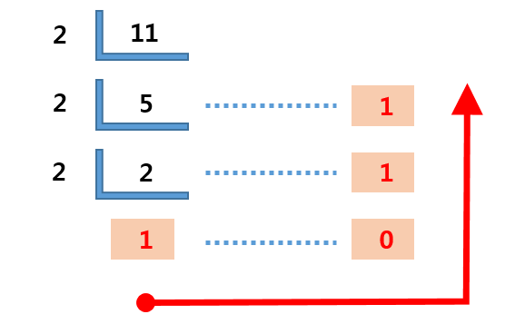
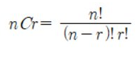
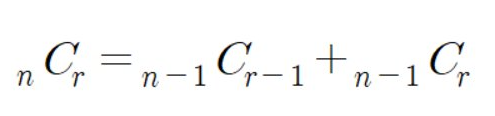
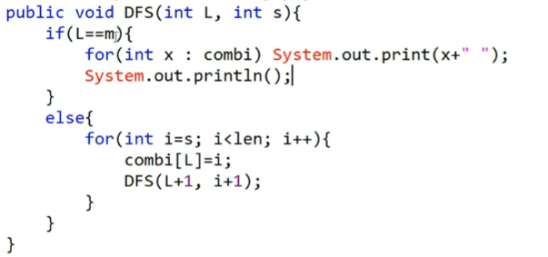

# JAVA_algorithm

인프런 자바 알고리즘 학습 기록을 위한 레포

<details>
<summary>01 String Section</summary>
<div markdown="1">

### 01-01 
- FindChar
- 문자열 안에서 특정 문자 찾는 문제
- 자바는 String에 대해서 for each 지원 안함 String의 메소드를 사용하여 char Array로 바꿀 수 있음! 바꿔서 enumeration controll 하자
- Character 클래스에 (Wrapper class) 여러 유용한 static method있다! 눈에 띌 때마다 정리하자 
```java
c = sc.next().charAt(0); //캐릭터는 이렇게 입력받기
String.toCharArray(); //문자열을 캐릭터의 배열로! 향상된 for문에 유용
Character.toLowerCase(c); //캐릭터를 소문자로 
```
### 01-02
- UpperLowerTrans
- 문자열의 대소문자 반전시키는 문제  
- char와 integer는 compatible 하다는 점을 이용하여 문제 풀 수도 있음
  - 즉 아스키 코드로 가능하다는 말
  - 대문자는 아스키코드 65 < c < 90
  - 소문자는 아스키코드 97 < c < 122
```java
//빈문자열에 붙여넣기 신공! 유용하게 쓰이는 편
//Stirng에서는 +연산자가 오버로딩 되니까.. 빈 문자열 만들어 놓고 정답을 붙여나갈 수 있다.
String answer = "";
```
### 01-03
- LongestWord
- 입력된 문장 속 가장 길이가 긴 단어 찾는 문제 
- 최댓값 알고리즘 -> max를 갱신해나가는 방식으로 풀 수 있다. 
- 문자열을 받아서 그 안의 단어들을 어떻게 tokenize해나갈 것인가? 
  1. str.split(" ") String[] 를 반환한다. 다만 스플릿 하는 문자가 여러개 이어져 있을 경우 배열에 빈문자열로써 포함 시킨다
  2. indexOf()의 연속적 사용
```java
//첫번째 방법
String[] str_arr = str.split(" ");

//두번째 방법 indexOf는 못찾으면 -1 반환하기에
while(str.indexOf(" ") != -1) {
    //substring 을 통해 잘라나간다.
}
```
### 01-04 
- ReverseWord
- 문자열 뒤집기
- 자바에서 스트링에 대한 연산을 한다면 객체가 수정되는 것이 아니라 새로운 객체가 계속해서 만들어짐
- 프로그래밍 언어론 관점에서 자바는 primitive 타입이 아닌 클래스 타입에 대해서는 referential value model을 사용하기 때문
- String Builder는 인자로 받은 문자열에 대해 여러가지 연산을 제공하며 객체를 효율적인 방법으로 사용한다
- 마구 만들어내지 않음

```java
//1. StringBuilder 클래스 사용
//StringBuilder 생성하고 인자로 넘긴 String에 대해 reverse메소드 적용 toString으로 찍어본다.
StringBuilder stbd = new StringBuilder(s);
stbd.reverse().toString();
//2. char단위 스왑하며 reverse하기
while (lt < rt) { //문자열의 길이가 홀수든 짝수든 상관없다
    tmp = str[lt];
    str[lt] = str[rt];
    str[rt] = tmp;
    lt++;
    rt--;
}
//다양한 primitve타입을 String으로 캐스트해주는 valueOf메소드 
String s = String.valueOf(str);
```
### 01-05
- SpecificReverse
- 특정 문자 뒤집기
```java
while (lt < rt) {     
        //알파벳이 아니라면 스왑하지 않는다.
        if (!Character.isAlphabetic(str[lt])) {
            lt++;
            continue;
        } else if (!Character.isAlphabetic(str[rt])) {
            rt--;
            continue;
        }
        tmp = str[lt];
        str[lt] = str[rt];
        str[rt] = tmp;
        lt++;
        rt--;
}
```
### 01-06
- RepeatedDelete
- 문자열에서 중복된 캐릭터 제거하고 출력 (기존의 순서 유지)
- 방법 1
  - Set은 중복이 없다는 점을 이용 (나의 방법)
  - Set.Contians를 통해 지금까지 나왔던 적이 있는 지 확인한다.
- 방법 2
  - indexOf()를 이용
  - 지금 살펴보는 위치의 char가 indexOf로 검색한 위치와 다르다면 처음 나온것이 아님을 이용
```java 
//방법 1
Set<Character> charSet = new HashSet<>();
for (char c : str) {
    //set에 들어있다면 패스
    if (charSet.contains(Character.valueOf(c))) {
        continue;
    }
    //set에 들어있지 않으면 char하나 출력 
    System.out.printf("%c", c);
    charSet.add(c);

}
//방법 2
for (int i = 0; i < str.length; i++) {
    //현재 보고 있는 인덱스와 indexOf를 이용하여 확인한 인덱스가 같다면 처음 나온 것
    //다르다면 처음 나온 것이 아님
    if (i == s.indexOf(s.charAt(i))) {
        System.out.printf("%c", s.charAt(i));
    }
}
```
### 01-07
- PalindromeCheck
- 회문 문자열인지 검사
- 방법 1
  - reverse시키고 String.equals 메소드 사용
- 방법 2 
  - 대칭되는 인덱스 자리끼리 같은지 확인 
```java
while (lt < rt) {
    //인덱스의 대칭되는 자리에 같지 않은게 있으면 palindrom 아님
        if (str.charAt(lt) != str.charAt(rt)) {
            System.out.println("NO");
            return;
        }
        lt++;
        rt--;
}
```
### 01-08
- SpecificPalindrome
- 회문 문자열인지 검사하는 알고리즘 but 특수문자 무시
- 특수문자 제거 방법 1
  - 빈문자열에다가 하나씩 검사하면서 붙여넣기
- 특수문자 제거 방법 2
  - String.replaceAll메소드 이용 정규식으로 해결
```java 
//특수문자 제거 방법 1
//String parsing 
//es는 특수문자를 제외한 문자열을 가지게 된다.
for (int i = 0; i < str.length(); i++) {
    if (!Character.isAlphabetic(chars[i])) {
        continue;
    }
    es += chars[i];
}
//특수문자 제거 방법 2
str.toLowerCase().replaceAll("[^A-Z]", ""); //정규식 이용! 

```
### 01-09
- NumericExtract
- 문자열 사이에서 숫자만 추출해서 '자연수로' 만들기
- 방법 1.
  - 문자열 받고 정규식이용해서 숫자 아닌 것들 거르기
  - Integer.parseInt 혹은 Integer.valueOf로 문자열 정수로 캐스트
- 방법 2. 
  - 문자열 char의 배열로 만들기
  - Character.isDigit사용해서 숫자라면 10 곱해나가면서 더한다. 
```java 
//방법 1
str = str.replaceAll("[^0-9]", "");
System.out.println(Integer.valueOf(str));
//방법 2
for (char c : chars) {
      if (Character.isDigit(c)) {
          answer = (answer * 10) + (c - 48)
      }
}

```
### 01-10
- InterChar
- 문자열과 char가 입력되면 문자열의 각 인덱스에서 문자까지 최소로 떨어진 거리가 얼마인지 찾기

```java
for (int i = 0; i < str.length; i++) {
        int cnt = 0;
        lt = i;
        rt = i;
        //그 자리에 찾는게 있다면 거리는 0
        if (str[i] == c) {
            System.out.printf("%d ", cnt);
            continue;
        }
        //그렇지 않다면 반복문 진입
        //먼저 왼쪽 오른쪽으로 한칸씩 옮겨서 찾는 문자가 있는지 확인해본다. 
        //왼쪽이든 오른쪽이든 먼저 발견하면 그게 최솟값 출력하고 다음 루프로! 
        while (true) {
            cnt++;
            //인덱스가 유효하다면 왼쪽으로 한칸 옮겨서 우리가 찾는 문자가 있는지 확인해본다.
            if (lt-cnt >= 0 && lt-cnt < str.length) {
                if (str[lt-cnt] == c) {
                System.out.printf("%d ",cnt);
                break;
                }
            }

            //인덱스가 유효하다면 오른쪽으로 한칸 옮겨서 우리가 찾는 문자가 있는지 확인해본다.
            if (rt + cnt >= 0 && rt + cnt < str.length) {
                if (str[rt + cnt] == c) {
                System.out.printf("%d ", cnt);
                break;

                }
            }

        }
}
    
```
### 01-11
- Compress
- 같은 문자가 여러번 반복되면 하나로 출력하고 뒤에 횟수 찍기 (하나일때는 생략)
```java 
for (int i = 1; i < str.length(); i++) {
    //이전 문자와 현재 문자가 같다면 cnt++
    if (str.charAt(i) == prev) {
        cnt++;
    }
    //같지 않다면 cnt가 1인지 그보다 큰지 확인하고 분기
    else {
        //cnt가 1이 아니라면 결과에 덧붙여야 함 
        if (cnt != 1) {
            res += cnt;
        }
        //현재 다른 문자가 나온 상태임
        //다른 문자 res에 붙여주고 prev를 현재 문자로 바꾸고 cnt를 1로 다시 설정 
        res += str.charAt(i);
        prev = str.charAt(i);
        cnt = 1;
    }
}
```
### 01-12
- Crypto
- 암호 변환 문제
- replaceAll을 사용하지 않아도 전부 바꿀 수 있다. 정규식 유무의 차이
- subString(beg, end) 는 beg부터 end-1까지를 자른다. 
```java 

//정규식으로 암호 이진수로 바꾸기 
cryp = cryp.replace('*', '0').replace('#', '1'); 

//char개수 만큼 substring으로 자르고 parseInt이용해서 2진수로 바꾸기
//후에 char로 캐스팅, res에 붙인다.
for (int i = 0; i < cnt; i++) {
    subCryp = cryp.substring(i * 7, i * 7 + 7); //substring의 end index는 두번째 인자 -1 까지
    int ch = Integer.parseInt(subCryp, 2); //두번째 인자가 진법 
    res += (char)ch;
} 
```
</div>
</details>

<details>
<summary>02 Array Section</summary>
<div markdown="1">

### 02-01
- PrintMax
- N개의 정수를 입력받아 자신의 앞수보다 큰 수만 출력하는 프로그램
- 자바는 primitive type에 대해서는 value model of variables를 사용 
- Reference model에 대해서는 reference model of variables를 사용
- 요러한 차이 때문에 Wrapper 클래스 라는 것이 나왔다.
  - primitive 타입은 null 처럼 값이 없다는 것을 표현할 수 없음 또한 컬렉션에서 generic에 primitive type을 사용할 수 없음
  - 이에 wrappe class 등장
- 자바는 shortcut evaluation 지원
```java
int cnt = sc.nextInt();
for (int i = 0; i < cnt; i++) {
    arr.add(sc.nextInt()); //primitive type이 자동으로 boxing되어서 arrayList에 들어간다.
    if (i == 0 || arr.get(i - 1) < arr.get(i)) { //Short cut eval
        System.out.printf("%d ", arr.get(i));
    }
}
```
### 02-02
- VisibleStudent
- 학생들의 키를 담은 배열이 주어졌을 때 맨 앞에서 몇명이 보이는지 찾는다.
- O(n)으로 해결할 수 있다! subMax를 갱신 시켜나간다! 
  - 사실 요게 핵심 안그러면 시간초과 남 
- subMax는 현재 보고 있는 인덱스의 전 학생들 중 가장 큰 키값
  - subMax보다 커야지만 현재 인덱스의 학생이 보인다. 
```java
ArrayList<Integer> arr = new ArrayList<>();
arr.add(sc.nextInt());
subMax = arr.get(0); //맨 앞은 항상 보임 subMax 갱신
res++; //맨 앞은 항상 보임 
for (int i = 1; i < cnt; i++) {
    arr.add(sc.nextInt());
    if (subMax < arr.get(i)) { //현재 보는 학생이 subMax보다 크다면
        subMax = arr.get(i); //subMax갱신
        res++; //보이는 학생 ++
    }
}
System.out.println(res);

```
### 02-03
- Rcs
- 횟수만큼 가위바위보 각 set마다 누가 이겼는지 찾기
- switch문 사용해서 해결
- 프로그래밍 언어론적 생각
  - 왜 switch가 더 유용한가?
  - compiler가 점프할 테이블을 만들어놓고 빠르게 처리할 수 있기 때문
  - 즉 효율적인 타겟코드를 만들어낼 수 있기 때문이다. 일일히 비교하는 것 보다 효율적임 
### 02-04
- Fibonachi
- 재귀적인 방법과 반복문으로 해결하는 방법이 있다는 거 일단 remind하자
- 아래는 배열로 O(n)으로 해결한 것 
- recursion 하더라도 tail recursion 형태이기는 하지만 부담이 되기는 함 
```java
package algorithm_ex.about_array;

import java.util.ArrayList;
import java.util.Scanner;

public class Fibonachi {
    public static void main(String[] args) {
        Scanner sc = new Scanner(System.in);

        int cnt = sc.nextInt();
        ArrayList<Integer> fib = new ArrayList<>();
        fib.add(1);
        fib.add(1);
        for (int i = 2; i < cnt; i++) {
            fib.add(fib.get(i - 1) + fib.get(i - 2));
        }

        for (int n : fib) {
            System.out.printf("%d ", n);
        }
    }
}

```
### 02-05
- PrimeNumber
- 에라토스테네스의 채 
- 주어진 숫자 보다 작은 수 중 소수의 개수 구하기
- bruteforce하게 소수인지 따지면 시간 초과 나온다
- 소수로 확정된 수의 배수는 소수가 아님을 이용하는 것이 에라토스테네스의 채 
  - 작은 소수의 배수들부터 지워나가면 찐 소수만 남는다. 왜? 자기보다 작은 소수의 배수를 지웠는데 소수로 남아있다는 것은 자기보다 작은 수가 자신의 약수가 되지 않았다는 뜻
```java
package algorithm_ex.about_array;

import java.util.ArrayList;
import java.util.Scanner;

public class PrimeNumber {

  public static void main(String[] args) {
    Scanner sc = new Scanner(System.in);
    int num = sc.nextInt();
    int cnt = 0;
    ArrayList<Boolean> eras = new ArrayList<>();

    //에라토스테네스 채 초기화
    eras.add(false);
    eras.add(false);
    for (int i = 2; i <= num; i++) {
      eras.add(true);
    }

    for (int i = 0; i < eras.size(); i++) {
      if (eras.get(i)) {
        //소수의 배수들은 소수가 아님 걸러낸다!
        for (int j = i*2; j <= eras.size(); j += i) {
          eras.set(j, false);
        }
      }
    }

    for (int i = 0; i < eras.size(); i++) {
      if (eras.get(i)) {
        cnt++;
      }
    }
    System.out.println(cnt);

  }

}
```
### 02-06
- ReversePrime
- 주어진 숫자를 뒤집은 숫자가 prime인지 확인하기
```java
/*
뒤집는 방식은 StringBuilder.reverse 쓰든가 아니면 while(lt<rt) 쓰든가
둘 중 하나 골라서 사용하자 나는 두가지 다 실습 해봄
isPrime은 간단하게 구현해도 좋다
 */
public static boolean isPrime(int num) {
        if (num == 0 || num == 1) {
            return false;
        }
        if (num ==2 ) {
            return true;
        }
        for(int i =2;i<num; i++){
            if(num%i==0){
            return false;
        }
    return true;
}
//손코딩으로 풀라고 하면 숫자를 어떻게 뒤집어야 할까?
public static int reverseInt(int num) {
    int tmp = num;
    int res = 0;
    while(tmp>0) {
        res = res*10 + tmp%10;
        tmp = tmp/10;
    }
    return res;
}
```
### 02-07
- CalcScore
- ox문제의 채점을 가중치를 포함해서 (연속 득점은 추가점수가 있다) 계산하기
```java
for (int i = 0; i < cnt; i++) {
    if (sc.nextInt() == 1) {
        score += (++point);
    } else {
        point = 0;
    }
}
System.out.println(score);
```
### 02-08
- Ranking
- 점수 배열 주어지면 배열 순서를 유지한 상태의 등수 구하기
- 이중 반복으로 해결! 
```java
for (int i = 0; i < cnt; i++) {
    int score = arr.get(i);
    int rank = 1;
    for (int j = 0; j < cnt; j++) {
        if (i == j) {
        continue;
        }
        if (score < arr.get(j)) {
            rank++;
        }
    }
    System.out.print(rank + " ");
}

```
### 02-09
- GridMaxSum
- 격자판의 sum 중 가장 큰 sum 구하기
- rowSum과 columnSum, 그리고 diagnolSum을 모두 구하고 그 중 최대를 찾는다.
```java
int subMax = Math.max(dMaxSum, rMaxSum);
int res = Math.max(subMax, cMaxSum);
System.out.println(res);
```


### 02-10
- Ridge
- 2차원 배열에서 봉우리 개수 구하기 (상하좌우보다 크다면 봉우리)
- 조건문 잘세우면 끝
```java
for (int i = 1; i < size-1; i++) {
    for (int j = 1; j < size-1; j++) {
        if (map[i][j] > map[i - 1][j] && map[i][j] > map[i][j - 1] && map[i][j] > map[i + 1][j] && map[i][j] > map[i][j + 1]) {
            cnt++;
        }
    }
}
System.out.println(cnt);
```

### 02-11
- TempPres
- 임시반장 정하기
- 다른 학생과 한번이라도 같은 반이었던 학생이 가장 많은 학생이 임시 반장으로 선정
```java

//i학생과 j학생은 한번이라도 같은 반이었던 적이 있는가?
for (int i = 0; i < size; i++) {
    int cnt = 0;
    for (int j = 0; j < size; j++) {
        if (i == j) {
            continue;
        }
        for (int k = 0; k < 5; k++) {
            if (arr[i][k] == arr[j][k]) {
                cnt++;
                break;
            }
        }
    }
    if (cnt > cmax) {
        cmax = cnt;
        pres = i+1;
    }

}
System.out.println(pres);
```
### 02-12
- Mentor
- 멘토링 가능한 경우의 수
- 문제 꼼꼼히 읽고 파악하는 것이 우선이다는 교훈을 주는 문제 ..
- 또한 문제 내에서 표시하는 학생번호와 나의 인덱스 번호 맞추자 
  - 나는 0번째부터 시작하는데 문제의 입력에서는 1번째 학생이 시작임 .. 맞춰야 함 
```java
//학생들의 모든 경우의 수를 돌며 멘토링이 가능한지 여부 메소드로 확인
int count = 0;
for (int i = 1; i<=num_of_student; i ++) { //i -> mento
    for (int j = 1; j<=num_of_student; j++) { //j -> menti
        if( i==j) continue;
        if(ableToTeach(i,j,test_res)) count++;
    }
}

```

</div>
</details>

<details>
<summary>03 Two pointers, Sliding window </summary>
<div markdown="1">

### 03-01
- TwoPointSort
- 두개의 배열 합병 과정에서 투포인터 사용해서 정렬하기
```java
//한쪽이 끝까지 갈 때 까지
 while (index1 < arr1.size() && index2 < arr2.size()) {
      if (arr1.get(index1) > arr2.get(index2)) {
          res.add(arr2.get(index2));
          index2++;
      } else {
          res.add(arr1.get(index1));
          index1++;
      }
  }
 //한쪽이 끝까지 갔다면 짜투리 이어 붙이기 
  if (index1 == size1) {
      for (int i = index2; i < size2; i++) {
          res.add(arr2.get(i));
      }
  } else if (index2 == size2){
      for (int i = index1; i < size1; i++) {
          res.add(arr1.get(i));
      }
  }

```

### 03-02
- SameElementSort
- 공통원소 구하기
- Arrays.sort, Collections.sort
- 손코딩으로 코딩 구현하는 것도 .. 연습하자
- index1과 index2로 이루어지는 투포인터 알고리즘이 핵심이다.
```java
ArrayList<Integer> res = new ArrayList<>();
while (index1 < arr1.length && index2 < arr2.length) {
    if (arr1[index1] == arr2[index2]) {
        res.add(arr1[index1]);
        index2++;
        index1++;
    } else if (arr1[index1] < arr2[index2]) {
        index1++;
    } else {
        index2++;
    }
}

```
### 03-03
- MaximumSales
- 주어진 윈도우 범위내에서 최대 매출 찾기
- 이중 반복이 아닌 단일 반복으로 가능
- 첫번째를 빼고 끝에를 더함으로써
- 인덱스가 헷갈릴때는 특정 수를 생각해서 해결하자
```java
for (int i = winSize; i < daySize; i++) {
    winSum -= arr.get(i-winSize);
    winSum += arr.get(i);
    if (winSum > maxSale) {
        maxSale = winSum;
    }
}

```
### 03-04
- ContinuousNum
- 연속 부분 수열
- 부분 수열의 시작이 어디냐로 케이스 분류 하는 것이 핵심
- 겹치지 않도록 케이스 분류를 설계단계에서 잘 하면 문제가 쉬워진다.
```java
//가능한 부분 수열을 구할 때 case 나누는 것을 시작 지점으로 나눈다.
//즉 0번째 인덱스에서 시작해서 나올 수 있는 부분수열이 가능한지 따지고
//1번째 인덱스에서 시작해서 나올 수 있는 부분수열이 가능한지 따지는 순으로 쭉쭉 나간다.
for (int i = 0; i < size; i++) {
    int subSum = 0;
    for (int j = i; j < size; j++) {
        subSum += arr.get(j);
        if (subSum == objSum) {
            cnt++;
            break;
        } else if (subSum > objSum) {
            break;
        }

    }
}

```
### 03-05
- ContinuousNumSum
- 연속 부분 수열의 합이 특정 수가 되는 경우의 수 구하기
- 이것도 시작이 어디냐로 케이스 분류
- 절반까지만 돌면 된다.
```java

for (int i = 1; i <= objNum / 2; i++) {
    int subSum = 0;
        for (int j = i; j < objNum; j++) {
            subSum += j;
            if (subSum == objNum) {
                cnt++;
                break;
            }
            if (subSum > objNum) {
                break;
            }
        }
}

```
### 03-06 
- MaxLength
- 연속 부분 수열 어려웠던 문제...
- 결국 두번째에 풀때에도 예전 코드 보고서야 쓸 수 있었다 
- 생각해보면 쉬운데 내가 이 방법을 쉽게 떠올리지 못함 유의해서 보자
- 결국 이것도 전에 문제들과 비슷하게 어디에서 시작하는 1이 가장 길까를 생각해보면 된다. 
- case 분류가 핵심! 
- case 분류를 하냐 안하냐에 따라 시간복잡도 차이 엄청나다! 

```java 
for (int i = 0; i < size; i++) {
    int num = sc.nextInt();
    arr.add(num);
}
//어디에서 시작하는 1이 가장 긴 1이 나올 수 있을까
//lt로부터 시작해서 찬스를 소모하여 rt까지 만든 연속되는 1의 길이를 확인해 보자
for (int lt = 0; lt < size; lt++) {
    int rt=lt;
    while (uChance < chance && rt<size) { //아직 찬스가 남아있다면 계속
        if (arr.get(rt) == 0) {
            uChance++;
        }
        rt++;
    }
    while (rt < size) {
        if (arr.get(rt) == 0) {
            rt--;
            break;
        } else {
            rt++;
        }
    }
    res = Math.max(res, rt - lt + 1);
    uChance = 0;
}


```

</div>
</details>


<details>
<summary>04 HashMap, Tree, Set </summary>
<div markdown="1">

### 04-01
- ClassPresident
- 해쉬맵을 이용한 학급회장 구하기
- HashMap 사용법을 익히자 
```java
map.get(key); // key값에 해당하는 value를 가져온다
map.getOrDefault(key,0) // key값이 맵에 없다면 0을리턴해라
for (char x : map.keySet()) {
    System.out.println(x + map.get(x))
    //이런식으로 모든 키를 찾아볼 수 있따.
}
map.containsKey(key) // 불타입 리턴 있는지 없는지
map.size // 들어있는 개수
map.remove(key) // key를 삭제함과 동시에 그 키가 가지고 있는 value를 팝한다

```
### 04-02
- Anagram
- 두 문자열이 아나그램인지 판별하기
- 맵하나 만들고 하나의 문자열에 대한 정보 넣는다 <Character, Integer>
- 다른 문자열에 대해 map의 value 줄여나가 본다
- 0이면 아나그램 아니면 아나그램 아님
```java
for (int i = 0; i < s1.length(); i++) {
    map.put(s1.charAt(i), map.getOrDefault(s1.charAt(i), 0) + 1);
}
for (int i = 0; i < s2.length(); i++) {
    map.put(s2.charAt(i), map.getOrDefault(s2.charAt(i),0) - 1);
}

for (Character c : map.keySet()) {
    if (map.get(c) != 0) {
        System.out.println("NO");
        return;
    }
}
System.out.println("YES");
```
### 04-03
- TypeOfSales
- 매출액의 종류
- Window Size가 주어졌을 때 해당 윈도우 안에 매출액의 종류가 몇개인지를 체크
- 윈도우를 한칸씩 옮기며 출력하는 문제
- 이중 포문으로 하면 시간초과
- 단일 for문으로 양 끝값을 건드리며 해결할 수 있다!!! 
- 이중 포문을 단일 포문으로 줄일 수 있다 -> 이걸 알아야 함 
- 뭔말인지 모르겠으면 코드 한번 보라 미래의 나여
```java
for (int i = 0; i < K; i++) {
    int num = arr.get(i);
    map.put(num, map.getOrDefault(num,0) + 1);
}
System.out.print(map.size() + " ");
for (int i = K; i < arr.size(); i++) {
    int num = arr.get(i);
    map.put(num, map.getOrDefault(num, 0) + 1);
    num = arr.get(i - K);
    if (map.get(num) == 1) {
        map.remove(num);
    }
    else {
        map.put(num, map.get(num)-1);
    }
    System.out.print(map.size() + " ");
}

```

### 04-04
- AllAnagram
- Window size만큼의 부분문자열을 모두 구하여 대상 문자열과 아나그램인지 비교
- 아나그램이 몇개인지 세어보자
- 이번에도 '앞을 자르고 뒤를 붙인다'는 개념으로 이중 반복문을 하나의 반복문으로 줄일 수 있음을 배울 수 있었다.
  - window size가 고정이 되면 단일 반복문이 가능하다는 것! 
```java
//이전 문제에서도 활용했었던 알고리즘, 아나그램인지 확인하는 메소드
public static boolean isAnagram(String s1, String s2) {
    Map<Character, Integer> map = new HashMap<>();
    for (int i = 0; i < s1.length(); i++) {
        char key = s1.charAt(i);
        int val = map.getOrDefault(key, 0);
        map.put(key, val + 1);
    }
    for (int i = 0; i < s2.length(); i++) {
        char key = s2.charAt(i);
        int val = map.getOrDefault(key, 0);
        map.put(key, val - 1);
    }
    for (char c : map.keySet()) {
        int val = map.get(c);
        if (val != 0) {
            return false;
        }
    }
    return true;
}
//부분 문자열과 대상 문자열이 아나그램인지 하나씩 확인해나가는 부분
int maxIdx = s1.length();
int startIdx = s2.length();
for (int i = startIdx; i < maxIdx; i++) {
    subString = subString.substring(1) + s1.charAt(i);
    //System.out.println("subString = " + subString);
    if (isAnagram(subString, s2)) {
        cnt++;
    }
}
System.out.println(cnt);

```

### 04-05
- KMax
- 주어진 숫자 중 3개의 숫자를 뽑아 나올 수 있는 모든 경우의 수 중 그 합이 K번째로 큰 수를 찾아라
- 삼중 루프로 모든 경우의 수를 구하면 된다.
- TreeSet을 사용하면 중복이 제거되고 자동으로 정렬 된다 (RedBlackTree)
```java

Set<Integer> sums = new TreeSet<>();
for (int i = 0; i < arr.size(); i++) {
    for (int j = i + 1; j < arr.size(); j++) {
        for (int k = j + 1; k < arr.size(); k++) {
            int sum = arr.get(i) + arr.get(j) + arr.get(k);
            sums.add(sum);
        }
    }
}
if (sums.isEmpty()||sums.size() < K) {
    System.out.println("-1");
    return;
}
Object[] objects = sums.toArray();
int maxIdx = sums.size() - 1;//제일 큰 수
Object object = objects[maxIdx - K + 1];
System.out.println(object);
 
```
</div>
</details>

<details>
<summary>05 Stack Queue </summary>
<div markdown="1">

### 05-01
- BraceCheck
- 올바른 괄호인지 확인
- '(' 가 들어오면 스택에 넣는다.
- ')' 가 들어오면 스택에서 팝한다 팝했을 때 있으면 괄호하나 닫힌것 없으면 괄호 오류
- 루프 끝내고 왔을 때 스택의 사이즈가 0이면 올바른 괄호 구성
- 스택에 남아있는게 있다면 닫히지 못한 괄호가 있음을 의미


닫는 괄호의 짝은 스택의 제일 상단이다. 
```java
//stack의 여러 메소드
stack.push();
stack.pop();
stack.isEmpty(); //boolean 반환

```

### 05-02
- IgnoreBrace
- 괄호 속 문자 제거
- 주구장창 스택에 넣다가 ')'가 들어왔을 경우 stack에 '('가 있는지 확인
  - 있다면 '(' 꺼낼때까지 팝
  - 없다면 걍 stack에 넣는다.

```java
for (int i = 0; i < str.length(); i++) {
        char c = str.charAt(i);
        if (c == ')') {
            if (stack.contains('(')) {
                while (stack.pop() != '(');
                continue;
            }
        }
        stack.push(c);
}
```

### 05-03
- PuppetDraw
- 카카오 기출
- 인형 뽑고 바구니에 담기
- 잘 안되는게 있을 때 출력 적절히 뽑아보며 수정하는 거 완전 능력임 이거 길러야 함 

```java
for (int move : moves) {

    //크레인이 0이 아닌 인형을 발견할 때까지 내려간다.
    for (int i = 0; i < size; i++) {
        if (board[i][move] == 0) {
        continue;
        }
        //여기로 왔다는 것은 0이 아닌 것을 발견하였다는 것 버켓에 넣을 것임 
        //버켓에 들어가게 될 인형의 종류: type
        int type = board[i][move];
        board[i][move] = 0;

        //버켓이 비어있거나 버켓에 맨 위에 담겨있는 인형의 종류가 내가 넣으려는 인형의 종류와 다르다면
        //그냥 넣으면 된다.
        if (bucket.empty() || bucket.peek() != type) {
            bucket.push(type);
            //break해야 된다.. 반복문 돌지 않도록! 이런 부분 빠릿하게 생각해낼 수 있어야.. 
            break;
        } else if (bucket.peek() == type) {
            //넣으려는 인형이 꼭대기에 있는 인형과 일치한다면
            //pop하고 두개가 없어졌음을 명시
              bucket.pop();
              cnt = cnt + 2;
              break;
        }
    }
}
```

### 05-04
- Postfix
- 후위 연산 계산기 만들기
- 캐릭터를 문자로 바꿀 때 48을 빼자 

```java
for (int i = 0; i < calc.length(); i++) {
        int c = calc.charAt(i);
        //숫자가 들어왔을 경우
        if (Character.isDigit(c)) {
            stack.push(c-48);
        }
        //계산식이 들어왔을 경우
        else {
            int sec = stack.pop();
            int first = stack.pop();
            switch (c) {
                case '+':
                    //System.out.println("first = " + first);
                    //System.out.println("sec = " + sec);
                    stack.push(first + sec);
                    break;
                case '-':
                    stack.push(first - sec);
                    break;
                case '*':
                    stack.push(first * sec);
                    break;
                case '/':
                    stack.push(first / sec);
                    break;
                default:
                    System.out.println("NoSuch Operator");
                    break;
            }
        }
}

```

### 05-05
- CuttingStick
- 쇠막대 절단기
- 작은 아이디어로 문제를 편하게 할 수 있다.
- 꼼꼼한 설계 (case분류 확실하게 빈틈없이) 중요

```java
for (int i = 0; i < placeInfo.length(); i++) {
    //System.out.println(stack);
    char c = placeInfo.charAt(i);
    //System.out.println("res = " + res);
    if (c == '(') {
        stack.push(c);
        res++;
    } else {
        if (stack.peek() == '(') {  
            res--;
            stack.pop();
            stack.push('*');
            res += countStick(stack);
        } else {
            while (stack.pop() != '(');
            //이전의 '('와 헷갈리지 않도록 구분자 '*'추가! 
            stack.push('*');
        }
    }
}
```

### 05-06
- SaveDeer
- 누가 공주를 구할까
- 큐로 풀면 된다는 것을 알면 코드 확 준다
  - 번호를 외친 넘들을 맨뒤로 보내버리면 되니까 큐를 사용하면 좋겠다고 알 수 있어야 함!

```java
//큐 관련 여러 메소드
Queue<Integer> Q = new LinkedList<>(); // 큐선언은 이렇게
Q.offer(x); // x를 큐에 넣는다. enqueue
Q.poll(); // 나와야 될 것을 꺼낸다. dequeue
Q.peek(); // 꺼내지 않고 젤 앞에 있는 거 확인 한다. 나와야 될 지점에서
Q.size();
Q.contains(x); // 불타입 리턴
```

### 05-07
- Course
- 교육과정 설계
- 큐를 써야 할 필요는 없어 보임
- indexOf로 순서가 맞추어 졌는지 확인

```java
for (char c : essentialArr) {
    int curIdx = schedule.indexOf(c);
    if (preIdx >= curIdx || curIdx == -1) {
        System.out.println("NO");
        return;
    }
//System.out.println("preIdx = " + preIdx);
//System.out.println("curIdx = " + curIdx);
    preIdx = curIdx;
}
System.out.println("YES");
```

### 05-08
- Emergency
- 응급실 m번째 환자는 몇번째로 진료를 받을까
- 시키는대로 하면 되는데 1과 0차이.. 0과 -1차이 요거 빠삭하게 설계해야 함 ..
- 기계적으로 할 수 있을 때까지 많은 연습 필요하다.
- 큐에 넣을 것을 객체로 설정하는 아이디어 생각해내면 훨씬 편하다.
  - Queue<Person>
```java
while (!mCured) {
    //현재 보고 있는 환자의 위험도
    Integer cur = q.poll();

    //대기 순번 중 최대 위험도 환자 구하기
    int listMax = getMax(q);

    //치료 못함
    if (cur < listMax) {
        q.offer(cur);
        if (M == 0) {
            M = q.size() - 1;
            continue;
        }
        M--;
        continue;
    }
    //치료 함
    else {
        //치료 한게 M이라면
        if (M == 0) {
            System.out.println(cnt);
            return;
        } else {
            cnt++;
            M--;
        }
    }
}
```
 
</div>
</details>


<details>
<summary>06 Sorting Searching </summary>
<div markdown="1">

### 06-01 
- SelectSort
- 선택정렬 
```java
// 1. 최솟값을 찾는다. 
// 2. 최솟값과 0번째 인덱스 교환
// 3. 0번째를 제외한 나머지에서 최솟값을 찾는다.
// 4. 최솟값을 1번째 인덱스와 교환 
// 5. 이렇게 쭉쭉 idx와 최솟값을 바꿔치기 해나간다. swap

package algorithm_ex.sorting_searching;

import java.util.ArrayList;
import java.util.Scanner;

public class SelectSort {

  public static void main(String[] args) {
    Scanner sc = new Scanner(System.in);
    int size = sc.nextInt();
    ArrayList<Integer> arr = new ArrayList<>();
    for (int i = 0; i < size; i++) {
      arr.add(sc.nextInt());
    }

    //select sort
    int idx = 0;
    while (idx < size) {
      int min = Integer.MAX_VALUE;
      int minIdx = -1;
      //idx부터 끝까지 중에서 가장 작은 놈 찾아서 idx자리에 집어넣을 것
      for (int i = idx; i < size; i++) {
        if (arr.get(i) < min) {
          min = arr.get(i);
          minIdx = i;
        }
      }
      Integer tmp = arr.get(idx);
      arr.set(idx, min);
      arr.set(minIdx, tmp);
      idx++;

    }
    for (Integer integer : arr) {
      System.out.print(integer+" ");
    }

  }
}


```


### 06-02
- BubbleSort
- 버블 정렬
- i for 문의 의미와 j for문의 의미 잘 기억해두자 헷갈린다.
- i for 문에서 i번째 루프를 돌고 있다는 것은? -> 오른쪽에서 i번쨰 까지 정렬이 완료
- j for 문은 오른쪽에서 i번째 까지 정렬이 완료 되었으니 그전까지만 버블 비교
```java
package algorithm_ex.sorting_searching;

import java.util.ArrayList;
import java.util.Scanner;

public class BubbleSort {

  public static void main(String[] args) {
    Scanner sc = new Scanner(System.in);
    int size = sc.nextInt();
    ArrayList<Integer> arr = new ArrayList<>();
    for (int i = 0; i < size; i++) {
      arr.add(sc.nextInt());
    }

    for (int i = 0; i < size; i++) {
      for (int j = 0; j < size-i-1; j++) {
        if (arr.get(j) > arr.get(j + 1)) {
          //swap
          int tmp = arr.get(j);
          arr.set(j, arr.get(j + 1));
          arr.set(j + 1, tmp);
        }
        //System.out.println("arr = " + arr);

      }

    }
    System.out.println(arr);

  }
}

```

### 06-03
- InsertionSort
- 삽입 정렬
- 2번째 원소부터 시작 현재 보고 있는 인덱스 보다 왼쪽은 정렬된 상태로 유지
- 현재 보고 있는 부분이 왼쪽 중에 어디에 들어가야 할 지 인덱스를 감소 시켜나가며 따진다.
```java

package algorithm_ex.sorting_searching;

import java.util.ArrayList;
import java.util.Scanner;

public class InsertionSort {

  public static void main(String[] args) {
    Scanner sc = new Scanner(System.in);
    int size = sc.nextInt();
    ArrayList<Integer> arr = new ArrayList<>();

    for (int i = 0; i < size; i++) {
      arr.add(sc.nextInt());
    }

    //i번째 원소를 i번째 이전의 정렬된 배열 중 어디에 꽂아 넣어야 하나를 찾는다.
    for (int i = 1; i < size; i++) {
      //System.out.println("arr = " + arr);
      //cur가 자기보다 왼쪽에 정렬된 애들 중에서 방을 찾는다.
      int cur = arr.get(i);
      //System.out.println("cur = " + cur);
      //들어갈 수 있는 위치는 0부터 i중 하나
      //왼쪽 중에서 자기가 들어갈 인덱스를 찾는다.
      int idx = i;
      while (idx > 0) {
        if (cur > arr.get(idx - 1)) {
          break; //idx에 들어갈 수 있다.
        } else {
          arr.set(idx, arr.get(idx - 1));
          idx--;
        }
      }
      arr.set(idx, cur);

    }

    for (Integer integer : arr) {
      System.out.print(integer + " ");
    }
  }
}

```


### 06-04
- LRU
- 캐쉬 상태 확인하기
- 배열 미루기 기술 기억하자 
- 반복문 인덱스 실수 조심할 것 int i = idx로 해놓고 반복문 body안에서 idx 사용하지 말라는 뜻.. 
```java
package algorithm_ex.sorting_searching;

import java.lang.reflect.Array;
import java.util.*;


class Cache {
  int size;
  int[] cache;

  public Cache(int size) {
    this.size = size;
    cache = new int[size];
    for (int i = 0; i < size; i++) {
      cache[i] = 0;
    }
  }

  public int cacheHit(int work) {
    for (int i = 0; i < size; i++) {
      if (cache[i] == work) {
        return i;
      }
    }
    return -1;
  }

  public void add(int work) {

    int idx = cacheHit(work);

    //cache miss
    if (idx == -1) {

      for (int i = size-1; i>=1; i--) {
        cache[i] = cache[i - 1];
      }
      cache[0] = work;

    }
    //cache hit
    else {

      for (int i = idx; i >= 1; i--) {
        cache[i] = cache[i - 1];
      }
      cache[0] = work;

    }


  }

  @Override
  public String toString() {
    String str = "";
    for (int i : cache) {
      str += (i+" ");
    }
    return str;
  }
}
public class LRU {

  public static void main(String[] args) {
    Scanner sc = new Scanner(System.in);
    int S = sc.nextInt(); //캐시 크기
    int N = sc.nextInt(); //작업 개수
    Cache cache = new Cache(S);

    for (int i = 0; i < N; i++) {
      cache.add(sc.nextInt());
    }

    System.out.println(cache);


  }
}

```

### 06-05
- DupCheck
- 중복확인
- HashMap 혹은 contains method로 해결
```java
package algorithm_ex.sorting_searching;

import java.util.ArrayList;
import java.util.Collections;
import java.util.HashMap;
import java.util.Scanner;

public class DupCheck {

  public static void main(String[] args) {
    Scanner sc = new Scanner(System.in);
    int size = sc.nextInt();
    ArrayList<Integer> arr = new ArrayList<>();
    for (int i = 0; i < size; i++) {
      int num = sc.nextInt();
      if (arr.contains(num)) {
        System.out.println("D");
        return;
      }
      arr.add(num);
    }
    System.out.println("U");

    //배열 정렬

  }
}


```

### 06-06
- Tricker
- 장난꾸러기 속인 애들을 찾아라
- 키순으로 정렬된 배열 속에 키를 속이고 자리를 바꾼 두명의 아이가 있다
- 정렬한다음 정렬 전의 배열과 비교, 다르게 나타나는 놈이 속인 아이
- 깊은 복사하는 방법은 arr.clone();
```java
package algorithm_ex.sorting_searching;

import java.util.*;

public class Tricker {

    public static void main(String[] args) {

        Scanner sc = new Scanner(System.in);
        int size = sc.nextInt();
        ArrayList<Integer> arr = new ArrayList<>();
        ArrayList<Integer> tArr = new ArrayList<>();
        for (int i = 0; i < size; i++) {
            int num = sc.nextInt();
            arr.add(num);
            tArr.add(num);
        }

        Collections.sort(arr);

        for (int i = 0; i < size; i++) {
            int arrIdx = arr.get(i);
            int tArrIdx = tArr.get(i);
            if (arrIdx != tArrIdx) {
                System.out.print(i+1 +" ");
//                System.out.println("arr: " + arr.get(i));
//                System.out.println("tArr: " + tArr.get(i));
            }
        }
//        System.out.println();
//
//        System.out.println(arr);
//        System.out.println(tArr);
    }
}

```

### 06-07
- CoordSort
- 좌표 정렬
- 객체를 비교할 수 있도록 Comparable 인터페이스를 구현
- compareTo메소드를 구현한다. 
  - compareTo메소드는 인자로 넘어온 객체와 내 객체를 비교한다.
  - 여기에 비교하는 로직을 써주면 됨
  - 내 자신 객체에서 입력인자로 넘어온 것을 빼면 오름차순 
```java

class Point implements Comparable<Point> { //Comparable은 인터페이스
    
    public int x,y;
    Point(int x, int y) {
        this.x = x;
        this.y = y;
    }
    
    @Override
    public int compareTo(Point o) {
        if (this.x == o.x) return this.y - o.y;
        else this.x - o.x;
    }
}
//이후 Collections.sort(arr);
```

### 06-08
- BinarySearch
- 이분 탐색
- 정렬된 상태에서 중간 넘버와 비교 lt와 rt수정해나가며 찾는 탐색
```java


while(lt<=rt) {
    int mid = (lt + rt)/2;
    if (arr[mid] == num) return mid;
    else if (arr[mid] > num) rt = mid -1;
    else lt = mid + 1;
}

```

### 06-09
- DecisionMV
- 뮤직비디오 결정 알고리즘
- 결정 알고리즘 : 좁혀 나가서 최고의 답을 찾는다.

우리가 생각하는 범위내에 답이 반드시 있다. -> 결정 알고리즘 

우리가 생각하는 범위가 lt 부터 rt라면 이제 이분검색 해나가면서 답이 될 수 있는 것들을 찾는 것 
답이 될 수 있는 것을 하나 찾았으면 그것 보다 적은 숫자 중에서 또 찾는다.
답이 될 수 없다면 큰쪽에서 찾는다.
```java

package algorithm_ex.sorting_searching;

import java.util.ArrayList;
import java.util.Scanner;

public class DecisionMV {

  public static void main(String[] args) {
    Scanner sc = new Scanner(System.in);
    int numOfSongs = sc.nextInt();
    int numOfDvds = sc.nextInt();
    ArrayList<Integer> songLengths = new ArrayList<>();
    int totalLength = 0;
    for (int i = 0; i < numOfSongs; i++) {
      int length = sc.nextInt();
      songLengths.add(length);
      totalLength += length;
    }

    int vol = totalLength / numOfDvds;
//        System.out.println("vol = " + vol);

    for (int i = vol; i < 10000; i++) {
      //dvd 하나에 i만큼의 용량을 가지고 있을 때
      int dvdVol = i;
      int used = 1;
      for (Integer sl : songLengths) {
        if ((dvdVol - sl) < 0) {
          used++;
          dvdVol = i;
        }
        dvdVol -= sl;
      }

//            System.out.println("used = " + used);
      if (used <= numOfDvds) {
        System.out.println(i);
        return;
      }
    }


  }

}

```

### 06-10
- Stall
- 2번째로 풀어도 어려운 문제..  
- 마굿간 결정 알고리즘
- 맨 왼쪽의 마굿간에 말 한마리를 무조건 배치한다는 아이디어가 떠올라야 함
- 결정 알고리즘을 통해 lt와 rt사이의 mid값을 구하여 mid 값보다 거리가 크도록 배치 해나갈 때 배치 할 수 있는 말의 마리수가 몇 마리 인지 체크한다.
- 배치할 수 있는 말의 마리 수가 배치하고자 하는 말의 마리보다 많다면 mid는 정답이 되기에 손색이 없음
- 그렇지 않다면 lt혹은 rt를 조정

```java
package algorithm_ex.sorting_searching;

import java.util.ArrayList;
import java.util.Collections;
import java.util.Scanner;

public class Stall {

  public static int count(int C, int distance, ArrayList<Integer> arr) {
    int ep = arr.get(0);
    int cnt = 1;
    for (int i = 1; i < arr.size(); i++) {
      if (arr.get(i) - ep >= distance) {
        cnt++;
        ep = arr.get(i);
      }
    }
    return cnt;

  }
  public static void main(String[] args) {
    Scanner sc = new Scanner(System.in);
    int N = sc.nextInt(); //마구간의 개수
    int C = sc.nextInt(); //말의 마리수
    ArrayList<Integer> arr = new ArrayList<>();
    for (int i = 0; i < N; i++) {
      arr.add(sc.nextInt());
    }

    Collections.sort(arr);
    //두 말의 거리가 가질 수 있는 최댓 값
    //우리가 구하고자 하는 해는 lt부터 rt사이에!
    int lt = 1;
    int rt = arr.get(arr.size() - 1) - arr.get(0);
    int answer = 0;
    while (lt <= rt) {
      int mid = (lt + rt) / 2;
      //System.out.println("mid = " + mid);
      if (C <= count(C, mid, arr)) {
        answer = mid;
        lt = mid + 1;
      } else {
        rt = mid -1;
      }
    }
    System.out.println(answer);
  }
}

```

</div>
</details>

<details>
<summary>07 Recursive </summary>
<div markdown="1">

### 07-01 
- RecursiveFunc
- 재귀 이용해서 숫자 출력하기
- 종료 조건을 잘 설정해야 한다. if else로 구분하자
- 재귀문장이 위에 위치하냐 아래에 위치하느냐에 따라 전혀 다른 결과 나온다.
```java
package algorithm_ex.recursive;

import java.util.Scanner;
/*
자연수 N이 입력되면 재귀함수를 이용하여 1부터 N까지 출력하는 프로그램을 작성
 */
public class RecursiveFunc {

  public static void printRecursive(int num) {
    if (num == 1) {
      System.out.print(num + " ");
    } else {
      printRecursive(num - 1); //얘가 여기 위치하기 때문에 1 2 3 이렇게 출력되는 것!
      System.out.print(num + " ");
    }
  }
  public static void main(String[] args) {
    Scanner sc = new Scanner(System.in);
    int num = sc.nextInt();
    printRecursive(num);

  }
}

```

- 스택 프레임

스택프레임 안에는 매개변수 정보와 지역변수정보, 그리고 함수가 끝났을 때 복귀주소가 들어있다.

### 07-02
- RecursiveBin
- 재귀 이용해서 10진수 2진수로 변환하기
- 이진수로 변환하는 방법




```java
package algorithm_ex.recursive;

import java.util.Scanner;

public class RecursiveBin {

  public static void decToBin(int num) {
    //System.out.println("몫 : " + num);
    if (num == 1) {
      System.out.print(num);
      return;
    }
    if (num == 0) {
      return;
    }
    decToBin(num / 2);
    System.out.print(num % 2);

  }


  public static void main(String[] args) {
    Scanner sc = new Scanner(System.in);
    int num = sc.nextInt();
    decToBin(num);

  }
}
```

### 07-03
- RecursiveFactorial
- 팩토리얼 구하기 - 재귀
```java
package algorithm_ex.recursive;

import java.util.Scanner;

public class RecursiveFactorial {

  public static int getFactorial(int num) {
    if (num == 1) {
      return 1;
    } else {
      return num * getFactorial(num-1);
    }
  }
  public static void main(String[] args) {
    Scanner sc = new Scanner(System.in);
    int num = sc.nextInt();
    int res = getFactorial(num);
    System.out.println(res);
  }
}

```

### 07-04
- FibRecursive
- 피보나치 수열 구하기 - 재귀
```java
package algorithm_ex.recursive;

import java.util.Scanner;

public class FibRecursive {

  public static int getFib(int num) {
    if (num == 1 || num == 2) {
      return 1;
    } else {
      return getFib(num - 1)
              +getFib(num - 2);
    }
  }
  public static void main(String[] args) {
    Scanner sc = new Scanner(System.in);
    int num = sc.nextInt();
    for (int i = 1; i <= num; i++) {
      System.out.print(getFib(i)+" ");

    }


  }
}

```
메모이제이션은? 구한 걸 배열에 넣어놓는다 재귀로만 풀면 같은걸 정말 여러번 구함 스택프레임도 엄청 쌓임 

### 07-05
- TreeTravel
- 깊이 우선 탐색 - 전위 순회, 중위 순회, 후위 순회
- 깊이 우선 탐색 : alike 미로 길 찾을 때 갈 수 있을 만큼 가고 막히면 백트래킹, 재귀의 형식을 가짐
- 전위 순회 : 부 왼 오
- 중위 순회 : 왼 부 오
- 후위 순회 : 왼 오 부
- 부모가 기준 

### 07-06
- SubSet
- 모든 부분 집합 DFS로 구하기
- 지금 내가 보고 있는 숫자를 쓴다 안쓴다로 나누고 그 다음 숫자 쓴다 안쓴다로 나누고 ......
- 이걸 반복 끝까지 가면 백트래킹 하면서 자연스럽게 모든 경우의 수를 커버하게 된다.
```java
package algorithm_ex.recursive;

import java.util.ArrayList;
import java.util.Scanner;

public class Subset {
  static int n;
  static ArrayList<Integer> arr = new ArrayList<>();

  public static void DFS(int num) {
    if (num > n) {
      System.out.println(arr);
    } else {
      //쓴다.
      arr.add(num);
      DFS(num + 1);
      //안쓴다.
      arr.remove(arr.size() - 1);
      DFS(num + 1);

    }
  }

  public static void main(String[] args) {
    Scanner sc = new Scanner(System.in);
    n = sc.nextInt();
    DFS(1);

  }
}
 
```
### 07-07
- BFS 레벨 탐색
- root - 0레벨
- 아래 - 1레벨
- ...
BFS는 Queue를 이용한다. 레벨당 탐색하기 위해 level 변수 필요.
```java
public void BFS(Node root) {

        Queue<Node> Q = new LinkedList<>();
        Q.offer(root);
        int level = 0;

        while (!Q.isEmpty()) {
            int len = Q.size();
            System.out.print(level + " : ");
            for (int i = 0; i < len; i++) {
                Node cur = Q.poll();
                System.out.print(cur.data + " ");
                if (cur.lt != null) {
                    Q.add(cur.lt);
                }
                if (cur.rt != null) {
                    Q.add(cur.rt);
                }
            }
            level++;
            System.out.println();

        }
}

```

### 07-08 
송아지 찾기 by BFS
- 레벨 = JumpCount로 생각해서 레벨이 1이라면 1번의 점프만에 갈 수 있는 곳으로 판단한다. 요 idea가 핵심
- 자식 노드들은 자신이 뛸 수 있는 경우의 수인 3가지 -1, 1, 5 를 더한 것 이걸로 모든 경우를 커버한다.
- 다만 방문했던 곳은 재방문한다면 이거는 원래 방문한 것보다 점프의 수가 클 수 밖에 없음으로 제외 
- 별도의 배열을 따로 두어 방문했던 곳은 패스한다. 
- BFS를 Q가 빌때까지 계속돈다. 
- 우리가 방문하고자 하는 위치가 나온다면 해당 레벨을 출력하면 답이된다. 

```java
package algorithm_ex.recursive;

import java.util.LinkedList;
import java.util.Queue;
import java.util.Scanner;

public class FindCow {

    public static void main(String[] args) {
        Scanner sc = new Scanner(System.in);
        int pPoint = sc.nextInt(); //수직선 상 사람 위치
        int cPoint = sc.nextInt(); //수직선 상 송아지 위치

        int res = BFS(pPoint, cPoint);
        System.out.println(res);

    }

    private static int BFS(int pPoint, int cPoint) {
        Queue<Integer> q = new LinkedList<>();
        int level = 0;
        q.offer(pPoint);
        boolean[] visited = new boolean[10001];
        int[] mv = new int[3];
        mv[0] = 1;
        mv[1] = -1;
        mv[2] = 5;

        for (int i = 0; i < visited.length; i++) {
            visited[i] = false;
        }
        visited[pPoint] = true;


        while (!q.isEmpty()) {
            int len = q.size();
            for (int i = 0; i < len; i++) {
                int cur = q.poll();
                if (cur == cPoint) {
                    return level;
                }
                for (int move : mv) {
                    int dest = cur + move;
                    if (1 > dest || dest > 10000) {
                        continue;
                    }
                    if (visited[dest]) {
                        continue;
                    }
                    q.offer(dest);
                    visited[dest] = true; //아직 방문하지는 않았지만 큐에 들어있으니까 중복적으로 방문하지 않도록 하는 것
                }

            }
            level++;
        }

        return -999;
    }
}

```

### 07-09 
루트노드에서 가장 가까운 리프노드 찾기
```java 
    public int DFS(int level, Node1 root) {

        if (root.lt == null && root.rt == null) {
            return level;
        }
        else {
            return Math.min(DFS(level + 1, root.lt),DFS(level + 1, root.rt));

        }
    }
```

### 07-10
루트노드에서 가장 가까운 리프노드 찾기 (BFS)
```java
public int BFS(Node1 root) {

        Queue<Node1> Q = new LinkedList<>();
        int level1 = 0;
        Q.add(root);
        //System.out.println("Q.size() = " + Q.size());

        while(!Q.isEmpty()) {

            int len = Q.size();
            for (int i = 0; i < len; i++) {
                Node1 cur = Q.poll();
                //System.out.println("cur.data = " + cur.data);
                //System.out.println("level = " + level1);
                if (cur.lt == null && cur.rt == null) {
                    return level1;
                }
                Q.add(cur.lt);
                Q.add(cur.rt);

            }
            //System.out.println("loopdone");
            level1 = level1+1;
        }

        return -999;

}
// 참고 len으로 안하면 루프 적절하게 끝나지 않음
```

### 07-11
- 그래프와 인접 행렬
- graph[a][b] = 1 a에서 b로 

### 07-12 
경로 탐색
- DFS는 사실상 모든 경우의 수에 대한 가지 뻗기

```java
    public static void DFS(int start) {
        if (start == 5) {
        count++;
        }

        else {
            for (int i = 1; i < arr.length; i++) {
            if (arr[start][i] == 1 && visited[i] == false) {
                visited[i] = true;
                DFS(i);
                visited[i] = false; //원복
                }
            } 
        }

    }
```

### 07-13
경로 탐색 by 인접 리스트
- sparse한 그래프인데다가 vertex가 엄청 많다? 인접 행렬은 굉장히 부담 -> 인접 리스트가 좋다
- 자바에서 인접 리스트는 ArrayList의 중첩으로 사용 가능하다 각 인덱스가 배열이 되는 어레이 리스트를 만드는 것
- 각 인덱스의 배열은 초기화가 필요하다 아래의 코드에서 확인
```java
    public static ArrayList<ArrayList<Integer>> graph;

public static void main(String[]args){
        graph = new ArrayList<>();
        for (int i = 0; i < v_num + 1; i++) {
        graph.add(new ArrayList<>());
        }
}

```

### 07-14
그래프 최단거리
- 나는 인접행렬로 만들고 각 버텍스로 갈 때의 레벨을 기록하는 배열을 만들어서 풀었음
- 강사는 인접리스트로 풀고 내가 출발하는 지점의 거리에 +1을 함으로써 최단 거리 구함

</div>
</details>

<details>
<summary>08 DFS BFS </summary>
<div markdown="1">

### 08-01
- EqualSumSubset
- 주어진 집합에서 합이 같은 부분집합 둘이 존재하는 지 찾는 문제
- 문제 꼼꼼히 읽자 서로소인 부분집합끼리여야 하며 두 부분집합을 합쳤을 때 원래의 집합이 나와야 함 
- 부분 집합을 구할 때 마다 상대되는 부분집합을 즉석에서 만들어내면 된다.
```java
package algorithm_ex.dfs_bfs;

import java.util.ArrayList;
import java.util.Scanner;

public class EqualSumSubset {

  static int size;
  static boolean isSameSum = false;
  static ArrayList<Integer> arr = new ArrayList<>();
  static ArrayList<Integer> sums = new ArrayList<>();
  static ArrayList<Integer> subSet1 = new ArrayList<>();
  static ArrayList<Integer> subSet2 = new ArrayList<>();


  public static void dfs(int idx) {
    if (idx >= size) {

      for (Integer num : arr) {
        if (!subSet1.contains(num)) {
          subSet2.add(num);
        }
      }
//            System.out.println("subSet1 = " + subSet1);
//            System.out.println("subSet2 = " + subSet2);
      int sum1 = 0;
      int sum2 = 0;
      for (Integer num : subSet1) {
        sum1 += num;
      }
      for (Integer num : subSet2) {
        sum2 += num;
      }
      if (sum1 == sum2) {
        isSameSum = true;
      }
      subSet2.clear();
      return;
    }
    //쓴다
    subSet1.add(arr.get(idx));
    dfs(idx + 1);
    //쓰지 않는다.
    subSet1.remove((Object) arr.get(idx));
    dfs(idx + 1);
  }

  public static void main(String[] args) {
    Scanner sc = new Scanner(System.in);
    size = sc.nextInt();
    for (int i = 0; i < size; i++) {
      arr.add(sc.nextInt());
    }

    dfs(0);
    if (isSameSum) {
      System.out.println("YES");
    } else {
      System.out.println("NO");
    }

//        System.out.println("sums = " + sums);

//        System.out.println("sums = " + sums.size());
//        System.out.println("sums = " + sums);

  }
}

```

- 강사의 성능을 높이는 아이디어
  - 플래그 설정해서 두개의 부분집합이 같을 수 있음을 확인하면 이후의 DFS는 쭉쭉 패스하도록 설계
  - 지금까지 더한 합이 총 집합을 더한 것 나누기 2 보다 크다면 그것은 양분될 수 없는 부분집합을 보고 있는 것 과감히 끝낸다.
  
### 08-02
- LimitWeight
- 제한된 무게가 있을 때 최대로 차에 탑승시킬 수 있는 무게는?
- 부분집합 문제와 똑같은 논리로 해결 가능
- 태운다 안태운다를 나누어서 모든 경우를 DFS로 확인하면 끝

```java
package algorithm_ex.dfs_bfs;

import java.util.*;

public class LimitWeight {

  static int size, cp;
  static int max = Integer.MIN_VALUE;

  static ArrayList<Integer> arr = new ArrayList<>();

  public static void dfs(int idx, int sum) {
    if (idx >= size) {
      if (sum > cp) {
        return;
      }
      if (max < sum) {
        max = sum;
      }
      return;
    }
    //idx 강아지를 태운다
    Integer dw = arr.get(idx);
    dfs(idx + 1, sum + dw);
    //태우지 않는다.
    dfs(idx + 1, sum);
  }
  public static void main(String[] args) {
    Scanner sc = new Scanner(System.in);
    cp = sc.nextInt(); //capacity
    size = sc.nextInt();

    for (int i = 0; i < size; i++) {
      arr.add(sc.nextInt());
    }

    dfs(0, 0);
    System.out.println(max);

  }

}

```


### 08-03
- MaxScore
- 결국 이것도 푸냐 안푸냐 정하는 문제 
- 문제를 인덱스로 구분
- Problem이라는 클래스 하나 만듦
- 8챕터의 1, 2, 3모두 템플릿이 정해진 dfs 문제 같다. 
- dfs로 하면 백트래킹 과정을 거치며 모든 경우를 커버할 수 있다는 점 다시 한번 생각하자
```java
package algorithm_ex.dfs_bfs;

import java.util.ArrayList;
import java.util.HashMap;
import java.util.Map;
import java.util.Scanner;

class Problem {
  int solTime;
  int score;
  public Problem(int solTime, int score) {
    this.solTime = solTime;
    this.score = score;
  }
}
public class MaxScore {

  static int n, m;
  static ArrayList<Problem> pbs;
  static int totalTime;
  static int totalScore;
  static int maxScore = Integer.MIN_VALUE;
  public static void dfs(int idx) {
    //끝까지 돌았음
    if (idx >= n) {
      //총 시간이 주어진 제한시간을 넘지 않았을 때
      if (totalTime <= m) {
        //지금까지 계산한 최대 점수와 비교
        if (maxScore < totalScore) {
          maxScore = totalScore;
        }
      }

    } else {
      //푼다.
      Problem cur = pbs.get(idx);
      totalTime += cur.solTime;
      totalScore += cur.score;
      dfs(idx + 1);
      //풀지 않는다.
      totalTime -= cur.solTime;
      totalScore -= cur.score;
      dfs(idx + 1);
    }
  }
  public static void main(String[] args) {
    Scanner sc = new Scanner(System.in);
    n = sc.nextInt(); //문제 개수
    m = sc.nextInt(); //제한 시간

    pbs = new ArrayList<>();

    for (int i = 0; i < n; i++) {
      int score = sc.nextInt();
      int solTime = sc.nextInt();
      pbs.add(new Problem(solTime, score));
    }

    dfs(0);
    System.out.println(maxScore);

  }
}

```
### 08-04
- PermutationWithRepeat
- 중복 순열 
- 2갈래로 뻗어나가는 것이 아니라 여러 갈래로 dfs가 돌아간 다는 것이 이전 문제와의 차이점
- for문 안에서 dfs가 돈다!
- 어쨋든 핵심은 같다. 모든 뿌리, 모든 경우의 수로 뻗어나가는 DFS
```java
package algorithm_ex.dfs_bfs;

import java.util.ArrayList;
import java.util.Scanner;

public class PermutationWithRepeat {

    static int n;
    static int m;
    static ArrayList<Integer> arr = new ArrayList<>();
    static ArrayList<Integer> choiced = new ArrayList<>();

    public static void dfs(int c) {
        //뽑아야 할 만큼 뽑았을 경우
        if (c == m) {
            System.out.println("choiced = " + choiced);
            return;
        } else {
            for (int i = 1; i <= n; i++) {
                //i를 뽑는다.
                choiced.add(i);
                dfs(c + 1);
                //i를 뽑지 않는다.
                choiced.remove((Object) i);
                
            }

        }
    }
    public static void main(String[] args) {
        Scanner sc = new Scanner(System.in);
        n = sc.nextInt();
        m = sc.nextInt();
        for (int i = 1; i <= n; i++) {
            arr.add(i);
        }
        dfs(0);


    }
}

```
### 08-05
- CoinExchange
- 거스름돈 가장 작은 수의 동전으로 거스르기
- 순수 수학으로.. 몫과 나머지 이용한 그리디_ 알고리즘 적용..
```java
package algorithm_ex.dfs_bfs;

import java.util.ArrayList;
import java.util.Scanner;

public class CoinExchange {

  public static void main(String[] args) {
    Scanner sc = new Scanner(System.in);
    int n = sc.nextInt(); //동전 종류 개수
    ArrayList<Integer> type = new ArrayList<>();
    for (int i = 0; i < n; i++) {
      type.add(sc.nextInt());
    }
    int m = sc.nextInt();
    int res = 0;
    for (int i = n - 1; i >= 0; i--) {
      int coin = type.get(i); //지금 보는 동전의 종류
      int num = m / coin; //사용된 동전 개수
      m -= coin * num;
      res += num;
    }

    System.out.println(res);
  }
} 
```
- 오답! Greedy알고리즘으로는 3번째 케이스에 대해서 해결할 수 없음 
  - 더 많은 개수의 1원으로 메꿔야 하는 경우가 있을 수 있음 
- 최단 이라는 키워드에 집중하자 bfs로 푸니깐 한방에 풀린다

```java
package algorithm_ex.dfs_bfs;

import java.util.ArrayList;
import java.util.LinkedList;
import java.util.Queue;
import java.util.Scanner;

public class CoinExchange {

    public static void main(String[] args) {
        Scanner sc = new Scanner(System.in);
        int n = sc.nextInt(); //동전 종류 개수
        ArrayList<Integer> types = new ArrayList<>();
        for (int i = 0; i < n; i++) {
            types.add(sc.nextInt());
        }
        int m = sc.nextInt();

        Queue<Integer> q = new LinkedList<>();
        q.add(m); //거슬러줘야 하는 금액이 q에 들어가게 된다.
        int level = 0;
        while (!q.isEmpty()) {
//            System.out.println("level = " + level);
            int len = q.size();
            for (int i = 0; i < len; i++) {
                Integer ch = q.poll();
                if (ch == 0) {
                    System.out.println(level);
                    return;
                } else {
                    for (Integer type : types) {
                        q.add(ch - type);
                    }
                }
            }
            level++;
        }
    }
}

```
- dfs로도 풀 수는 있다 CoinExchange2 참조
```java 
  public static void dfs(int remain) {
        if (count > min || remain < 0) {
            return;
        }

        else if (remain == 0) {
            if (count < min) {
                min = count;
            }
        }
        else {
            for (int i = type_arr.length-1; i>=0; i--) { //아하 알겠다!!
                count++;
                dfs(remain - type_arr[i]);
                count--;
            }

        }
    }
```

### 08-06
- Permutation
- 주어진 배열에서 m개의 수를 뽑을 때 경우의 수 모두 구하기
- 익숙한 두갈래 dfs가 아니다. 중복 순열도 그렇고 
- for문안에 하나의 dfs 들어가는 형태.. (꼭 이럴 필요는 없겠지만) 
- 핵심을 이해하자 
```java
package algorithm_ex.dfs_bfs;

import java.util.ArrayList;
import java.util.Scanner;

public class Permutaion {

  static int n, m;
  static ArrayList<Integer> arr;
  static ArrayList<Integer> res;
  public static void dfs(int num) {
//        System.out.println("res = " + res[0]);
    if (num == m) {
      for (int n : res) {
        System.out.print(n + " ");
      }
      System.out.println();
    } else {
      for (Integer n : arr) {
//                System.out.println("num = " + num);
        if (res.contains(n)) {
          continue;
        } else {
          res.add(n);
          dfs(num + 1);
          res.remove((Object) n);
        }

      }
    }
  }
  public static void main(String[] args) {
    Scanner sc = new Scanner(System.in);

    n = sc.nextInt();
    m = sc.nextInt();

    arr = new ArrayList<>();
    for (int i = 0; i < n; i++) {
      arr.add(sc.nextInt());
    }
    res = new ArrayList<Integer>();

    dfs(0);


  }
}

```

### 08-07
- Combination
- 조합 경우의 수 재귀로 구하기




```java
package algorithm_ex.dfs_bfs;

import java.util.Scanner;

public class Combination {

  static int n, r;
  static int[][] mem;
  public static int combination(int n, int r) {
    //nCr = n-1Cr-1 + n-1Cr
    if (mem[n][r] != 0) {
      return mem[n][r];
    }
    if (r == 1) {
      return n;
    } else if (n == r) {
      return 1;
    }

    int res = combination(n - 1, r - 1) + combination(n - 1, r);
    mem[n][r] = res;
    return res;
  }
  public static void main(String[] args) {
    Scanner sc = new Scanner(System.in);
    n = sc.nextInt();
    r = sc.nextInt();
    mem = new int[n + 1][r + 1];
    System.out.println(combination(n, r));
  }
}

```
- 성능 개선시킬수 있는 방법은? 
  - nCr의 여러 공식을 이용한 숏컷 생성하기
  - 메모이제이션 2차원 배열로 만들어서 쓰면 됨

### 08-08
- PascalInfer
- 파스칼 최상위 숫자를 보고 맨 아래 계층 숫자 마추기
- 모든 가능한 경우의 수를 답이 가능한지 일일히 체크
- 제일 먼저 발견한 답이 사전 순 제일 우선인 답임 플래그 사용해서 여러 스택이 실행되지 않도록 했음
  - 이 플래그 하나로 시간초과 나던것이 시간 초과 안난다! 
```java
package algorithm_ex.dfs_bfs;

import java.util.ArrayList;
import java.util.Scanner;

public class PascalInfer {

  static int n, top;
  static ArrayList<Integer> arr;
  static ArrayList<ArrayList<Integer>> pl;
  static boolean gotAnswer = false;

  public static void dfs(int ch) {
//        System.out.println("PascalInfer.dfs");
    if (gotAnswer) {
      return;
    }
    if (ch == n) {
//            System.out.println("arr = " + arr);
      if (isPossible(arr)) {
//                System.out.println("arr = " + arr);
        pl.add((ArrayList<Integer>) arr.clone());
        gotAnswer = true;
        return;
      }
      return;
    } else {
      for (int i = 1; i <= n; i++) {
        if (arr.contains(i)) {
          continue;
        } else {
          arr.add(i);
          dfs(ch + 1);
          arr.remove((Object) i);
        }
      }
    }
  }

  public static boolean isPossible(ArrayList<Integer> arr) {
//        System.out.println("PascalInfer.isPossible");
    ArrayList<Integer> tArr;
    tArr = (ArrayList<Integer>) arr.clone();

    while (tArr.size() != 1) {
      for (int i = 0; i < tArr.size() - 1; i++) {
        int num = tArr.get(0) + tArr.get(1);
        tArr.add(num);
        tArr.remove(0);
      }
      tArr.remove(0);
    }
    Integer res = tArr.get(0);
    if (res == top) {
      return true;
    } else {
      return false;
    }

  }

  public static void main(String[] args) {
    Scanner sc = new Scanner(System.in);
    n = sc.nextInt();
    top = sc.nextInt();
    arr = new ArrayList<>();
    pl = new ArrayList<>();
    dfs(0);
    ArrayList<Integer> res = pl.get(0);
    for (Integer num : res) {
      System.out.print(num + " ");
    }

  }
}


```

### 08-09
- Combination
- 조합 DFS로 구하기  
- 중복 순열과 다르게 같은 것을 뽑지 않는다. 
- 순서를 고려하지 않기에 dfs에 파라미터 하나 더 넘겨서 뒤의 숫자들만 단계적으로 정복하도록 해야 함
- 순열, 중복 순열, 조합 모두 비슷한 양상이지만 결이 조금씩 다르다 
```java
package algorithm_ex.dfs_bfs;

import java.util.ArrayList;
import java.util.Scanner;

public class Combination {

  static int n, m;
  static ArrayList<Integer> comb;
  //num -> 하나를 뽑고 그 이후에 뽑는 것들은 1부터 다시 단계를 거치지 않는다.
  //조합은 순서를 고려하지 않음 즉, 1,2 와 2,1은 하나의 조합임
  //따라서 하나를 뽑았으면 그 이전에 것들은 돌아볼 필요가 음슴
  public static void dfs(int ch, int num) {
    if (ch == m) {
      System.out.println(comb);
      return;
    } else {
      for (int i = num; i <= n; i++) {
        //i를 뽑는다.
        if (comb.contains(i)) {
          continue;
        }
        comb.add(i);
        dfs(ch + 1,i+1);
        //i를 뽑지 않는다.
        comb.remove((Object) i);
//                dfs(ch);
      }
    }
  }
  public static void main(String[] args) {
    Scanner sc = new Scanner(System.in);
    n = sc.nextInt(); //n개중에
    m = sc.nextInt(); //m개를 뽑는 경우의 수 구하기
    comb = new ArrayList<>();
    dfs(0,1);
    //nCm

  }
}
```

### 08-10
- Maze
- 이제는 쉬운 미로 dfs
- 미로 탈출 경우의 수 세기
- 백트래킹 했을 때 갔던 경로를 원복하는 과정 필요하다는 것 기억하자
```java
package algorithm_ex.dfs_bfs;

import java.util.Scanner;

public class Maze {

  static final int RSIZE = 7;
  static final int CSIZE = 7;
  static int[][] maze = new int[RSIZE][CSIZE];;
  static int res = 0;

  public static void dfs(int r, int c) {
    //목적지 도착
    if (r == RSIZE-1 && c == CSIZE-1) {
      res++;
      return;
    }

    //상
    if (isInBoundary(r - 1, c) && maze[r - 1][c] == 0) {
//            System.out.println("상");
      maze[r - 1][c] = 1;
      dfs(r - 1, c);
      maze[r - 1][c] = 0;
    }
    //하
    if (isInBoundary(r + 1, c) && maze[r + 1][c] == 0) {
//            System.out.println("하");
      maze[r+1][c] = 1;
      dfs(r + 1, c);
      maze[r + 1][c] = 0;
    }
    //좌
    if (isInBoundary(r, c - 1) && maze[r][c - 1] == 0) {
//            System.out.println("좌");
      maze[r][c - 1] = 1;
      dfs(r, c - 1);
      maze[r][c - 1] = 0;
    }
    //우
    if (isInBoundary(r, c + 1) && maze[r][c + 1] == 0) {
//            System.out.println("우");
      maze[r][c + 1] = 1;
      dfs(r, c + 1);
      maze[r][c + 1] = 0;
    }


  }

  public static boolean isInBoundary(int r, int c) {
    if (r >= 0 && r < RSIZE && c >= 0 && c < CSIZE) {
      return true;
    } else {
      return false;
    }
  }
  public static void main(String[] args) {
    Scanner sc = new Scanner(System.in);
    //출발지

    for (int i = 0; i < RSIZE; i++) {
      for (int j = 0; j < CSIZE; j++) {
        maze[i][j] = sc.nextInt();
      }
    }
    maze[0][0] = 1;
    dfs(0, 0);
    System.out.println(res);

  }
}

```

### 08-11
- MazeShortestPath
- 미로에서 가장 짧은 경로의 길이 찾기
- 최단 거리 하면 BFS가 떠올라야 함 DFS로도 풀 수는 있다.
- 아래는 dfs 코드
```java
package algorithm_ex.dfs_bfs;

import java.util.LinkedList;
import java.util.Queue;
import java.util.Scanner;
public class MazeShortestPath {

  public final static int RSIZE = 7;
  public final static int CSIZE = 7;
  public static int[][] maze = new int[RSIZE][CSIZE];
  public static int sp = Integer.MAX_VALUE;

  public static void dfs(int r, int c, int len) {

    //도착
    if (r == RSIZE - 1 && c == CSIZE - 1) {
//            System.out.println("MazeShortestPath.dfs");
      //도착까지 경로의 길이가 현재 최소경로 보다 짧다면 갱신
      if (len < sp) {
        sp = len;
      }
      return;
    }
    //상
    if (isInBoundary(r - 1, c) && maze[r - 1][c] == 0) {
//            System.out.println("상");
      maze[r - 1][c] = 1;
      dfs(r - 1, c, len+1);
      maze[r - 1][c] = 0;
    }
    //하
    if (isInBoundary(r + 1, c) && maze[r + 1][c] == 0) {
//            System.out.println("하");
      maze[r + 1][c] = 1;
      dfs(r + 1, c, len + 1);
      maze[r + 1][c] = 0;
    }
    //좌
    if (isInBoundary(r, c - 1) && maze[r][c - 1] == 0) {
//            System.out.println("좌");
      maze[r][c - 1] = 1;
      dfs(r, c - 1, len + 1);
      maze[r][c - 1] = 0;
    }
    //우
    if (isInBoundary(r, c + 1) && maze[r][c + 1] == 0) {
//            System.out.println("우");
      maze[r][c + 1] = 1;
      dfs(r, c + 1, len + 1);
      maze[r][c + 1] = 0;
    }


  }

  public static boolean isInBoundary(int r, int c) {
    if (r >= 0 && r < RSIZE && c >= 0 && c < CSIZE) {
      return true;
    }
    return false;
  }

  public static void main(String[] args) {

    Scanner sc = new Scanner(System.in);
    //미로 초기화
    for (int i = 0; i < RSIZE; i++) {
      for (int j = 0; j < CSIZE; j++) {
        maze[i][j] = sc.nextInt();
      }
    }
    maze[0][0] = 1;
    dfs(0, 0, 0);

    if (sp == Integer.MAX_VALUE) {
      System.out.println(-1);
      return;
    }
    System.out.println(sp);

  }

} 
```

- BFS 이용
- equals 정리하자 -> equals는 오버라이드를 해야 의미가 있다 String 같은 경우에는 정의되어 있는 것 
- bfs에서 visited 사용해야 하는 이유!? 한번 방문한 것은 이미 해당 경로에 대한 최단거리가 계산되었다는 뜻
- 강사는 distance배열을 이용 모든 지점에 대한 최단 경로를 최신화 시켜나감 이 문제에서는 그닥 필요 없는 듯 하지만 익혀두어야 함 

```java
public  static int findShortestPathInMaze(int[][] maze) {

        int level = 0;
        Queue<Coord> Q = new LinkedList<>();
        Q.add(new Coord(0, 0)); //start

        while (!Q.isEmpty()) {
            //System.out.println("MazeShortestPath.findShortestPathInMaze");
            //System.out.println("level = " + level);

            int len = Q.size();
            //System.out.println("len = " + len);
            for (int i = 0; i < len; i++) {
                Coord cur = Q.poll();
                if (cur.row == destination.row && cur.col == destination.col) { // arrived 이거 equals 왜 안되지 까먹었다.. 다시 공부 ㄱㄱ
                    return level;
                }
                if (isableToGo(cur.row-1,cur.col)) { //상
                    Q.add(new Coord(cur.row-1,cur.col ));
                    visited[cur.row - 1][cur.col] = true;
                    //System.out.println(new Coord(cur.row-1,cur.col));
                }
                if (isableToGo(cur.row+1,cur.col )) { //하
                    Q.add(new Coord(cur.row + 1,cur.col ));
                    visited[cur.row + 1][cur.col] = true;
                    //System.out.println(new Coord(cur.row + 1,cur.col ));
                }
                if (isableToGo(cur.row,cur.col-1)) { //좌
                    Q.add(new Coord(cur.row,cur.col-1));
                    visited[cur.row][cur.col - 1] = true;
                    //System.out.println(new Coord(cur.row, cur.col - 1));
                }
                if (isableToGo(cur.row, cur.col+1)) { //우
                    Q.add(new Coord(cur.row, cur.col+1));
                    visited[cur.row][cur.col+1] = true;
                    //System.out.println(new Coord(cur.row, cur.col+1));
                }
            }
            level++;

        }
        return -1;

    }
```

### 08-12
- Tomato
- 익은 토마토 주변 상하좌우에 있는 익지 않은 토마토들이 하루 걸려 익어나갈 때 모든 토마토가 익기까지의 시간 
- BFS로 해결. level이 day라고 생각하면 됨 

```java
package algorithm_ex.dfs_bfs;

import java.util.LinkedList;
import java.util.Queue;
import java.util.Scanner;

public class Tomato {
  static int n, m;
  public static int bfs(int[][] arr) {
    int level = 0;
    Queue<Point> q = new LinkedList<>();
    //익은 토마토의 위치를 큐에 넣는다.
    for (int i = 0; i < arr.length; i++) {
      for (int j = 0; j < arr[0].length; j++) {
        if (arr[i][j] == 1) {
          q.offer(new Point(i, j));
        }
      }
    }

    while (!q.isEmpty()) {
      int len = q.size();
//            System.out.println("q = " + q);
      for (int i = 0; i < len; i++) {
        Point cur = q.poll();

        //현재 위치의 상
        if (cur.uPoint().isInBoundary() && arr[cur.uPoint().r][cur.uPoint().c] == 0) {
          Point point = cur.uPoint();
          q.add(point);
          arr[point.r][point.c] = 1;
        }
        if (cur.dPoint().isInBoundary() && arr[cur.dPoint().r][cur.dPoint().c] == 0) {
          Point point = cur.dPoint();
          q.add(point);
          arr[point.r][point.c] = 1;
        }
        if (cur.lPoint().isInBoundary() && arr[cur.lPoint().r][cur.lPoint().c] == 0) {
          Point point = cur.lPoint();
          q.add(point);
          arr[point.r][point.c] = 1;
        }
        if (cur.rPoint().isInBoundary() && arr[cur.rPoint().r][cur.rPoint().c] == 0) {
          Point point = cur.rPoint();
          q.add(point);
          arr[point.r][point.c] = 1;
        }

      }
      level++;
    }
    for (int i = 0; i < arr.length; i++) {
      for (int j = 0; j < arr[0].length; j++) {
        if (arr[i][j] == 0) {
          return -1;
        }
      }
    }
    return level - 1;
  }

  public static void main(String[] args) {
    Scanner sc = new Scanner(System.in);
    m = sc.nextInt();
    n = sc.nextInt();
    int[][] arr = new int[n][m];

    //배열 초기화
    for (int i = 0; i < n; i++) {
      for (int j = 0; j < m; j++) {
        arr[i][j] = sc.nextInt();
      }
    }
    System.out.println(bfs(arr));

  }
}

class Point {
  int r, c;

  public Point(int r, int c) {
    this.r = r;
    this.c = c;
  }
  public boolean isInBoundary() {
    if (r >= 0 && c >= 0 && r < Tomato.n && c < Tomato.m) {
      return true;
    }
    return false;
  }
  public Point uPoint() {
    return new Point(r - 1, c);
  }
  public Point dPoint() {
    return new Point(r + 1, c);
  }
  public Point lPoint() {
    return new Point(r, c - 1);
  }
  public Point rPoint() {
    return new Point(r, c + 1);
  }

  @Override
  public String toString() {
    return "Point{" +
            "r=" + r +
            ", c=" + c +
            '}';
  }
}
```

### 08-13 
- Island
- 지도에서 섬이 몇개인지 세는 프로그램
- DFS가 불릴때마다 섬이 하나씩 카운트 된다고 생각하면 편함
- 다른 DFS들과 다르게 아래로 뻗어나간 흐름이 종료되고 다음 라인을 실행할 때 원복할 필요가 없다
  - 그냥 뻗는 대로 체크하고 돌아오기 때문 
```java
package algorithm_ex.dfs_bfs;

import java.util.LinkedList;
import java.util.Queue;
import java.util.Scanner;

public class Island {

    static int size;
    static int[][] arr;
    static int res = 0;
    static boolean[][] check;

    public static void dfs(int r, int c) {
        //상
        check[r][c] = true;
        if (isInBoundary(r-1,c) && arr[r - 1][c] == 1 && check[r - 1][c] == false) {
            check[r - 1][c] = true;
            dfs(r - 1, c);
        }
        //하
        if (isInBoundary(r+1,c) && arr[r + 1][c] == 1 && check[r + 1][c] == false) {
            check[r + 1][c] = true;
            dfs(r + 1, c);
        }
        //좌
        if (isInBoundary(r,c-1) && arr[r][c-1] == 1 && check[r][c-1] == false) {
            check[r][c-1] = true;
            dfs(r, c-1);
        }
        //우
        if (isInBoundary(r,c+1) && arr[r][c+1] == 1 && check[r][c+1] == false) {
            check[r][c+1] = true;
            dfs(r, c + 1);
        }
        //상좌
        if (isInBoundary(r-1,c-1) && arr[r-1][c-1] == 1 && check[r-1][c-1] == false) {
            check[r-1][c-1] = true;
            dfs(r-1, c - 1);
        }
        //상우
        if (isInBoundary(r-1,c+1) && arr[r-1][c+1] == 1 && check[r-1][c+1] == false) {
            check[r-1][c+1] = true;
            dfs(r-1, c + 1);
        }
        //하좌
        if (isInBoundary(r+1,c-1) && arr[r+1][c-1] == 1 && check[r+1][c-1] == false) {
            check[r+1][c-1] = true;
            dfs(r+1, c - 1);
        }
        //하우
        if (isInBoundary(r+1,c+1) && arr[r+1][c+1] == 1 && check[r+1][c+1] == false) {
            check[r+1][c+1] = true;
            dfs(r+1, c + 1);
        }
    }

    public static boolean isInBoundary(int r, int c) {
        if (r >= 0 && c >= 0 && r < size && c < size) {
            return true;
        }
        return false;
    }
    public static void main(String[] args) {
        Scanner sc = new Scanner(System.in);
        size = sc.nextInt();
        arr = new int[size][size];
        check = new boolean[size][size];
        for (int i = 0; i < size; i++) {
            for (int j = 0; j < size; j++) {
                arr[i][j] = sc.nextInt();
                check[i][j] = false;
            }
        }

        for (int i = 0; i < size; i++) {
            for (int j = 0; j < size; j++) {
                if (arr[i][j] == 1 && check[i][j] == false) {
                    res++;
                    dfs(i, j);
                }
            }
        }
        System.out.println(res);

    }
}


```
### 08-14 
- 피자집 문제 
- 문제 소화할 수 있는 만큼 분리시켜서 꼭꼭 씹어먹는 거 중요하다 .. 볼륨이 큰 문제일 수록.. divide & conquer
- 모든 조합에 대해서 계산하면 된다.
- 근데 블로그에 이상한 글이 있던데 .. 집을 기준으로 피자집을 3개고르면 된다는 둥 ..? 스터디 할 때 얘기하자



- 요 조합 코드 눈독 들이자 내가 쓴 코드보다 훨씬 간결하면서 좋은듯 강사도 강조 


</div>
</details>


<details>
<summary>09 Greedy </summary>
<div markdown="1">

### 09-01 
- 씨름선수 선발 키와 몸무게 둘 다 한 선수에 비해 딸리는 애가 있으면 제외
- Map 당연히 못 쓰지 유일해야 하는 키값으로 키 몸무게 둘다 적합하지 않으니
- 조합 방식으로 선택 DFS 사용한다는 것은 아니고 1,2 1,3 1,4 1,5 2,3 2,4 이런식으로 간다는 뜻
- 갈때마다 더 작은쪽이 있으면 제외 시켜야함
- 근데 제외되고 또 제외되는 경우 조심해야함 이거 만약에 채점결과 못보면 내가 맞출 수 있었을까 ..? 
- 나름의 함정같은 느낌 

- 강사의 아이디어
  - 이게 그리디 ..? 여튼 키를 기준으로 정렬(Comparable)하고 몸무게의 최댓값을 저장해놓는다.
  - 즉 리스트의 처음부터 읽게 되면 키가 큰 순으로 읽게 됨
  - 키가 젤 큰놈은 빠질일이 없음
  - 그 다음으로 나오게 되는 키가 작은 애들은 앞에서 부터 따져온 몸무게의 최댓값보다 몸무게가 더 나가야 뽑힐 수 있고 아니면 뽑힐 수 없음
  - 정렬한번 for문 한번 O(n)이라고 강사가 주장하지만 O(n)짜리 정렬이 있나 ..? nlogn일 듯
  - Comparable 이거 compareTo사용법에 대해서 잘 정리해놓은 블로그는 왜 없는가 .. 
```java
public static int getMaxSelection(List<Spec> playerList,int num) {

        int[] get_eli = new int[num];
        int eli_count = 0;
        //System.out.println("count = " + count);
        for (int i = 0; i < playerList.size()-1; i++) { //i 선수와 j 선수의 비교
            for (int j = i+1; j < playerList.size(); j++) {
                if (playerList.get(i).getHeight() > playerList.get(j).getHeight() && playerList.get(i).getWeight() > playerList.get(j).getWeight()) {
                    //count--;
                    get_eli[j]= 1;
                    //System.out.println(i+ " " +j); //여러번 빠지는 경우 어쩔꺼야 ..
                }
                else if (playerList.get(i).getHeight() < playerList.get(j).getHeight() && playerList.get(i).getWeight() < playerList.get(j).getWeight()) {
                    get_eli[i] = 1;
                    //count--;
                }
            }
        }

        for (int i : get_eli) {
            if (i == 1) {
                eli_count += 1;
            }
        }
        return num - eli_count;
    }
```

### 09-02 
- 회의시간 배정할 때 몇개의 회의를 최대로 설정할 수 있는가
- 끝나는 시간 기준 greedy
- 회의 배열을 끝나는 시간 기준 정렬(Comparable) 하고 진행하면 됨 

```java
    private static int getMaxCounsle(List<CTime> arr) {

        int count = 0;

        int end_time = arr.get(0).getFinish();
        count++;
        for (int i = 1; i < arr.size(); i++) {
            if (end_time <= arr.get(i).getStart()) {
                count++;
                end_time = arr.get(i).getFinish();
            }
        }
        return count;
    }

```

### 09-03 
- 사람들이 머무는 시간이 주어졌을 때 동시에 최대 붐비는 인원의 수 
- 3분컷함 
- 배열 만들어서 사람들이 머무는 시간 전부 해당 인덱스 ++ 한다음에 그 배열의 최댓값 출력
- 시간초과를 의도한 것일 까 나의 풀이가 맞는 것일까 ..? -> 맞다
- 강사도 비슷 cnt 변수 만들어서 start만나면 +1 finish 만나면 -1 cnt의 값이 바뀔 때마다 max와 비교

```java 
    private static int getSameTimeMaxNumOfPeople(List<StayTime> arr) {

        int size = arr.get(arr.size() - 1).getFinish();
        //System.out.println("size = " + size);
        int[] same_time_num = new int[size + 1];
        for (StayTime person : arr) {
            int start = person.getStart();
            int finish = person.getFinish();

            for (int i = start; i < finish; i++) {
                same_time_num[i]++;
            }
        }

        int max = Integer.MIN_VALUE;

        for (int n : same_time_num) {
            if (n > max) {
                max = n;
            }
        }
        
        return max; 
    }
```

### 09-04 
- 며칠안에 강의를 해주면 강연료 x를 준다고 했을 때 최대로 얻을 수 있는 강연료는?
- 나의 풀이
  - 강연료 기준 정렬
  - 젤 많이 주는 애 부터 제일 늦게 배치할 수 있을 만큼 배치
  - 오답 ... 이 로직이 틀렸다고 ..?
  - ㅇㅇ 틀림 반례 
  - 60 4
    60 2
    50 2
    50 1
    40 2
    30 3
    30 1
    20 1
- 강사의 풀이
  - 우선순위 큐 사용해야 함
  - 시간의 내림차순으로 강의정렬
  - 가장 큰 날짜부터 해당 날짜에 강의 할 수 있는 것들중 가장 좋은 것 찾아 넣기

```java
public static int getMaxIncome(List<Request2> req_arr) {

        int day = req_arr.get(0).getDline();
        int fee_sum = 0;
        PriorityQueue<Integer> pq = new PriorityQueue<>(Collections.reverseOrder()); //내림차순 큰게 우선

        for (int i = 0; i<req_arr.size(); i++) {
            Request2 cur = req_arr.get(i);
            if (cur.getDline() == day) {
                pq.add(cur.getFee());
                //System.out.println(r.getFee());
            }
            else {
                if (!pq.isEmpty()) {
                    fee_sum += pq.poll();
                }
                day--;
                i--;
            }
        }
        if (day>=1 && !pq.isEmpty()) {
            fee_sum += pq.poll();
        }

        return fee_sum;

    }
```


### 09-05
- dijkstra
  - 한 노드에서 모든 노드로의 최단 거리 구하기 가중치 있는 그래프
  - 음수 간선 안됨 
  - 출발지점에서 붙어있는 애들까지 거리 구해서 거기까지의 거리를 일단 고걸로 넣어놓는다.
  - 방문안한 애들 중에서 가장 가까운 거리에 있는 거에서 갈 수 있는 애들 구한다. 거리 배열 갱신 가장 가까운 거리에 있는 애는 확정 된 것! 
  - 반복 
  - 나는 pq 안쓰고 먼저 풀어봤는데 pq로 푸는 것이랑 무엇이 다를까..?
  - pq를 쓴다는 것은 힙구조를 이용한다는 것 O(nlogn)으로 설계할 수 있다. 
  - dis 배열에서 최솟값을 찾을 때 priority q 사용하면 트리구조이기 때문에 logn으로 최솟값을 찾을 수 있다는 것!!

```java
    private static void dijkstra(int start) {

        distance = new int[graph.size()];
        visited = new boolean[graph.size()];
        Arrays.fill(distance, Integer.MAX_VALUE);
        distance[start] = 0;
        visited[start] = true;

        for (Edge e : graph.get(1)) {
            distance[e.getFinish()] = e.getWeight();
        }

        while (anyLeftToGo()) {
            int togo = getSmallestIndex();
            System.out.println(togo);

            visited[togo] = true;
            int w_to_here = distance[togo];
            for (Edge e : graph.get(togo)) {
                if (distance[e.getFinish()] > w_to_here + e.getWeight()) {
                    distance[e.getFinish()] = w_to_here + e.getWeight();
                }
            }
            System.out.println();
            for (int num : distance) {
                System.out.println("num = " + num);
            }
        }

    }
```
### 09-06

- 친구 맞니 문제
- 친구의 친구는 모두 친구 
- 정보가 주어졌을 때 친구가 맞는지 확인해 주는 알고리즘
- 나는 꽤나 브루트포스하게 푼듯
- 일단 일차원 적으로 친구 그룹을 나누고 그룹간 교집합이 없을 때 까지 교집합을 없애 나간다. 
- 시간초과는 안나네 .. 다만 좋은 알고리즘은 아닌듯?

```java
    while (!allDisjoint(group)) { // 모든 그룹에 교집합이 하나라도 존재한다면
            for (int i = 0; i < group.size()-1; i++) {
                for (int j = i + 1; j < group.size(); j++) {
                    if (!isDisjoint(group.get(i), group.get(j))) { //교집합 발견 합치고 없앤다
                        for (int num : group.get(j)) {
                            group.get(i).add(num);
                        }
                        group.remove(j);
                    }
                }
            }
        }
```

- Union-Find
  - 여러 노드가 존재할 때 두 개의 노드를 선택해서 현재 두 노드가 서로 같은 그래프에 속하는지 판별하는 알고리즘
  - 2가지 연산으로 이루어져 있다.
    - FIND : x가 어떤 집합에 포함되어 있는 지 찾는 연산
    - UNION : x와 y가 포함되어있는 집합을 합치는 연산
  - 참고 : https://brenden.tistory.com/33
  


### 09-07
- 유니온 파인드 활용한 크루스칼 알고리즘
- 최소 신장트리를 찾아라
  - 신장트리 : 모든 정점을 포함하고 정점간 서로 연결이 되며 싸이클이 존재하지 않는 그래프 
  - 사실 그래프와 트리의 차이점은 싸이클의 유무
  - 최소 신장트리 : 가중치의 합이 최소
  - 최소 신장트리를 찾는 크루스칼 알고리즘
    - 간선들을 기준으로!
    - 간선들 가중치의 오름차순으로 정렬
    - 싸이클을 만들지 않는다면 넣고 만들면 넣지 않음
    - 이렇게 했을 때 모든 정점을 포함할 수 밖에 없겠지? 반복문이 전부도니 
    - 참고 : https://chanhuiseok.github.io/posts/algo-33/
    - 싸이클을 만드는지 안만드는지 유니온 파인드로 체크한다!

```java 
    private static void union(int s, int f) {
        int fa = find(s);
        int fb = find(f);

        if (fa != fb) {
            unf[fa] = fb;
        }
    }

    private static int find(int s) {
        if (s == unf[s]) {
            return unf[s];
        }
        else {
            return find(unf[s]);
        }
    }
    private static boolean isTriggerCycle(Edge1 e1) {
        if (find(e1.getS()) == find(e1.getF())) {
            return true;
        }
        else {
            return false;
        }
    }
```


### 09-08 
- 최소 신장 트리 MST를 프림알고리즘으로..
- 크루스칼이 간선기준이었다면 프림은 노드기준
- 프림 알고리즘
  - 임의의 시작점 고른다
  - 그 시작점에서 부터 서브 그래프를 그려나간다.
  - 서브 그래프와 서브그래프가 아닌 나머지 노드들 사이의 간선을 pq에 때려넣고
  - pq중에서 간선이 최소가 되는 것들 골라와서 서브그래프에 포함시킨다.

```java
    public static int prim() {

        PriorityQueue<Edge> pq = new PriorityQueue();
        boolean[] checked = new boolean[v + 1];
        pq.add(new Edge(1, 0));
        int answer = 0;

        while (!pq.isEmpty()) {
            Edge cur = pq.poll();
            if (!checked[cur.getFinish()]) { //우리가 만들고 있는 서브그래프에 포함되지 않은 노드일 때
                checked[cur.getFinish()] = true;
                answer += cur.getWeight();
                //System.out.println("answer = " + answer);
                for (Edge e : graph.get(cur.getFinish())) {
                    pq.add(e);
                }
            }
        }
        return answer;
    }
```
</div>
</details>

<details>
<summary>10 DP(dynamic programming)</summary>
<div markdown="1">

### 10-01
- 철수는 계단을 한칸 오르거나 두칸 오를 수 있음
- 계단의 수가 주어졌을 때 철수가 계단을 올라갈 수 있는 가짓수는?
- 나는 재귀의 형식으로 dfs스럽게 풀었다. 

- DP란..?
  - 결국 분할 정복을 하는 문제이되 같은 문제를 다시풀지 않는다?
  - 메모이제이션이 다이나믹 프로그래밍의 예?

- 나의 코드

```java
    public static void dfs(int left_num) {

        if (left_num == 0) {
            count++;
        }
        else if (left_num < 0) {
            return;
        }
        else {
            dfs(left_num -1);
            dfs(left_num - 2);
        }
    }
```


### 10-02
- 위의 10-01과 동일한 문제 아직 강의 안들었는데 말하고자 하는 바를 확실히 이해하고 기록하자

### 10-03 
- LIS 최장 부분 수열 길이 구하는 문제
- 최장 부분 수열이란 기존 수열의 배치를 변형하지 않는 선에서 각 원소들을 뽑아 나올 수 있는 증가 부분 수열중에서 가장 길이가 긴 녀석

- 나의 풀이 1
  - dfs로 모든 경우의 수를 따지는 완전탐색
  - 넣을지 말지 정하고 answer 갱신해나가는 
  - 결국 시간초과 .. 
  

</div>
</details>