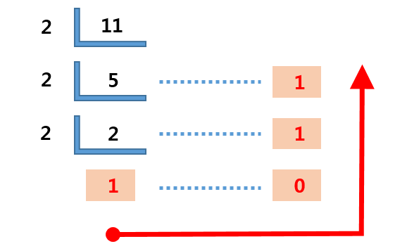
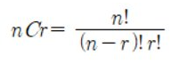
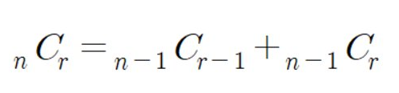

# JAVA_algorithm

인프런 자바 알고리즘 학습 기록을 위한 레포

<details>
<summary>01 String Section</summary>
<div markdown="1">

### 01-01
문자열 안에서 특정 문자 찾는 문제 

```java
c = sc.next().charAt(0); //캐릭터는 이렇게 입력받기
String.toCharArray(); //문자열을 캐릭터의 배열로! 향상된 for문에 유용
Character.toLowerCase(c); //캐릭터를 소문자로 
```
### 01-02
문자열 내에서 대소문자 반전시키는 문제 
```java
//빈문자열에 바꾼걸 하나씩 붙여나간다는 아이디어 떠오르면 굿 
Character.isLowerCase(c);//와 같은 메소드로 대소문자 확인가능
//아스키 코드로도 가능 
//대문자는 아스키코드 65 < c < 90
//소문자는 아스키코드 97 < c < 122
```
### 01-03
입력된 문장 속 가장 길이가 긴 단어 찾는 문제
```java
//최댓값 알고리즘 >> 맥스를 갱신해나가는 방식으로 푼다.
        
//첫번째 방법
        
String[] str_arr = str.split(" "); 


//두번째 방법 indexOf는 못찾으면 -1 반환하기에
        
while(str.indexOf(" ") != -1) {
    //substring 을 통해 잘라나간다.
};
```
### 01-04 
문자열 배열 다 뒤집어서 보여주기
```java
//자바에서 스트링에 대한 연산을 한다면 객체가 수정되는 것이 아니라 새로운 객체가 계속해서 만들어짐
//이런 것 때문에 나온게 String Builder. 여러가지 연산을 제공하며 객체를 마구 만들어내지 않음

String tmp = new StringBuilder(x).reverse().toString();

//좀 더 직접적인 방법도 알아두자
while(lt<rt) {} //요거는 문자의 개수가 홀수건 짝수건 딱 맞게 바꿔줄 수 밖에 없다는점 
String.valueOf(s)//요거는 문자배열을 문자열로 바꿔줄 수 있는 메소드!
```
### 01-05
문자열 배열 다 뒤집어서 보여주기
```java
while(lt<rt) {} //적극활용 둘다 알파벳을 가리킬때 스왑한다. lt와 rt가 따로 움직이도록
Character.isAlphabetic(ch);//요거 통해서 알파벳인지 쉽게 알 수 있다.
//뭐뭐인지 확인하는 is 메소드는 거의 스태틱인듯 --> 생각해보니 그럴 수 밖에
//명확한 구조가 중요하다 설계 잘하고 들어가면 금방 푸는 문제


```
### 01-06
중복된 캐릭터 제거 문제
```java 
indexOf()//요게 없으면 -1을 반환한다는 것을 이용해서
//자기위치와 처음 발견된 indexof의 결과가 다르다? 제거
str.indexOf(str.charAt(i)) == i
```
### 01-07
회문 문자열인지 검사하는 알고리즘 
```java 
//내가 푼거는 reverse 시켜서 String.equals 사용
//강사의 풀이방식은 문자열의 length / 2 로 자르고 반대편과 비교해나가면서
//틀린게 있다면 NO하도록 --> 요게 오버헤드가 더 라이트한듯.. 반성
for (int i = 0; i <= ch_arr.length / 2; i++) {
    if (ch_arr[i] != ch_arr[ch_arr.length - i]) {
        return false;
    }
    continue;
}
```
### 01-08
회문 문자열인지 검사하는 알고리즘 but 특수문자 무시
```java 
//나는 특수문자를 제거한 캐릭터 배열을 새로 만들어 특수문자가 제거된 문자열을 만듬
//강좌에서는 replaceAll과 정규식을 이용했다.
str = str.toUppercase().replaceAll("[^A-Z]", "");// 대문자 A-Z가 아니면 빈문자화 시켜라
//replaceAll은 첫번째 인자를 두번째 인자로 바꾸는 메소드
```
### 01-09
문자열 사이에서 숫자만 추출해서 '자연수로' 만들기
```java 
//정규식 이용해서 숫자가 아닌 것들 제거
//나는 Integer.valueOf()메소드 사용했다. 정규식 꼭 익혀두자
//강좌에서는 문자 0의 아스키 코드값이 48인것을 이용해서 *10을 해나가는 방식 사용
answer = answer * 10 + (x-48);
Character.isDigit(x);// 요거 사용할 수도 있다.
Integer.parseInt(answer);// 파스인트 요거도 정수로 바꿔준다.
```
### 01-10
문자 거리
```java 
/* 내가 푼 방식
    c가 있는 위치 모든 인덱스 뽑아와서 리스트로 nest 변수를 사용했어야 되었음..
    각 문자의 위치와 c와의 거리비교 최솟값 가져와서 출력 요게 루프가 좀 지저분함 c의 모든 인덱스와 비교해야 해서
   
*/

/* 강사의 방식
    오른쪽으로 갔다가 왼쪽으로 한번 더가면서 '갱신' 방식 ㄷㄷ 개깔끔
    str.charAt() 요거 좀 쓰셈 간편함 
*/
    
```
### 01-11
문자열 압축 문제
```java 
/* 별다른 아이디어 없이 설계 잘 하면 되는 문제
    빈문자열에 붙여나가기
    마지막에 dummy space 남겨서 푸는게 강사의 방식 but 다른 방식으로도
    할 수 있으면 노상관 */
    
```
### 01-12
암호 변환 문제
```java 
/*  10진수는 char로 캐스트 하면 바뀐다.
    강사와 나의 커다란 아이디어 차이 없음
    다만 나는 need_decrypt 변수 설정 while문의 조건으로 사용
    강사는 replace로 2진수로 바꿨다. 
    */
    str.substring(0,7).replace('#','1').replace('*','0');
    Integer.parseInt(str,2); // 두번째 인자가 진법
    
```
</div>
</details>

<details>
<summary>02 Array Section</summary>
<div markdown="1">

### 02-01

```java
/*
배열에서 앞의 수보다 크면 출력하는 문제
그냥 탐색 돌면서 전 인덱스와 비교하면 된다 끝.
*/
```
### 02-02
```java
/*
    학생들의 키 리스트가 주어질 떄 보이는 학생의 수를 찾는 문제
    나는 탐색해나가면서 현재 인덱스 시점의 최댓값을 갱신 시켜나감
    또한 처음에 다안보인다고 설정해놓고 순회하면서 이전 인덱스가 이후 인덱스보다 값이 
    더 큰게 있으면 안보이니까 하나씩 더해 나갔음
    강사랑 똑같음.
*/
```
### 02-03
가위바위보 누가 이겼는지 
```java
/*
가위바위보 if else로 나눈다.
 */
```
### 02-04
사이즈 크기만큼의 피보나치 수열 만들기
```java
/*
가위바위보 if else로 나눈다.
 */
```
### 02-05
주어진 숫자 보다 작은 수 중 소수의 개수 구하기
```java
/*
자세히 보자 어려웠다 나는..
첫번째 시도 : 소수는 약수를 1과 자신만을 가지는 수
수가 주어지면 1부터 자기자신까지 루프를 돌며 약수의 개수를 카운팅하는
isPrime 메소드를 생성. 이 함수를 다시 루프에 사용하며 소수의 개수 세는 naive 방식 
-> 시간초과
두번째 시도 : 절반 떼어내기 방법
어차피 1부터 자기자신까지 나머지를 확인하며 약수를 세는 과정에서
절반보다 큰수는 다 자기자신의 약수가 될 수 없으니 루프의 크기를 절반으로 줄인다
-> 시간초과
세번째 시도 : 짝수까지 걸러내기 짝수는 2를 제외하고는 소수가 될 수 없다.
짝수는 조건문으로 거른다 
-> 시간초과 
결국 2부터 배수들을 지워나간다.
작은 소수의 배수들부터 지워나가면 찐 소수만 남는다. 왜? 자기보다 작은 소수의 배수를 지웠는데 
소수로 남아있다는 것은 자기보다 작은 수가 자신의 약수가 되지 않았다는 뜻       
 */
```
### 02-06
주어진 숫자 뒤집은 숫자가 prime인지 확인하기
```java
/*
뒤집는 방식은 StringBuilder.reverse 쓰든가 아니면 while(lt<rt) 쓰든가
둘 중 하나 골라서 사용하자 나는 두가지 다 실습 해봄
isPrime은 간단하게 구현해도 좋다
 */
public static boolean isPrime(int num) {
        if (num == 0 || num == 1) {
        return false;
        }
        if (num ==2 ) {
        return true;
        }
        for(int i =2;i<num; i++){
            if(num%i==0){
            return false;
            }
        }
        
        return true;
}
//손코딩으로 풀라고 하면 숫자를 어떻게 뒤집어야 할까?
public static int reverseInt(int num) {
    int tmp = num;
    int res = 0;
    while(tmp>0) {
        res = res*10 + tmp%10;
        tmp = tmp/10;
    }
    return res;
}
```
### 02-07
ox문제 가중치를 포함한 학생의 점수 계산하지
```java
/*
연속득점에 점수 가중치가 있는 문제 생각한대로 어렵지 않게 풀면된다

 */
```
### 02-08
학생 등수 계산하기 .. 난 왜 이게 어렵지
```java
/*
내가 푼방식 : 임시 배열에 점수리스트 정렬하고 원래 배열의 원소가
정렬된 배열에서 인덱스 번호가 몇번인지로 찾았음
버블소트 직접 구현했고 <-- 여기서 시간 오래걸림
오름차순 정렬을 다시 한번 뒤집었다.

강사의 방식 : 간단 이중포문 돌면 끝 자기보다 큰애들이 발견될때마다 등수 하나씩
높인다.

 */

```
### 02-09
격자판의 sum 중 가장 큰 sum 구하기
```java
/*
sum의 종류는 3가지 모두 구해서 최대를 찾는다 끝

 */
```


### 02-10
2차원 배열에서 봉우리 개수 구하기
```java
/*
2차원 배열 선언하고 조건문 잘세우면 끝
조건문 잘세우면 아닐 때 quit 하게 할 수도 있다.
*/
```

### 02-11
임시반장 정하기 은근 쉬운데?
```java
int[][] arr = new int[5][5]; //이런게 있다고 칠 때  
arr[0]; // 이거는 하나의 배열을 말한다.
//이거 이용 1번학생의 몇반이었는지 배열과 다른 학생들의 몇반이었는지의 배열을
//everSame메소드에 전달해서 카운트하는 방식으로 풀었다.
//1부터 사용할거면 그냥 넉넉히 만들자

```
### 02-12
멘토링 가능한 경우의 수
```java
//학생들의 모든 경우의 수를 돌며 멘토링이 가능한지 여부 메소드로 확인
int count = 0;
for (int i = 1; i<=num_of_student; i ++) { //i -> mento
    for (int j = 1; j<=num_of_student; j++) { //j -> menti
        if( i==j) continue;
        if(ableToTeach(i,j,test_res)) count++;
    }
}

```
</div>
</details>

<details>
<summary>03 Two pointers, Sliding window </summary>
<div markdown="1">

### 03-01
두개의 배열 합병 과정에서 투포인터 사용해서 정렬하기
```java
//두개의 배열에서 lt를 하나씩
//farr[f_lt] 와 sarr[s_lt] 비교 
//while문 사용하자 딱봐도 사용하라고 만든 문제
```

### 03-02
공통원소 구하기
```java
//한쪽 배열 고정하고 contains 함수 쓰니까 시간 초과 나오네.. 더 효율적인 방법 필요
//퀵소트 쓰고 투포인터쓰니까 정답이 나왔다.
//간단한 정렬은 컬렉션 프레임워크로 Array.sort(a); 이런시긍로 사용하면 된다.
//아래는 퀵소트
//강사는 포인터중 아무쪽이나 한쪽이 끝나면 공통원소가 없다고 했는데 그렇지 않을 텐데?

private static void quickSort(int[] arr,int start, int end) {
        int part=partition(arr,start,end);
        if(start<part-1) quickSort(arr,start,part-1);
        if(end>part) quickSort(arr,part,end);
        }

private static int partition(int[] arr,int start,int end) {
        int pivot=arr[(start+end)/2];
        while(start<=end) {
        while(arr[start]<pivot) start++;
        while(arr[end]>pivot) end--;
        if(start<=end) {
        swap(arr,start,end);
        start++;
        end--;
        }
        }
        return start;
        }

private static void swap(int[] arr,int start,int end) {
        int tmp=arr[start];
        arr[start]=arr[end];
        arr[end]=tmp;
        return;
        }
```
### 03-03
주어진 윈도우 범위내에서 최대 매출 찾기
```java
//이중 포문 사용해서 모두 비교했더니 타임 리밋 ??
// 근데 어차피 다 비교해야 하는거 이중포문 안돌고 풀 수가 있나..??
// 반복문 중첩 없앨 수 있다 -1번째를 빼고 window + 1번째를 더함으로써 .. 코드 참조
```
### 03-04
연속 부분 수열
```java
//부분 수열의 시작이 어디냐로 케이스 분류 이중 포문 돌렸다.
//즉 내가 푼 방식이 O(n^2)으로 푼것인 듯 
//주어진 N제한에서 이정도만 해도 굉장히 부담
//이중포문에서 발생하는 시간복잡도를 O(n)으로 줄이기 위해 존재하는 것이
//투포인터와 슬라이딩 윈도우라는 것을 기억하자
//근데 강사도 이중 포문 쓰는데????
//여튼 투포인터는 rt가 앞으로가고 lt가 쫓아가는 느낌
```
### 03-05
연속 부분 수열
```java
//이것도 시작이 어디냐로 케이스 분류 했다. 연속된 두 수 이상의 합이기 때문에 
//입력된 숫자 크기만큼 루프를 돌 필요 없이 절반까지만 돈다.
//결국 lt rt가 시작지점에따른 부분수열 합이다.

```
### 03-06
연속 부분 수열 어려웠던 문제...
```java

//그리디 알고리즘 이용했음 -> 근데 오답이긴 함
//0의 위치중에서 왼쪽과 오른쪽 도합 연속된 1이 가장 많은쪽이 바꾸기 좋은 후보 1순위로 선정
//후보 1순위의 0을 1로 바꾼다.
//이과정을 찬스만큼 반복 결국 배열이 완성되고 1의 길이가 얼마나 긴지 받아와서 출력한다. 근데 ..... 오답 .... 모든 경우의 수를 다비교하기에는 찬스가 커지면 루프가 얼마나 도는 거야... 

```
투포인터 개약하니까 다시한번 보자
</div>
</details>


<details>
<summary>04 HashMap, Tree, Set </summary>
<div markdown="1">

### 04-01
해쉬맵을 이용한 학급회장 구하기
```java
map.get(key); // key값에 해당하는 value를 가져온다
map.getOrDefault(key,0) // key값이 맵에 없다면 0을리턴해라
for (char x : map.keySet()) {
    System.out.println(x + map.get(x))
    //이런식으로 모든 키를 찾아볼 수 있따.
}
map.containsKey(key) // 불타입 리턴 있는지 없는지
map.size // 들어있는 개수
map.remove(key) // key를 삭제함과 동시에 그 키가 가지고 있는 value를 팝한다

```
### 04-02
두 문자열이 아나그램인지 판별하기
```java
//나는 해쉬맵 두개 만들어서 둘이 비교했다.
//강사는 해쉬맵 하나만 만들고 두번째 문자열을 처리하는 과정에서는
//해쉬맵의 값을 감소시켜나감 완벽이 0들이 나오면 아나그램

```
### 04-03
매출액의 종류
```java
//이중포문 시도 -> 시간초과
//윈도우 고정이고 첫번째 것 빼고 두번째 것 더하기만 하면 되니까
//1차 반복으로 줄일 수 있다. 

```

### 04-04
부분수열에 대한 모든 아나그램
```java
//더 작은 문자열인 두번째 문자열의 맵을 목적맵으로, 첫번째 배열에서 루프를 돌며 윈도우를 잘라온 것을 그냥 맵으로 설정
//루프마다 isSameMap() 메소드 활용 같은지 확인한다.
    public static boolean isSameMap(Map<Character,Integer> map, Map<Character,Integer> obj_map) {
        for (char key : obj_map.keySet()) {
        if (!map.containsKey(key)) return false;
        if (map.get(key) != obj_map.get(key)) return false;
        }
        return true;
    }
//슬라이딩 윈도우 고정이면 2중포문 아닌 하나의 반복문으로 가능하다는 것 이거 익숙해지자.
//맵 하나만 쓰고 하는 것도 해봤는데 걍 두개로 하는게 가독성도 좋지 않은가 싶다.

        return map.equals(obj_map);
//맵이 같은지 따질 때 요로코롬 따져도 됨


```

### 04-05
K번째 큰 수 
```java

//제일 큰 수 하나씩 고르는 그리디가 안먹힌다.. 그리디는 언제 써야한다는 기준이 있을려나..?
//맘편하게 모든 것 중에서 따자 3중 포문으로 해결했다. -> 정답
//Set중 TreeSet을 사용하면 중복도 제거하고 정렬도 된다. RedBlackTree
//TreeMap도 마찬가지로 정렬시켜줌 트리맵으로 Tree 붙으면 정렬 시켜주는듯
TreeSet<Integer> Tset = new TreeSet<>(Collections.reverseOrder)); // 내림차순 디폴트는 오름차순 
Tset.first();// 첫번째에 있는 값 오름차순으로 되어 있냐 반대냐에 따라 다른 값 나옴
Tset.last();// 마지막에 있는 값 마찬가지        
//3중 포문 꿀팁
for (int i = 0; i<n; i++) {
    for (int j = 0; j<n; j++) {
        for (int l =0; l<n; l++) {
        }
    }
}
//이렇게 반복 조건을 모두 n보다 작도록 설정해도 상관없다 
//어차피 걸리게 되어있음

```
</div>
</details>

<details>
<summary>05 Stack Queue </summary>
<div markdown="1">

### 05-01
올바른 괄호

닫는 괄호의 짝은 스택의 제일 상단이다. 
```java
/*
 '(' 가 들어오면 스택에 넣는다.
 ')' 가 들어오면 스택에서 팝한다 팝했을 때 있으면 괄호하나 닫힌것
        없으면 괄호 오류 
 루프 끝내고 왔을 때 스택의 사이즈가 0이면 올바른 괄호 구성
 스택에 남아있는게 있다면 닫히지 못한 괄호가 있음을 의미 
 */

//여러 메소드
stack.push();
stack.pop();
stack.isEmpty(); //boolean 반환

```

### 05-02
괄호 속 문자 제거

```java
/*
 '(' 가 들어오면 스택에 넣는다.
 ')' 가 들어오면 스택에서 팝한다 괄호하나 닫힌 것 
 다른 문자가 들어왔을 때 스택에 남아있는게 있다면 아직 괄호 속임을 의미 continue;
 스택에 남은 것이 없다면 괄호 밖임을 의미 
 */

//즉 나는 괄호 속인지 밖인지만 판별함
//강사는 모든 char를 스택에 때려 넣고 닫는 괄호를 만나면 여는 괄호를 만날 때 까지 팝

//스택에 남아있는 거 출력 해보고 싶으면? pop 할 수도 있지만
//애초에 스택도 배열이라 반복문으로 인덱스 접근이 가능하다

for (int i = 0; i<stack.size(); i++) {
    System.out.print(stack.get(i) + " ");
}
```

### 05-03
인형 뽑고 바구니에 담기

```java
//초기 설계가 중요하다고 느낀 또하나의 문제 
//다시 풀어 볼 때에는 슈도 코드 써보고 풀어보자
//여러가지 조건 명심하고 들어가야함
//메소드 잘 나누자 나눠놓으면 편함
//컴과아닌 사람이 1부터 막 써놓는데 더미 스페이스 만들던지 하자 

/*
 나는 2차원 배열에서 어디서 뽑을지 선택되면 종으로 0이 아닌 숫자를 만날 때 까지 내려가도록 했음
 0이 아닌 숫자 만나면 res 스택에다가 집어넣는데 이전 것과 비교 같은게 있으면 사라진게 두개 카운트 하도록 했음 이렇게 바로바로 일어나줘야 함
 처음에는 몽땅쓰고 지워나가다가 없어져서 없어지는 것을 체크 못했음 문제 이해나 파악의 중요성을 강조하는 문제 다시 풀어보자 나중에
 어렵지는 않음 다만 설계 명확히 해서 한번에 처리할 수 있는 애들 조건문마다 반복하지 말자
 */

stack.peek(); //스택의 상단 값을 꺼내보기만 한다.
board.length(); //이거는 2차원 배열의 행크기
board[0].length();//이거는 열크기
```

### 05-04
후위 연산 계산기 만들기

```java
// 캐릭터를 숫자로 바꾸는 부분과 후위 연산의 로직만 이해해놓자 
// 어렵지 않은 문제

//캐릭터를 문자로 바꿀때 계속 아스키 값이 넘어가는데 강사는 아스키넘버를 빼는 것을 선택

```

### 05-05
쇠막대 절단기

```java
// 스택 이용해서 처리할 것임 스택에 막대들을 넣어놓는다
// ()가 같이 나올 때 스택에 들어있는 막대가 몇개인지 세자 3개라면 자르면 6개가 된다.
// but!!!
// 막대 하나가 끝났다 그다음에 자른다면? 조각은 곱하기 2개가 되는 것이 아니라 하나만 추가됨
// 그말인 즉슨 처음자르는 것인지 두번째 이상으로 자르는 것인지 판별 필요 변수하나 추가해서 해결

// 강사걸 보니까 사실 처음 자르는 건지 나중에 자르는건지 체크할 필요가 없음
// 하나씩 더하다가 막대가 끝나면 하나를 더 더해주면됨 .. 요런건 뭐 .. 
// 어차피 닫는 괄호나왔을 때 스택에 있는 여는괄호와 짝궁으로 사라져야됨 .. 생각해내면 좋은데 나처럼 다집어넣는 것보다 내가 했던 것 처럼 하는 게 좋았음

```

### 05-06
누가 공주를 구할까

```java
// 배열 만들어서 해결.. 끝 특별하지 않은 쉬운 문제

// but 강사왈 큐를 사용하는 문제!?
// 큐의 사이즈가 1이 될 때 까지 머리에서 빼고 꽁지에서 넣는다.
Queue<Integer> Q = new LinkedList<>(); // 큐선언은 이렇게
Q.offer(x); // x를 큐에 넣는다. enqueue
Q.poll(); // 나와야 될 것을 꺼낸다. dequeue
Q.peek(); // 꺼내지 않고 젤 앞에 있는 거 확인 한다. 나와야 될 지점에서
Q.size();
Q.contains(x); // 불타입 리턴 

```

### 05-07
순서가 유지되는가? 교육과정 설계

```java
// 큐를 써야 되는지 잘 모르겠음 ..
// 짜여진 스케줄 반복문으로 읽으면서 must에 있는 것이라면
// 가져와야되는 순서의 must를 가져왔는지 체크 
// 모두 돈 다음에는 must를 몽땅썻는지 확인 
// try catch 까지 사용하면서 조금 조잡하게 푼듯한 느낌..?
  
// 강사도 따지는 방식은 나랑 같은데 MustQueue를 만든거야 그냥 ..

```

### 05-08
응급실 m번째 환자는 몇번째로 진료를 받을까

```java
// 큐에다가 넣고 한명씩 꺼내는데 큐의 맥스값 구해서 더 위독한 환자가 있다면 걍 뒤로 밀어 넣는다.
// m번째의 환자 값 추적할 수 있도록 m_tracer넣음 
// m번쨰 환자의 위치를 m_tracer로 기억해 놨다가 m번째 환자가 진료받을 때의 카운트가 정답

//강사는 Queue에 넣을 것을 객체로써 만듬
public Person() {
    // .....
}
//이렇게 하면 아이디 관리도 편하고 현재 치료받는 사람이 2번 아이디인지 확인하기 훨씬 쉽네
//tracer 고집하지 말자 요거 머리아픔 더 쉽게 객체로 관리하자
```

</div>
</details>


<details>
<summary>06 Sorting Searching </summary>
<div markdown="1">

### 06-01 
선택정렬 
```java
// 1. 최솟값을 찾는다. 
// 2. 최솟값과 0번째 인덱스 교환
// 3. 0번째를 제외한 나머지에서 최솟값을 찾는다.
// 4. 최솟값을 1번째 인덱스와 교환 

```


### 06-02
버블 정렬
```java
//i for 문의 의미와 j for문의 의미 잘 기억해두자 헷갈린다.
// i for 문에서 i번째 루프를 돌고 있다는 것은? -> 오른쪽에서 i번쨰 까지 정렬이 완료
// j for 문은 오른쪽에서 i번째 까지 정렬이 완료 되었으니 그전까지만 버블 비교

for (int i = 0; i<arr.length; i++) {
        for (int j = 0; j<arr.length-i-1; j++) {
            if (arr[j] > arr[j+1]) {
            swap(arr,j,j+1);
            }
        }
}
```

### 06-03
삽입 정렬
```java
//2번째 원소부터 시작하여 현재보고 있는 인덱스보다 왼쪽을 정렬시켜나간다는 개념
//현재 보고 있는 인덱스보다 왼쪽을 살펴보며 자기가 들어갈 위치에 삽입 나머지는 한칸씩 밀어낸다.
//개인적으로 어려웠던 알고리즘 gg 침.. 다시 철저히 공부하자
//j를 밖에다 써야하는 이유는 곰곰히 생각해봤는데 저 조건에 걸리지 않고 j루프가 다끝날때까지 조건에 해당되지 않는 경우가 있기 때문일 것 같음

public static void insertionSort(int[] arr) {
    for (int i = 1; i<arr.length; i++) {
        int tmp = arr[i],j;
        for (j = i-1; j>=0; j--) {
            if (arr[j] < tmp) {
                break;
            }
            else {
                arr[j+1] = arr[j];
            }
        }
        arr[j+1] = tmp;
    }
}
```


### 06-04
LRU를 거치고 캐쉬의 stat 찍기
```java
//삽입정렬에서 사용되었던 배열 미루기 기술 기억하자! 
//옮겨야 하는 애를 템프로 두고 쭉쭉 미루고 tmp에 담긴애는 0번째 인덱스로! 
//hit와 miss를 if else로 구분!

//ArrayList에서 list.set(2,5)이런식으로 하면 알아서 밀어준다!? 몰랐음 요거 이용하면 쉽게 풀 수 있지만 알고리즘 자체에 집중하기 위해서 손코딩 해라 
```

### 06-05
중복확인
```java
//해쉬맵을 사용하니까 시간초과 단박에 해결!?
//어쨋든 O(n)으로 바꾸는 게 중요 set으로 받은 다음에 size를 재봐서 원래 개수인지 비교하는 방식도 가능할 듯 
//근데 신기하긴 하네 해쉬맵도 결국에는 key가 있는지 없는지 확인해야 할텐데 우째서 빠를까

//정렬로도 풀수 있다는 걸 보여주기 위한 문제 
//정렬하고 이웃한 숫자와 같은게 있는지 확인 
Arrays.sort(arr); // 배열 정렬해준다. 오름차순

```

### 06-06
장난꾸러기 속인 애들을 찾아라
```java
//문제 진짜 맘에 안듬
//여튼 어거지로 풀기는 함 첫번째 속이는 아이는 반드시 등장하게 되어있음 
//두번째 속이는 아이는 찾을 수도 못찾을 수도 있음 count한다.
//속이는 아이가 두명 모두 발견되었다면 상황 종료
//속이는 아이가 한명만 발견되었다면 나머지는 오름차순을 어기지 않고 서있음 적절히 찾아주어야 함

//강사왈 정렬을 하면 쉽게 풀린다?
//arr을 깊은 복사한 tmp배열 만든다.
//tmp는 정렬하고 arr[i]와 tmp[i]를 비교 다르다면 속인놈
int tmp = arr.clone(); //깊은 복사 하는 방법
```

### 06-07
좌표 정렬
```java
// 클래스 하나 만들자 Coord
// 시간초과가 무서웠지만 제일 간단한 선택정렬 사용했다. (최솟값을 찾아 왼쪽부터 정렬)
// 조건하나만 x값 같을 때 추가했을 뿐 

//강사 코드
class Point implements Comparable<Point> { //Comparable은 인터페이스
    
    public int x,y;
    Point(int x, int y) {
        this.x = x;
        this.y = y;
    }
    
    @Override
    public int compareTo(Point o) {
        if (this.x == o.x) return this.y - o.y;
        else this.x - o.x;
    }
}
//이후 Collections.sort(arr);
```

### 06-08
이분 탐색 Binary Search
```java
//난 재귀로 풀었당 

//재귀가 아닌 방법

while(lt<=rt) {
    int mid = (lt + rt)/2;
    if (arr[mid] == num) return mid;
    else if (arr[mid] > num) rt = mid -1;
    else lt = mid + 1;
}

```

### 06-09
뮤직비디오 결정 알고리즘
- 결정 알고리즘 : 좁혀 나가서 최고의 답을 찾는다.

우리가 생각하는 범위내에 답이 반드시 있다. -> 결정 알고리즘 

우리가 생각하는 범위가 lt 부터 rt라면 이제 이분검색 해나가면서 답이 될 수 있는 것들을 찾는 것 
답이 될 수 있는 것을 하나 찾았으면 그것 보다 적은 숫자 중에서 또 찾는다.
답이 될 수 없다면 큰쪽에서 찾는다.
```java

//* 1. 용량을 전체 길이 나누기 dvd개수로 설정해두고 가능한지 확인 (이게 최소로 가능한 시나리오)
//* 2. 가능한지 확인은 차근차근 담으면서 용량 초과하면 다음 dvd로 넘기기 dvd를 다썻는데 인덱스가 남아있다면 실패
//* 3. 가능하지 않다면 용량 1만큼 늘리기

```

### 06-10
마굿간 결정 알고리즘

```java

// 답의 범위
lt = stall_loc[1] - stall_loc[0];
rt = stall_loc[num_of_stall - 1] - stall_loc[0];

//배치할 수 있는 말의 마리수 카운트
    public static int count(int[] arr, int dist) {
        int cnt = 1; //배치한 말의 마리수
        int ep = arr[0]; //왜???
        for(int i=1; i<arr.length; i++) {
            if(arr[i]-ep >= dist) {
                cnt++;
                ep = arr[i];
            }
        }
        return cnt;
    }

//왜 첫번째에 배치???
//그리고 미드 값이 유효한지 안한지 모르는데 뭘믿고 나감???
```

</div>
</details>

<details>
<summary>07 Recursive </summary>
<div markdown="1">

### 07-01 
재귀 이용해서 숫자 출력하기
```java
//종료 조건을 잘 설정해야 한다! if else로 구분하는 것이 제일 좋음

public static void printAll(int num) {

        if (num == 0) {
            return;
        }
        printAll(num-1); //아랫문장과의 위치로 인해서 전혀 다른 결과가 나온다!!!
        System.out.print(start+" ");

}
```

- 스택 프레임

스택프레임 안에는 매개변수 정보와 지역변수정보, 그리고 함수가 끝났을 때 복귀주소가 들어있다.

### 07-02
재귀 이용해서 10진수 2진수로 변환하기
- 이진수로 변환하는 방법




```java
public static void convertToBinaryNum(int num) {

        int q = num/2;
        int r = num%2;
        if (q<=1) {
            System.out.print(q + "" + r);
            return;
        }
        else {
            convertToBinaryNum(q);
            System.out.print(r);
        }
}

```

### 07-03
팩토리얼 구하기 - 재귀
```java
public static int getFactorial(int num) {

        if (num == 1) {
            return 1;
        }
        else {
            return num * getFactorial(num-1);
        }
}

```

### 07-04
피보나치 수열 구하기 - 재귀
```java
private static int getFib(int num) {

        if (num == 1 || num == 2) return 1;
        else return getFib(num - 1) + getFib(num - 2);
}

```
메모이제이션은? 구한 걸 배열에 넣어놓는다 재귀로만 풀면 같은걸 정말 여러번 구함 스택프레임도 엄청 쌓임 

### 07-05
깊이 우선 탐색 - 전위 순회, 중위 순회, 후위 순회
- 깊이 우선 탐색 : alike 미로 길 찾을 때 갈 수 있을 만큼 가고 막히면 백트래킹, 재귀의 형식을 가짐
- 전위 순회 : 부 왼 오
- 중위 순회 : 왼 부 오
- 후위 순회 : 왼 오 부
- 부모가 기준 

### 07-06
모든 부분 집합 DFS로 구하기
- 지금 내가 보고 있는 숫자를 쓴다 안쓴다로 나누고 그 다음 숫자 쓴다 안쓴다로 나누고 ......
- 이걸 반복 끝까지 가면 백트래킹 하면서 자연스럽게 모든 경우의 수를 커버하게 된다.

### 07-07
- BFS 레벨 탐색
- root - 0레벨
- 아래 - 1레벨
- ...
BFS는 Queue를 이용한다. 레벨당 탐색하기 위해 level 변수 필요.
```java
public void BFS(Node root) {

        Queue<Node> Q = new LinkedList<>();
        Q.offer(root);
        int level = 0;

        while (!Q.isEmpty()) {
            int len = Q.size();
            System.out.print(level + " : ");
            for (int i = 0; i < len; i++) {
                Node cur = Q.poll();
                System.out.print(cur.data + " ");
                if (cur.lt != null) {
                    Q.add(cur.lt);
                }
                if (cur.rt != null) {
                    Q.add(cur.rt);
                }
            }
            level++;
            System.out.println();

        }
}

```

### 07-08 
송아지 찾기 by BFS
- 레벨 = JumpCount로 생각해서 레벨이 1이라면 1번의 점프만에 갈 수 있는 곳으로 판단한다. 요 idea가 핵심
- 자식 노드들은 자신이 뛸 수 있는 경우의 수인 3가지 -1, 1, 5 를 더한 것 이걸로 모든 경우를 커버한다.
- 다만 방문했던 곳은 재방문한다면 이거는 원래 방문한 것보다 점프의 수가 클 수 밖에 없음으로 재외 
- 별도의 배열을 따로 두어 방문했던 곳은 패스한다. 
- BFS를 Q가 빌때까지 계속돈다. 
- 우리가 방문하고자 하는 위치가 나온다면 해당 레벨을 출력하면 답이된다. 

### 07-09 
루트노드에서 가장 가까운 리프노드 찾기
```java 
    public int DFS(int level, Node1 root) {

        if (root.lt == null && root.rt == null) {
            return level;
        }
        else {
            return Math.min(DFS(level + 1, root.lt),DFS(level + 1, root.rt));

        }
    }
```

### 07-10
루트노드에서 가장 가까운 리프노드 찾기 (BFS)
```java
public int BFS(Node1 root) {

        Queue<Node1> Q = new LinkedList<>();
        int level1 = 0;
        Q.add(root);
        //System.out.println("Q.size() = " + Q.size());

        while(!Q.isEmpty()) {

            int len = Q.size();
            for (int i = 0; i < len; i++) {
                Node1 cur = Q.poll();
                //System.out.println("cur.data = " + cur.data);
                //System.out.println("level = " + level1);
                if (cur.lt == null && cur.rt == null) {
                    return level1;
                }
                Q.add(cur.lt);
                Q.add(cur.rt);

            }
            //System.out.println("loopdone");
            level1 = level1+1;
        }

        return -999;

}
// 참고 len으로 안하면 루프 적절하게 끝나지 않음
```

### 07-11
- 그래프와 인접 행렬
- graph[a][b] = 1 a에서 b로 

### 07-12 
경로 탐색
- DFS는 사실상 모든 경우의 수에 대한 가지 뻗기

```java
    public static void DFS(int start) {
        if (start == 5) {
        count++;
        }

        else {
            for (int i = 1; i < arr.length; i++) {
            if (arr[start][i] == 1 && visited[i] == false) {
                visited[i] = true;
                DFS(i);
                visited[i] = false; //원복
                }
            } 
        }

    }
```

### 07-13
경로 탐색 by 인접 리스트
- sparse한 그래프인데다가 vertex가 엄청 많다? 인접 행렬은 굉장히 부담 -> 인접 리스트가 좋다
- 자바에서 인접 리스트는 ArrayList의 중첩으로 사용 가능하다 각 인덱스가 배열이 되는 어레이 리스트를 만드는 것
- 각 인덱스의 배열은 초기화가 필요하다 아래의 코드에서 확인
```java
    public static ArrayList<ArrayList<Integer>> graph;

public static void main(String[]args){
        graph = new ArrayList<>();
        for (int i = 0; i < v_num + 1; i++) {
        graph.add(new ArrayList<>());
        }
}


```

### 07-14
그래프 최단거리
- 나는 인접행렬로 만들고 각 버텍스로 갈 때의 레벨을 기록하는 배열을 만들어서 풀었음
- 강사는 인접리스트로 풀고 내가 출발하는 지점의 거리에 +1을 함으로써 최단 거리 구함

</div>
</details>

<details>
<summary>08 DFS BFS </summary>
<div markdown="1">

### 08-01
- 주어진 집합에서 합이 같은 부분집합 둘이 존재하는 지 찾는 문제
- 굉장히 빨리 풀었는데 머릿속에 남아있는 이 찝찝함..
- 스택 프레임과 상태트리를 머릿속으로 곱씹으며 알고리즘을 검토하자
```java
    public static void dfs(int index) {
        //System.out.println("EqualSumSubset.dfs index : " + index);
        if (index == size) {
            int sum_subset1 = 0;
            int sum_subset2 = 0;
            for (int i = 0; i < size; i++) {
                if (used[i]) {
                    sum_subset1 += set[i];
                } else {
                    sum_subset2 += set[i];
                }
            }
            if (sum_subset2 == sum_subset1) {
                isSumEqualSubsetExist = true;

            }
        }
        else {
            used[index] = true; //사용한다
            dfs(index + 1);
            used[index] = false; //사용하지 않는다 
            dfs(index + 1);

        }
    }
```

- 강사의 성능을 높이는 아이디어
  - 플래그 설정해서 두개의 부분집합이 같을 수 있음을 확인하면 이후의 DFS는 쭉쭉 패스하도록 설계
  - 지금까지 더한 합이 총 집합을 더한 것 나누기 2 보다 크다면 그것은 양분될 수 없는 부분집합을 보고 있는 것 과감히 끝낸다.
  
### 08-02
- 제한된 무게가 있을 때 최대로 차에 탑승시킬 수 있는 무게는?
- 부분집합 문제와 똑같은 논리로 해결 가능
- 태운다 안태운다를 나누어서 모든 경우를 DFS로 확인하면 끝

```java
    public static void dfs(int index) {
        if (index == dog_num) {
            int sum = 0;
            for (int i = 0; i < dog_num; i++) {
                if (on_board[i]) {
                    sum += weight_arr[i];
                }
            }
            if (sum > max_weight && sum < lim) {
                max_weight = sum;
            }
        }
        else {
            on_board[index] = true;
            dfs(index + 1);
            on_board[index] = false;
            dfs(index + 1);

        }
    }
```


### 08-03
- 결국 이것도 푸냐 안푸냐 정하는 문제 
- 문제를 인덱스로 구분
- 해당 문제를 풀었을 때 소요되는 시간은 time[i]
- 해당 문제를 풀었을 때 얻게 되는 점수는 score[i]
- 원래 해쉬맵으로 풀려했는데 해쉬맵은 인덱스 접근이 까다로운듯..?
- 그래서 time score 배열을 따로 만들어서 해결했다.
```java
    public static void dfs(int index, int s_sum, int time_used) {
        if (time_used > lim) { //shortcut
            return;
        }
        if (index == p_num) {
            if (s_sum > max) {
                max = s_sum;
            }

        }
        else {

            dfs(index+1,s_sum+score[index],time_used+time[index]);
            dfs(index + 1, s_sum, time_used);
        }
    }
```
### 08-04
- 중복 순열 
- 2갈래로 뻗어나가는 것이 아니라 여러 갈래로 dfs가 돌아간 다는 것이 이전 문제와의 차이점
- 어쨋든 핵심은 같다. 모든 뿌리, 모든 경우의 수로 뻗어나가는 DFS
```java
    public static void dfs(String answer, int choiced) {

        if (choiced == haveto_choice) {
            /*for (int i = 1; i <= N; i++) {
                if (checked[i]>0) {
                    for (int j = 0; j < checked[i]; j++) {
                        System.out.print(i + " ");
                    }

                }
            }*/
        System.out.println(answer);

        }
        else {
            for (int i = 1; i < checked.length; i++) {
                checked[i]++;
                dfs(answer+i+" ",choiced + 1);
                checked[i]--;
            }
        }
    } 
```
### 08-05
- 거스름돈 가장 작은 수의 동전으로 거스르기 
- DFS 이용 ... 동전 종류가 3개라면 각각을 사용하는 경우로 DFS 아래로 뻗게하기 
- 시간초과!? _마지막 케이스는 3초가 넘게 걸리네
- 그러면 순수 수학으로.. 몫과 나머지 이용한 그리디_ 알고리즘 적용..?
- 오답! Greedy알고리즘으로는 3번째 케이스에 대해서 해결할 수 없음 
- DFS를 이용하면서 shortcut을 극대화 시켜야 하는데 .. 
- 작은 것들을 먼저 넣으면서 아래로 뻗치게 하는 것이 아니라 큰 것들 먼저 넣으면서 뻗치게 하면 조건을 잘타게 해서 몇번의 호출 없이 가능하게 할 수 있다! 

```java 
  public static void dfs(int remain) {
        if (count > min || remain < 0) {
            return;
        }

        else if (remain == 0) {
            if (count < min) {
                min = count;
            }
        }
        else {
            for (int i = type_arr.length-1; i>=0; i--) { //아하 알겠다!!
                count++;
                dfs(remain - type_arr[i]);
                count--;
            }

        }
    }
```

### 08-06
- 순열 (Permutation)
- 머없는데? 2갈래 아닌 DFS 쭉쭉 뻗어나가게 하고 중복으로 뽑으면 안됨으로
- 사용했는지 체크할 수 있는 불타입 배열 하나 만들자 
```java
    public static void dfs(int choice_count, String answer) {
        if (choice_count == need_to_choice) {
            System.out.println(answer);
        }
        else {
            for (int i = 0; i < arr.length; i++) {
                if (!used[i]) {
                used[i] = true;
                dfs(choice_count + 1, answer + " " + arr[i]);
                used[i] = false;
                }
            }
        }
    } 
```

### 08-07
- 조합 경우의 수 재귀로 구하기




```java
public static int getCombination(int n, int r) {
        if (n == r ) {
            return 1;
        } else if (n - r == 1 || r==1) {
            return n;
        } else {
            //System.out.println("n = " + n);
            //System.out.println("r = " + r);
            return getCombination(n - 1, r - 1) + getCombination(n - 1, r);
        }
    }
```
- 성능 개선시킬수 있는 방법은? 
  - nCr의 여러 공식을 이용한 숏컷 생성하기
  - 메모이제이션 2차원 배열로 만들어서 쓰면 됨

### 08-08
- 파스칼 최상위 숫자를 보고 맨 아래 계층 숫자 마추기
- 모든 가능한 경우의 수를 답이 가능한지 일일히 체크
- 제일 먼저 발견한 답이 사전 순 제일 우선인 답임 success 플래그 사용 
```java
public static void dfs(int choiced,ArrayList<Integer> maybe_answer) {
        if (choiced == N) {
            //System.out.println("maybe_answer = " + maybe_answer);
            if (isValidAnswer(maybe_answer)) {
                succesed = true;
                //System.out.println("PascalInfer.dfs");
                for (int num : maybe_answer) {
                    System.out.print(num + " ");
                }
            }
        }
        else {
            if (succesed) {
                return;
            }
            for (int i = 1; i <= N; i++) {
                if (permutation_check[i]) {
                    continue;
                }
            else {
                permutation_check[i] = true;
                maybe_answer.add(i);
                dfs(choiced + 1, maybe_answer);
                maybe_answer.remove((Integer) i);
                permutation_check[i] = false;
                }
            }
        }
} 
```

### 08-09
- 조합 DFS로 구하기 
```java
private static void dfs(int index,int left_choice) {
        if (index == N) {
            if (left_choice == 0) {
                for (int i = 0; i < checked.length; i++) {
                    if (checked[i]) {
                        System.out.print(i);
                    }
                }
                System.out.println();
                count++;
            }
            else {
                return;
            }
        }
        else if (left_choice == 0) {
            for (int i = 0; i < checked.length; i++) {
                if (checked[i]) {
                    System.out.print(i);
                }
            }
            System.out.println();
            count++;
        }
        else {

            checked[index] = true;
            dfs(index+1,left_choice-1);
            checked[index] = false;
            dfs(index+1,left_choice);


        }


    }
```

### 08-10
- 미로 탈출 경우의 수 세기
```java
    public static void dfs(int i,int j) {
        if (i == 6 && j == 6) {
            count++;
        }

        else {
            if(isableToGo(i-1,j)) { //상
                visited[i-1][j] = true;
                dfs(i-1, j);
                visited[i-1][j] = false;
            }
            if(isableToGo(i+1,j)) { //하
                visited[i+1][j] = true;
                dfs(i+1, j);
                visited[i+1][j] = false;
            }
            if(isableToGo(i,j-1)) { //좌
                visited[i][j-1] = true;
                dfs(i, j-1);
                visited[i][j-1] = false;
            }
            if(isableToGo(i,j+1)) { //우
                visited[i][j+1] = true;
                dfs(i, j+ 1);
                visited[i][j+1] = false;
            }

        }
    } 
```

</div>
</details>


<details>
<summary>09 </summary>
<div markdown="1">


</div>
</details>