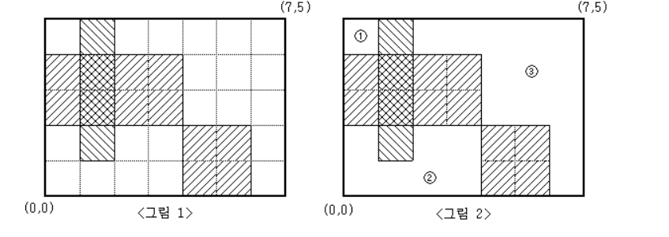
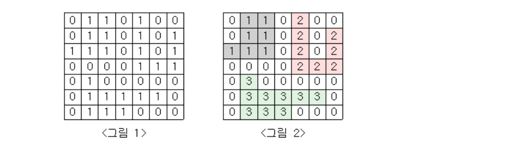
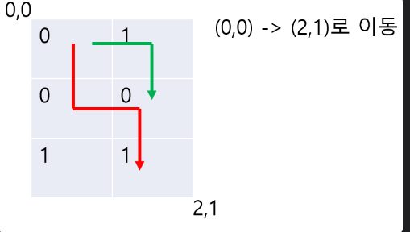

# boj Java

백준 알고리즘 자바 풀이 

<details>
<summary>DFS, BFS</summary></summary>
<div markdown="1">

<details>
<summary>2583</summary></summary>
<div markdown="1">

### - Q2583
#### 모눈 종이가 색칠된 부분과 그렇지 않은 부분으로 나누어 질때 색칠되지 않은 영역이 어떻게 나뉘는지 에 대한 정보 파악 문제

- 상하좌우를 살펴보는 dfs 구현으로 풀었다.
- 시작점을 찾고 dfs start
  - 지나간 곳은 map값을 바로 바꾸었기에 visited배열 사용하지 않음 (다음엔 써보자, 어렵지도 않지만)
  
```java
    public static void dfs(int r, int c) {

        board[r][c] = 1;
        //stack frame의 특징을 이용한 dfs
        //한 방향으로 갈 수 있는 곳 까지 파고든 후 back tracking한다.
        //visit 배열을 사용하지 않고 방문한 곳은 1로 바꾸어 처리
        sa++;
        //상
        if (isAvailableCoord(r - 1, c) && board[r - 1][c] == 0) {
            board[r - 1][c] = 1;
            dfs(r - 1, c);
        }
        //하
        if (isAvailableCoord(r + 1, c) && board[r + 1][c] == 0) {
            board[r + 1][c] = 1;
            dfs(r + 1, c);
        }
        //좌
        if (isAvailableCoord(r, c - 1) && board[r][c - 1] == 0) {
            board[r][c - 1] = 1;
            dfs(r, c - 1);
        }
        //우
        if (isAvailableCoord(r, c + 1) && board[r][c + 1] == 0) {
            board[r][c + 1] = 1;
            dfs(r, c + 1);
        }

    }
```

</div>
</details>


<details>
<summary>2667</summary></summary>
<div markdown="1">

### - Q2667
#### 정사각형의 지도에서 1이 집을, 0이 집이 없는 곳을 나타낼 때 집의 모임인 단지에 대한 정보를 파악하는 문제

- 상하좌우에 집이 이웃될 경우 하나의 단지에 포함되는 것으로 간주
- 나는 for문으로 1인 곳을 찾은뒤에 해당 시점에서 dfs로 단지를 파악했음
  - 파악된 곳을 바로바로 0으로 바꾸어 주었기에 visited 배열 사용하지 않음
  - 추가적으로 나는 상하좌우를 전부 조건문으로 나누는 것이 오히려 캐치하다고 생각하는데 다른 사람들 풀이보면 nx ny로 코드 줄이는 풀이가 많은 듯? 둘 다 알아놓자. 
- 궁금한 점 (고수를 만나면 물어보자)
  - dfs의 parameter가 많아지는 것이 싫어서 static 변수 설정으로 전역변수와 같은 역할을 하는 변수를 만드는데 무분별한 전역변수의 설정이 좋지 않다고 들은 적이 있음 코테 수준에선 이런 풀이 괜찮을까..?


```java
    public static void dfs(int r, int c) {

        board[r][c] = 1;
        //stack frame의 특징을 이용한 dfs
        //한 방향으로 갈 수 있는 곳 까지 파고든 후 back tracking한다.
        //visit 배열을 사용하지 않고 방문한 곳은 1로 바꾸어 처리
        sa++;
        //상
        if (isAvailableCoord(r - 1, c) && board[r - 1][c] == 0) {
            board[r - 1][c] = 1;
            dfs(r - 1, c);
        }
        //하
        if (isAvailableCoord(r + 1, c) && board[r + 1][c] == 0) {
            board[r + 1][c] = 1;
            dfs(r + 1, c);
        }
        //좌
        if (isAvailableCoord(r, c - 1) && board[r][c - 1] == 0) {
            board[r][c - 1] = 1;
            dfs(r, c - 1);
        }
        //우
        if (isAvailableCoord(r, c + 1) && board[r][c + 1] == 0) {
            board[r][c + 1] = 1;
            dfs(r, c + 1);
        }

    }
```

</div>
</details>

<details>
<summary>1759</summary></summary>
<div markdown="1">

### - Q1759
#### 암호의 조건이 주어질 때 가능한 암호를 모두 구해보기

- 암호는 주어진 문자들에서만 나와야 하고 모음 1개 자음 2개 이상 필요
- 나의 첫번째 시도 
  - 주어진 문자들에서 4개를 뽑아야 하는 상황
  - 모든 경우의 수를 dfs로 고른 후 뽑은 경우의 수가 유효한 암호가 될 수 있는지를 체크함
  - 결국 메모리 초과
- 나의 두번째 시도
  - 모두 구하고 유효한지 체크하는 것이 아닌 
  - 중간 중간 체크할 수 있도록 바꿈 
  - 예로 애초에 뽑을 때 오름차순으로 뽑을 수 밖에 없도록 설계한다던가..
  - 메모리 초과 안남

- 줄일 수 있다면 줄이자 naive하게 빠르게 접근하는 것은 좋지만 너무 naive하면 안된다는 것을 꺠달음

```java
    public static void dfs(int ch, String code, int idx) {
        //arr에서 l개를 뽑아냈다. -> 유효한 암호인지 검증
        if (ch == l) {
            char[] ca = code.toCharArray();
            boolean vowelExist = false; //모음이 1개이상 존재하는가?
            boolean isAscending = true; //오름차순인가?
            int constantsCnt = 0; //자음의 숫자

            char prevChar = 0;

            for (char c : ca) {
                if (c == 'a' || c == 'e' || c == 'i' || c == 'o' || c == 'u') {
                    vowelExist = true;
                } else {
                    constantsCnt++;
                }

                if (prevChar > c) {
                    isAscending = false;
                }

            }
            //자음이 2개 이상이고 모음이 존재하며 오름차순으로 정렬되었다면 codes에 추가
            if (constantsCnt >= 2 && vowelExist && isAscending) {
                codes.add(code);
            }

        }
        else {
            for (int i = idx; i < arr.size(); i++) {
                Character cur = arr.get(i);
                if (code.indexOf(cur) != -1) {
                    continue;
                }
                //cur 문자를 암호에 사용한다.
                dfs(ch+1, code + cur, i + 1);
                //사용하지 않는다. -> 다음 루프로

            }

        }
    }
```
</div>
</details>

<details>
<summary>1987</summary></summary>
<div markdown="1">

### - Q1987
#### 보드와 특정 위치의 말이 주어졌을 때 말이 제일 멀리 몇칸을 갈 수 있는가?

- 알파벳으로 채워진 2차원 보드에서 말은 한번 간 칸의 알파벳이 있는 다른 곳으로는 갈 수 없다
- 상하좌우로만 움직임 가능 
- dfs로 파고 들며 모든 경우의 수를 따진다.
- 방문했던 알파벳은 Set에 넣어 중복방문하지 않도록 처리했음 

```java
public static void dfs(int r, int c, int lev) {

        int row = r;
        int col = c;
        if (maxMv < lev) {
            maxMv = lev;
        }

        //상
        row = row -1;
        if (isAvailableIdx(row, col) && !set.contains(board[row][col])) {
            set.add(board[row][col]);
            dfs(row, col, lev + 1);
            set.remove(board[row][col]);
        }
        //하
        row = row + 2;
        if (isAvailableIdx(row, col) && !set.contains(board[row][col])) {
            set.add(board[row][col]);
            dfs(row, col, lev + 1);
            set.remove(board[row][col]);
        }
        //좌
        row = row - 1;
        col = col - 1;
        if (isAvailableIdx(row, col) && !set.contains(board[row][col])) {
            set.add(board[row][col]);
            dfs(row, col, lev + 1);
            set.remove(board[row][col]);
        }
        //우
        col = col + 2;
        if (isAvailableIdx(row, col) && !set.contains(board[row][col])) {
            set.add(board[row][col]);
            dfs(row, col, lev + 1);
            set.remove(board[row][col]);
        }
    }
```

</div>
</details>

<details>
<summary>2580</summary></summary>
<div markdown="1">

### - Q2580
#### 스도쿠 완성하기
- 가운데 사각형 검사를 구현하는 것이 조금 빡셈
- 또한 시간초과에 걸리지 않기 위해서 특정알고리즘을 사용해야 하는 듯? 
  - 근데 시간복잡도는 똑같은데 .. 입력과 출력으로도 시간초과가 갈리는거보면 크게 신경쓸 필요는 없으려나.. 
- 무튼 구현문제 하나 챙겨간다고 생각하자
- 빡구현일수록 코드부터가 아니라 설계부터하고 들어가자! 들어가서 이것저것 만지다 보면 머리 쥐남

```java
        while (!spaces.isEmpty()) {

            Space s = spaces.poll();
            //가로줄 검증
            ArrayList<Integer> checkSet = generateCheckSet();
            for (int i = 0; i < 9; i++) {
                if (board[s.getR()][i] != 0) {
                    checkSet.remove((Object) board[s.getR()][i]);
                }
            }
            if (checkSet.size() == 1) {
                board[s.getR()][s.getC()] = checkSet.get(0);
                spaces.remove(0);
                continue;
            }
            //세로줄 검증
            checkSet = generateCheckSet();
            for (int i = 0; i < 9; i++) {
                if (board[i][s.getC()] != 0) {
                    checkSet.remove((Object) board[i][s.getC()]);
                }
            }
            if (checkSet.size() == 1) {
                board[s.getR()][s.getC()] = checkSet.get(0);
                spaces.remove(0);
                continue;
            }
            //사각형 검증
            checkSet = generateCheckSet();
            int qr = s.getR() / 3;
            int qc = s.getC() / 3;
            for (int i = qr*3; i < qr*3 + 3; i++) {
                for (int j = qc * 3; j < qc * 3 + 3; j++) {
                    if (board[i][j] != 0) {
                        checkSet.remove((Object) board[i][j]);
                    }
                }
            }
            if (checkSet.size() == 1) {
                board[s.getR()][s.getC()] = checkSet.get(0);
                spaces.remove(0);
                continue;
            }
            //아무런 조건으로도 못찾으면 다시 큐로..
            spaces.add(s);

        }
        

```

</div>
</details>

<details>
<summary>14889</summary></summary>
<div markdown="1">

### - Q14889
#### 짝수명의 인원이 주어질 때 능력치 차이가 최소가 되는 두 팀으로 나누기
- dfs 조합으로 팀을 나눈 후 팀의 능력을 계산하여 모든 케이스를 살펴봄으로써 해결 가능
- 순열과 조합, 그리고 중복순열을 dfs로 구현하는 법을 기억하자! 
- 참고로 2개를 뽑는 순열은 dfs보다는 이중루프가 간단하다 첨부터 이렇게 갔으면 삽질 안했는데..

```java
    public static int getTeamAbility(ArrayList<Integer> team) {
        int ability = 0;
        //팀에서 임의 두명을 뽑았을 때의 능력치를 더해나가고 리턴한다.
        for (int i = 0; i < team.size(); i++) {
            for (int j = 0; j < team.size(); j++) {
                if (i == j) {
                    continue;
                }
                ability += ab[team.get(i)][team.get(j)];
            }
        }
        return ability;
    }

    public static void combinationDfs(int ch, int idx) {
        if (ch == n / 2) {
            //팀고르기 끝 team1에는 선수들이 편성되어있음
            //team1에 편성되지 못한 선수들은 team2로!
            for (int i = 0; i < n; i++) {
                if (!team1.contains(i)) {
                    team2.add(i);
                }
            }
            //각팀의 능력치를 구한다.
            int team1Ability = getTeamAbility(team1);
            int team2Ability = getTeamAbility(team2);

            //능력치의 차를 계산한다.
            int diff = Math.abs(team1Ability - team2Ability);

            //능력치의 차가 최소인지 확인한다.
            if (diff < minDiff) {
                minDiff = diff;
            }
            team2.clear();
        } else {
            for (int i = idx; i < n; i++) {
                //i번 선수를 team1에 포함한다
                team1.add(i);
                combinationDfs(ch + 1, i + 1);
                used[i] = true;
                //i번 선수를 team1에 포함하지 않는다
                team1.remove((Object) i);
            }
        }
    }
```

</div>
</details>

<details>
<summary>9019</summary></summary>
<div markdown="1">


### - Q9019
#### 연산 d,s,l,r이 정해짐 -> input에서 output으로 바꾸는 데에 최소한의 연산을 거칠 때 사용된 연산 정보를 출력하는 문제
- 최소라는 키워드 bfs와 밀접하게 연관되어 있다는 것 기억하시오
  - level별로 순회하니
- 다만 몇번만에 가능하냐를 묻는 문제가 아닌 연산과정을 알려달라는 문제기에 나는 HistoryInteger라는 새로운 클래스로 어떤 연산을 거쳐 왔는지 저장하도록 했음
  - 근데.. 세상.. 다른 사람 코드 보니 왤케 간단함?
  - History Integer 없이 그냥 Command를 배열로써 해결하는데 흠.. 길이는 훨씬 짧은데 일단은 내가 직관적으로 이해할 수 있는게 좋은 것이긴 하니까 
  - 아이디어가 떠오르지 않는다면 이런 사소한 것 가지고 오래 붙잡고 있을 필요는 없을 것 같다. 
- 참고로 dfs, bfs에서 내가 시간초과 내는 경우는 대부분 visited를 제대로 설정하지 않은 것 !
- 이번에도 visited를 만들긴 했지만 전체적 시간복잡도를 고려하지 않은 visited를 만들어서 왜 시간초과가 나는지 30분동안 뻘짓함 
  - boolean[] 이걸 만들고 처음에 초기화 해 놓은 것과
  - ArrayList를 만들고 isContan을 이너루프에서 하는 것 성능차이 있을 수 밖에 없음
  - 애초에 시간복잡도가 n배 차이남 (boolean[]는 idx를 통해 접근 가능하지만 ArrayList는 매번 for루프 하나 더 돌아야 함)

```java
        //각 케이스별로 첫번째 숫자를 두번째 숫자로 옮기기 위한 최소 연산을 찾는다.
        for (ArrayList<Integer> tc : cases) {

            int in = tc.get(0);
            int out = tc.get(1);
            boolean[] visited = new boolean[10001];
            for (int i = 0; i < visited.length; i++) {
                visited[i] = false;
            }
            //in에서 out으로 되기 위한 최소 연산을 구하자
            Queue<HistoryInteger> q = new LinkedList<>();
            int level = 0;
            HistoryInteger hi = new HistoryInteger(in, "");
            q.add(hi);
            visited[hi.getNum()] = true;
            //bfs start
            while (!q.isEmpty()) {
                int len = q.size();
                for (int i = 0; i < len; i++) {

                    HistoryInteger cur = q.poll();

                    if (cur.getNum() == out) {
                        System.out.println(cur.getOpHistory());
                        q.clear();
                        break;
                    } else {

                        //현재 숫자에서 4가지 연산한 결과들
                        int d = Calculator.d(cur.getNum());
                        int s = Calculator.s(cur.getNum());
                        int l = Calculator.l(cur.getNum());
                        int r = Calculator.r(cur.getNum());

                        //이미 만들어봤던 숫자로 돌아가는 것은 최단이 아님 q에 넣지 않는다.
                        if (!visited[d]) {
                            q.add(new HistoryInteger(d, cur.getOpHistory() + "D"));
                            visited[d] = true;
                        }
                        if (!visited[s]) {
                            q.add(new HistoryInteger(s, cur.getOpHistory() + "S"));
                            visited[s] = true;
                        }
                        if (!visited[l]) {
                            q.add(new HistoryInteger(l, cur.getOpHistory() + "L"));
                            visited[l] = true;
                        }
                        if (!visited[r]) {
                            q.add(new HistoryInteger(r, cur.getOpHistory() + "R"));
                            visited[r] = true;
                        }

                    }
                }
                level++;
            }
        }
```

</div>
</details>

<details>
<summary>5014</summary></summary>
<div markdown="1">

### - 5014
#### 엘레베이터가 위로 u층 아래로 d층만 움직일 수 있을 때 특정 floor에 도달하기 위한 최소한의 움직임 수
- 보자마자 이제는 bfs문제인 것을 알 수 있다.
- 문제 꼼꼼히 읽자 놓치는 정보가 아직 많다.
```java 

        while (!q.isEmpty()) {
            int len = q.size();

            for (int i = 0; i < len; i++) {
                int cur = q.poll();

                if (cur == g) {
                    System.out.println(level);
                    q.clear();
                    useStair = false;
                    break;
                } else {
                    // 방문한적 없고 범위에 포함되는 올바른 층이면 cur + u 층을 가는 경우를 따져본다
                    int dest = cur + u;
                    if (dest <= f && dest >= 1 && !visited[dest]) {
                        q.add(dest);
                        visited[dest] = true;
                    }
                    // 방문한적 없고 범위에 포함되는 올바른 층이면 cur + d 층을 가는 경우를 따져본다
                    dest = cur - d;
                    if (dest <= f && dest >= 1 && !visited[dest]) {
                        q.add(dest);
                        visited[dest] = true;
                    }

                }
            }
            level++;
        } 
```

</div>
</details>

<details>
<summary>15684</summary></summary>
<div markdown="1">

### - Q15684
#### 사다리에 최소 몇개의 다리를 추가해야 모든 세로선이 자기자신으로 회귀하는지 찾으시오
- DFS 모든 가로선 추가의 경우의 수를 따지면 된다.
- 다만 이문제의 핵심은 (적어도 내가 느낀 핵심) DFS 그 자체보다 문제를 어떻게 잘 추상화하는지 인듯
- 사다리를 어떤 자료구조로 표현할지 다리가 연결된 것은 어떻게 표현할지 이런 부분들을 처음부터 잘 정립해야 함
- 처음에 난잡하게 풀었다가 올바르게 동작하는 코드는 만들었지만 시간초과였음
- 후에 표현방법을 간결하게 만드니 자연스레 로직이 간결해지고 시간복잡도가 많이 줄었다. (똑같은 DFS인데)

```java 
    public static void dfs(int left, int rInd, int cInd) {
        //정해진 개수만큼 추가할 사다리를 모두 고른 상태 
        if (left == 0) {
            //고른 상태가 정답이 되었을 때 
            if (isAllColumnReturnToItsNumber()) {
                solvable = true;
            }
            return;
        } else {
            //가로선 고르기
            //2차원 인덱스를 기억하고 있기에 보고 있던 열의 나머지 부분을 추가적으로 체크 
            for (int j = cInd; j < n - 1; j++) {
                if (map[rInd][j] == 0 && map[rInd][j + 1] == 0) {
                    map[rInd][j] = 1;
                    map[rInd][j + 1] = -1;
                    //가로선 하나 선택 완료
                    dfs(left - 1,rInd,j);
                    //해당 가로선 쓰지 않음
                    map[rInd][j] = 0;
                    map[rInd][j + 1] = 0;
                }
            }
            //보고 있던 열 다봤음 다음 열부터 다시 
            for (int i = rInd + 1; i < h; i++) {
                for (int j = 0; j < n - 1; j++) {
                    if (map[i][j] == 0 && map[i][j + 1] == 0) {
                        map[i][j] = 1;
                        map[i][j + 1] = -1;
                        //가로선 하나 선택 완료
                        dfs(left - 1,i,j + 2);
                        //back tracking 해당 가로선을 선택 안한 것으로 하고 다음 가로선들 체크
                        map[i][j] = 0;
                        map[i][j + 1] = 0;

                    }
                }
            }
        }
    }
```

</div>
</details>

<details>
<summary>16956</summary></summary>
<div markdown="1">

### - Q16956
#### 양이 늑대에게 잡아먹히지 않도록 울타리를 설치하라 
- 양이 늑대에게 잡아 먹히는 것을 막을 수 없는 경우는 양과 늑대가 변을 공유하고 있을 때 뿐
- 따로 체크해준다.
- 그렇지 않다면 어떠한 경우에도 지킬 수 있음
- dfs로 늑대가 갈 수 있는 곳 모두에 'F'를 저장한다. 
- 양 주변에 'F'가 있다면 울타리로 막는다. 

```java 
    public static void dfs(int r, int c) {
        visited[r][c] = true;
        if (map[r][c] == 'S') {

        }

        int row, col;

        //상
        row = r - 1;
        col = c;
        if (isValidIdx(row,col) && !visited[row][col] && map[row][col] == '.') {
            map[row][col] = 'F';
            dfs(row, col);
        }
        //하
        row = r + 1;
        col = c;
        if (isValidIdx(row, col) && !visited[row][col] && map[r + 1][c] == '.') {
            map[row][col] = 'F';
            dfs(row, col);
        }
        //좌
        row = r;
        col = c - 1;
        if (isValidIdx(row,col)&& !visited[row][col] && map[r][c-1] == '.') {
            map[row][col] = 'F';
            dfs(row, col);
        }
        //우
        row = r;
        col = c + 1;
        if (isValidIdx(row,col)&& !visited[row][col] && map[r][c+1] == '.') {
            map[row][col] = 'F';
            dfs(row, col);
        }
    }
```

</div>
</details>

<details>
<summary>2468</summary></summary>
<div markdown="1">

### - Q2468
#### 비가 왔을 때 잠기지 않는 안전한 Sector 개수를 구하라
- 비의 양에 따라 루프를 돌며 각각의 양만큼 비가 왔을 때 나누어지는 섹터를 일일이 계산
- 섹터를 판별하는 것은 DFS로 visited배열과 함께 
- 어렵지 않은 문제 상하좌우 DFS

```java 
    public static void dfs(int row, int col) {

        int r = row;
        int c = col;

        visited[row][col] = true;

        //상
        r = row - 1;
        c = col;
        if (isValidIdx(r,c) && !visited[r][c] && map[r][c] != 0) {
            dfs(r, c);
        }
        //하
        r = row + 1;
        c = col;
        if (isValidIdx(r,c) && !visited[r][c] && map[r][c] != 0) {
            dfs(r, c);
        }
        //좌
        r = row;
        c = col - 1;
        if (isValidIdx(r,c) && !visited[r][c] && map[r][c] != 0) {
            dfs(r, c);
        }
        //우
        r = row;
        c = col + 1;
        if (isValidIdx(r,c) && !visited[r][c] && map[r][c] != 0) {
            dfs(r, c);
        }
    }

```

</div>
</details>

<details>
<summary>6593</summary></summary>
<div markdown="1">

### - Q6593
#### 건물을 탈출하는데 최소 몇 스텝이나 걸릴까?
- 특별하지 않은 문제이지만 삽질을 하며 깨달은 게 많은 문제
- 문제는 층까지 나누어진 건물을 탈출하는 최소 단계를 물어보지만 차원을 하나 더 늘린 char[][][] map으로 간단히 해결할 수 있음
- 메모리 초과
  - 계속 메모리초과가 나길래 visited 배열 쪽을 봤는데 내가 굉장히 착각을 하고 있었다.
  - visited는 도착해서 cur를 수정하는 것은 의미가 없다! 가기 전에 상하좌우 따질 때 갈 수 있다면 visited를 체크해야 의미가 있음
  - 도착해서 visited true로 찍으면 그전에 여러번 큐에 들어갈 가능성이 있기 때문!
- move 배열을 통한 분기 줄이기
  - 이거 그렇게 어렵지 않다 moveX, moveY, moveZ들이 각 인덱스에서 하나만 1이 되도록 설정하면 끝! 그러면 for 문으로 불러왔을 때 한칸씩만 움직임
```java
//for를 통한 동서남북상하 분기를 위한 
static int[] moveX = {-1, 1, 0, 0, 0, 0};
static int[] moveY = {0, 0, -1, 1, 0, 0};
static int[] moveZ = {0, 0, 0, 0, -1, 1};
```

```java 
//핵심 bfs
    public static int bfs(int sf, int sr, int sc) {

        Queue<Coord> q = new LinkedList<>();
        Coord start = new Coord(sf, sr, sc);
        q.add(start);
        int step = 0;

        while (!q.isEmpty()) {
            int len = q.size();
            for (int i = 0; i < len; i++) {
                Coord cur = q.poll();
//                System.out.println("cur = " + cur);
//                visited[cur.floor][cur.row][cur.col] = true;
                if (map[cur.floor][cur.row][cur.col] == 'E') {
                    q.clear();
                    return step;
                }
                int nf, nr, nc;


                for (int m = 0; m < moveX.length; m++) {
                    nf = cur.floor + moveZ[m];
                    nr = cur.row + moveY[m];
                    nc = cur.col + moveX[m];
                    if (isAvailableCoord(nf, nr, nc) && map[nf][nr][nc] != '#' && !visited[nf][nr][nc]) {
                        q.add(new Coord(nf, nr, nc));
                        visited[nf][nr][nc] = true; //visited 위치가 여기가 되야 더 많은 케이스를 절약할 수 있음!
                    }
                }


            }
            step++;

        }

        return -1;
    }

```

</div>
</details>

<details>
<summary>13459</summary></summary>
<div markdown="1">

### - 13459
#### 보드를 기울이며 파란공이 아닌 빨간공만 구멍에 넣어라
- bfs문제이지만 요구조건이 많은 문제 
- 문제를 꼼꼼히 읽고 처음에 전략 세우는 것이 중요하다고 알려주는 문제.. 
- 조건이 많으니 반례 테케도 각각의 조건에 따라 무수히 쏟아짐 
- 나는 공이 빠져도 공위치를 남겨놓았었는데 공이 빠지면 공이 없어지는 거임.. 지레 짐작하고 조건 무시하면 안됨 이거 하나때문에 99프로에서 계속 오답
- 너무 진을 많이 빼서 조건 분기를 그냥 주욱 갈겨놨는데 최적화는 구슬넣기2에서 진행해보자..
- 그래도 roll 함수 구현은 겁나 잘한 듯 이런 아이디어 다음에도 떠올랐으면 좋겠다 
- 자매품 13460 차이가 아예 없음 가능하다 아니다 1,0으로 나누어 출력하는 것이 아닌 실제 단계가 얼마나 걸리는지를 바꾸면 끝
```java

public static Co roll(Co pos, int rw, int cw, int nr, int nc) {
        Co tmp = new Co(pos.r, pos.c);
        while (board[tmp.r + rw][tmp.c + cw] != '#') {
            if (tmp.r + rw == nr && tmp.c + cw == nc) {
                return tmp;
            }
            tmp.r = tmp.r + rw;
            tmp.c = tmp.c + cw;

            if (board[tmp.r][tmp.c] == 'O') {
                tmp.in = true;
            }
        }
        return tmp;
}

```


</div>
</details>

<details>
<summary>12851</summary></summary>
<div markdown="1">

### - 12851
#### 직선 상 술래잡기 몇 스텝만에 잡을 수 있는가 또한 잡을 수 있는 경우의 수가 몇가지 인가
- 간단한 bfs문제이지만 도달할 수 있는 경우의 수가 몇가지인지도 체크해야 하는 문제
- 처음엔 visited를 사용하지 않고 모든 경우를 따져보아야 하나 생각했지만 메모리 초과 발생
- 메모리 문제로 visited를 안쓸 수는 없는 상황. 그럼 어떻게 해야 할까?
- 일전에 삽질한 문제 덕분에 빠르게 풀 수 있었다. Q6593 참고!
- visited는 실제로 도착하기 전에 다음 위치를 계산할 때 찍어야 의미가 있다고 삽질하며 크게 깨달은 적이 있었다.
- 이유는 같은 q에 추가하는 단계에서 같은 것이 여러 개 추가될 수 있기 때문 
- 하지만 이 문제에서는 visited를 도착해서 찍어야 한다! 해당 위치에 도착하기 전까지는 경로가 몇개인지 여러개 카운트를 해야 하기 때문
- 이것이 이 문제의 핵심!
```java

  public static int bfs() {
    int level = 0;
    Queue<Integer> q = new LinkedList<>();
    q.add(n);
    while (!q.isEmpty()) {
      int len = q.size();

      for (int i = 0; i < len; i++) {
        Integer curP = q.poll(); //현재 술래의 위치
        visited[curP] = true;
        if (curP == k) {
          //술래가 찾은 경우
          ++count;
          continue;
        }
        if (count > 0) {
          continue;
        }
        //술래가 걸었을 경우: X-1 혹은 X+1로 이동 가능
        if (curP - 1 >= 0 && curP -1 <=100000 && !visited[curP-1]) {
//                    visited[curP - 1] = true;
          q.offer(curP - 1);
        }
        if (curP + 1 >= 0 && curP + 1 <= 100000 && !visited[curP + 1]) {
//                    visited[curP + 1] = true;
          q.offer(curP + 1);
        }
        //술래가 순간이동 한 경우: 2*X 위치로 이동 가능
        if (curP * 2 >= 0 && curP * 2 <= 100000 && !visited[curP * 2]) {
//                    visited[curP * 2] = true;
          q.offer(curP * 2);
        }
      }

      if (count > 0) {
        return level;
      }
      level++;

    }

    return -1;
  }

```

### - 12851
#### 직선 상 술래잡기 몇 스텝만에 잡을 수 있는가 또한 잡는 경우 경로를 출력
- 간단한 bfs문제, but 경로를 관리하는 것 추가로 생각해야 함. 
- 오지게 삽질했다. 첫번째로 경로를 저장하기 위해 history를 저장할 수 있는 노드 객체를 만들어서 해결해보려고 했음
```java
class Node {

  int position;
  String route;

  public Node(int position) {
    this.position = position;
    route = "" + position;

  }

} 
```
- 이렇게 하고 다음 스텝에 갈 수 있는 곳이 있으면 현재 노드를 clone해서 경로에 맞는 새로운 히스토리를 추가했다.
- 이렇게 설정하면 마지막에 도착한 노드를 까보면 지금까지 거쳐온 경로를 모두 알 수 있음
- 제일 무난한 풀이방법이라 생각했으나 시간초과에 걸림
- 시간초과에 걸린 이유는 새로 만들어지는 노드마다 history를 관리해야 하기 때문 히스토리 크기가 크다면 시간이 오래걸릴 수 밖에 그리고 clone이 수시로 일어나니까..
- 결국 이문제의 핵심은 경로 관리에서 바로 이전 위치, 즉 내가 어디서 왔는지만 관리하느냐, 아니면 경로 전체를 관리하느냐에서 갈린다.
- 내가 노드로 푼 방법은 경로 전체를 관리하는 것이고 다음에 보이는 풀이 방법이 방문한 곳에서 내가 이전에 있던 곳만 따지는 풀이 방법이다.

```java

        bfs();
        Stack<Integer> st = new Stack<>();

        String route = "";
        int pos = parent[k];
        while (pos != -2) {
            st.push(pos);
            pos = parent[pos];
        }
        while (!st.isEmpty()) {
            System.out.print(st.pop() + " ");
        }
        System.out.println(k);
```
- parent[k]는 k에 도달한 놈이 이전에 어디있었는지를 말함 이렇게 바로 이전 경로들만 추적해 나가면 시간초과에 걸리지 않는다.


</div>
</details>

<details>
<summary>2210</summary></summary>
<div markdown="1">


### - 2210
#### DFS 기초 문제 
- 간단한 dfs문제 꼬는 부분 하나 없다. 그냥 모든 경우의 수를 dfs를 통해 구하면 끝
```java
    public static void dfs(int r, int c, int count, int sequence) {
        if (count == MOVE_COUNT) {
//            int res = sequence / 10;
                set.add(sequence);
        } else {
            for (int i = 0; i < moveR.length; i++) {
                int newR = r + moveR[i];
                int newC = c + moveC[i];
                if (newR >= 0 && newR < BOARD_WIDTH && newC >= 0 && newC < BOARD_HEIGHT) {
                    int newSequence = sequence * 10;    
                    newSequence += board[newR][newC];
                    dfs(newR, newC, count + 1, newSequence);
                }
            }
        }

    }
```


</div>
</details>

<details>
<summary>1780</summary></summary>
<div markdown="1">

### - 1780
#### 2차원 배열이 coherent한 구성인지 확인, 그렇지 않다면 부분 배열이 coherent할 때까지 9분할 해나가는 문제
#### Divide & Conquer
- 간단한 문제지만 배열 분할 하는 것에서 애를 많이 먹었다
- 첫번째 풀이에서 배열 분할은 다음과 같이 해결했다.
```java 
    /**
     * @param rs rowStart
     * @param cs colStart
     * @param size
     */
    public static void divideAndConquer(int rs, int cs, int size) {
        ....
        ....
    }
```
- 원래의 종이에서 subPaper는 세가지 parameter로 표현 가능함을 이용했다.(rs, cs, size )
- size가 9인 원본 종이에서 rs = 0, cs = 0, size = 3의 부분종이는 9등분 했을 때 좌상의 부분종이를 가리키도록 되는 것이다
- 또한 size가 9인 원본 종이에서 rs = 0, cs = 0, size = 1인 부분종이는 좌상을 다시 9등분했을 때의 좌상을 가리키게 된다. 
- 나머지 풀이는 어렵지 않으나 (그냥 재귀로 해결 가능) 배열을 분할한 것을 어떻게 표현할 것인지의 아이디어를 챙겨가도록 하자 


</div>
</details>

<details>
<summary>14502</summary></summary>
<div markdown="1">

### - 14502
#### 벽 3개를 세워서 전염병의 확산을 막을 때 어떻게 세우는 것이 가장 큰 안전영역을 가져오는가?
#### naive하게 모든 경우의 수를 따져 해결
- 벽 3개를 세울 때 가능한 모든 경우의 수를 구한다.
- 각 경우의 수처럼 벽을 세웠을 때 안전 지대를 count한다. 
- 전염병의 확산을 진행시키고 안전지대를 count해야 하는데 확산은 dfs를 이용하여 적용했다. 
- 어렵지 않은 문제인데 나름 자주 보이는 문제 예전에 소프트웨어 마에스트로 코테에서 본적 있음
- 조합은 다음과 같이 구현가능. 
```java
for (int i = 0; i < mapHeight * mapWidth; i++) {
    for (int j = i + 1; j < mapHeight * mapWidth; j++) {
        for (int k = j + 1; k < mapHeight * mapWidth; k++) {
            int row, col;
            //새로운 벽 1의 좌표
            int r1 = i / mapWidth;
            int c1 = i % mapWidth;
            //새로운 벽 2의 좌표
            int r2 = j / mapWidth;
            int c2 = j % mapWidth;
            //새로운 벽 3의 좌표
            int r3 = k / mapWidth;
            int c3 = k % mapWidth;
            
        ... 중략...
        }
    }
}

```
- 3개 이상의 것을 고르는 조합은 dfs를 이용하여 구현함이 현명해보인다. 지금은 3개니까 루프로 단순 해결했다.
- 그렇기에 꼬아서 낼려면 한도 끝도 없는 문제인 듯 함 
- 하지만 보통 이런 류의 문제가 4개 이상을 선택하도록 주어지진 않는 듯하다.
- 전염병의 확산을 구현한 dfs의 코드는 다음과 같이 간단하다.
```java 
    public static void infect(int r, int c, int[][] tmpMap, boolean[][] visited) {

        //4방향 살펴보기
        for (int i = 0; i < moveR.length; i++) {
            int newR = r + moveR[i];
            int newC = c + moveC[i];
            //유효 인덱스 검사
            if (!(newR >= 0 && newR < mapHeight && newC >= 0 && newC < mapWidth)) {
                continue;
            }
            if (tmpMap[newR][newC] == 0 ) {
                tmpMap[newR][newC] = 2;
                visited[newR][newC] = true;
                infect(newR, newC, tmpMap, visited);
            }
        }
    }
```
- 문제를 소화할 수 있는 만큼씩 잘라서 이해하고 차근차근 구현하는 것이 중요하다는 것을 명심하자


</div>
</details>

<details>
<summary>17141</summary></summary>
<div markdown="1">

### - 17141, 17142
#### 바이러스를 어떻게 배치했을 때 Spread Time이 최소가 되는가
#### naive하게 모든 경우를 따져 해결 with DFS, BFS
- 바이러스를 배치하는 모든 경우의 수를 DFS로 따진다.
- 각 경우의 수처럼 바이러스를 배치했을 때 SpreadTime을 count.
- 문제가 어렵진 않은데 볼륨이 크다 (요구하는 게 많음)
- 잘라서 소화하자 특히 한번에 주루룩 쓰고 돌리지 말고 좀 기능단위로 테스트 진행하면서 천천히가라 그게 결국엔 젤 빠른 방법이다.
- DFS로 모든 경우의 수 따지는 코드 (2차원 좌표를 save하며 조합해나갈때 다음 재귀에서 해당 row의 처리 한번 해야 하는 것 잊지말자 )
```java    

    public static void combinationDFS(int left, int r, int c, ArrayList<Integer> virusPutIdxs) {

        //모든 바이러스를 배치한 경우
        if (left == 0) {
            //지도 깊은 복사 임시 지도에 옮겨넣는다. 
            int[][] tmpMap = new int[mapSize][mapSize];
            for (int i = 0; i < mapSize; i++) {
                for (int j = 0; j < mapSize; j++) {
                    tmpMap[i][j] = map[i][j];
                    if (map[i][j] == 2) {
                        tmpMap[i][j] = 0;
                    }
                }
            }
            //지정한 위치에 바이러스 배치
            for (int i = 0; i < virusPutIdxs.size() / 2; i++) {
                Integer vr = virusPutIdxs.get(i * 2);
                Integer vc = virusPutIdxs.get(i * 2 + 1);
                tmpMap[vr][vc] = 2;
            }
            //해당 경우의 지도 추가
            virusDropCaseMaps.add(tmpMap);

        } else {
            if (r == mapSize) {
                return;
            }
            //해당 열의 나머지 부분 체크
            //조합 진행 인덱스의 r과 c중 r열의 c+1부터 나머지 확인하는 것
            for (int j = c; j < mapSize; j++) {
                int nextC = (j + 1) % mapSize;
                int nextR = r;
                if (nextC == 0) {
                    nextR += 1;
                }

                if (map[r][j] == 2) {
                    //바이러스를 현재 위치에 투하
                    virusPutIdxs.add(r);
                    virusPutIdxs.add(j);
                    combinationDFS(left-1, nextR, nextC, virusPutIdxs);

                    //바이러스를 현재 위치에 투하하지 않는다.
                    virusPutIdxs.remove(virusPutIdxs.size() - 1);
                    virusPutIdxs.remove(virusPutIdxs.size() - 1);
                    //다음 루프로
                }
            }
            //다음 열부터 진행
            for (int i = r+1; i < mapSize; i++) {
                for (int j = 0; j < mapSize; j++) {

                    int nextC = (j + 1) % mapSize;
                    int nextR = i;
                    if (nextC == 0) {
                        nextR += 1;
                    }

                    if (map[i][j] == 2) {
                        //바이러스를 현재 위치에 투하
                        virusPutIdxs.add(i);
                        virusPutIdxs.add(j);

                        combinationDFS(left-1, nextR, nextC, virusPutIdxs);
                        //바이러스를 현재 위치에 투하하지 않는다.
                        virusPutIdxs.remove(virusPutIdxs.size() - 1);
                        virusPutIdxs.remove(virusPutIdxs.size() - 1);
                        //다음 루프로
                    }
                }
            }
        }

    }
```
- 다음은 Spread Counting (by BFS)
```java 
    public static int countSpreadTime(int[][] caseMap) {

        Queue<Integer> q = new LinkedList<>();
        boolean[][] visited = new boolean[mapSize][mapSize];
        int time = 0;
        for (int i = 0; i < mapSize; i++) {
            for (int j = 0; j < mapSize; j++) {
                if (caseMap[i][j] == 2) {
                    q.add(i);
                    q.add(j);
                }
            }
        }

        while (!q.isEmpty()) {
            int len = q.size() / 2;
            boolean spread = false;
            for (int i = 0; i < len; i++) {
                Integer curR = q.poll();
                Integer curC = q.poll();

                for (int j = 0; j < 4; j++) {
                    int nextR = curR + moveR[j];
                    int nextC = curC + moveC[j];
                    //인덱스 유효 검사
                    if (!(nextR >= 0 && nextR < mapSize && nextC >= 0 && nextC < mapSize)) {
                        continue;
                    }
                    if (caseMap[nextR][nextC] == 0 && !visited[nextR][nextC]) {
                        spread = true;
                        caseMap[nextR][nextC] = 2;
                        q.add(nextR);
                        q.add(nextC);
                        visited[nextR][nextC] = true;
                    }
                }
            }
            if (spread) {
                time++;
            }
        }
        // 모든 빈 칸을 바이러스로 채웠는지 체크
        for (int i = 0; i < mapSize; i++) {
            for (int j = 0; j < mapSize; j++) {
                if (caseMap[i][j] == 0) {
                    return -1;
                }
            }
        }
        return time;

    }
```

</div>
</details>

<details>
<summary>17090</summary></summary>
<div markdown="1">

### - 17090
#### 미로의 격자에 적힌대로 이동해야 할 때 사이클에 빠지지 않고 탈출할 수 있는 시작점은 몇개인지 구하라
#### DFS가 핵심인데 DFS가 왜 쓰이는지 근본적인 이해를 요구한다. 
- Q17090.java 첫번째 풀이 
- 모든 출발점에 대해서 탈출 가능한지 불가능한지를 따진다. 사이클에 빠지면 무한으로 돌기에 사이클 체크를 visited로 확인했다. 
- 제출 결과는 시간 초과, 시간초과를 해결하기 위해서 dfs내에 shortCut을 추가했다.
- 방문한 곳이 이미 방문한 곳이면 사이클에 빠졌음을 감지하고 지금까지 밟아왔던 모든 인덱스는 한 번 밟으면 사이클에 빠지게 되는 것으로 구별했다.
- 정보를 저장하고 처음에 출발할 때 사이클지점인지 확인하여 모든 경우의 수에서 dfs를 하지 않게 하는 것에는 성공  
- 실제로 hit되는 경우가 많았고 압축에 나름 성공한 줄 알았으나 여전히 시간초과 .. 
- 아래는 실패한 코드 
```java        
//정해진 대로만 이동해야 함. 만약 이동했는데 왔던 곳으로 왔으면 루프에 빠져 탈출할 수 없는 상태임을 알리는 것
    public static void driveMaze(Node1 node) {

        int startRow = node.getRow();
        int startCol = node.getCol();

        char cur = map[startRow][startCol];
        int nextRow = 0, nextCol = 0;

        //현재 밟고 있는 곳에 적힌대로 이동
        switch (cur) {
            case 'U':
                nextRow = startRow - 1;
                nextCol = startCol;
                break;
            case 'D':
                nextRow = startRow + 1;
                nextCol = startCol;
                break;
            case 'L':
                nextRow = startRow;
                nextCol = startCol - 1;
                break;
            case 'R':
                nextRow = startRow;
                nextCol = startCol + 1;
                break;

        }

        //탈출 성공 확정
        if (nextRow < 0 || nextCol < 0 || nextRow >= n || nextCol >= m) {

            //현 위치는 탈출 가능한 위치임을 설정
            isEscapableStartPoint[startRow][startCol] = true;
            Node1 prevNode;
            int rowIdx = startRow;
            int colIdx = startCol;
            //지금 까지 밟아왔던 것들 중 하나라도 밟게 되면 탈출 성공
            while((prevNode = prev[rowIdx][colIdx]) != null) {
                isEscapableStartPoint[prevNode.getRow()][prevNode.getCol()] = true;
                rowIdx = prevNode.getRow();
                colIdx = prevNode.getCol();

            }
            return;
        }

        //가려는 곳에 방문한 적이 있다면 탈출 실패 확정
        if (prev[nextRow][nextCol] != null) {

            isEscapableStartPoint[startRow][startCol] = false;
            Node1 prevNode;
            int rowIdx = startRow;
            int colIdx = startCol;
            //지금 까지 밟아왔던 것들 중 하나라도 밟게 되면 탈출 불가
            while((prevNode = prev[rowIdx][colIdx]) != null) {
                isEscapableStartPoint[prevNode.getRow()][prevNode.getCol()] = false;
                rowIdx = prevNode.getRow();
                colIdx = prevNode.getCol();

            }
            return;
        }

        //다음으로 가고자 하는 곳이 이미 결과가 나온 곳인지 체크
        if (isEscapableStartPoint[nextRow][nextCol] != null) {
            //현 위치부터 지금까지 밟아온 곳은 다음 밟는 곳의 결과를 따른다.
            isEscapableStartPoint[startRow][startCol] = isEscapableStartPoint[nextRow][nextCol];
            Node1 prevNode;
            int rowIdx = startRow;
            int colIdx = startCol;
            while((prevNode = prev[rowIdx][colIdx]) != null) {
                isEscapableStartPoint[prevNode.getRow()][prevNode.getCol()] = isEscapableStartPoint[nextRow][nextCol];
                rowIdx = prevNode.getRow();
                colIdx = prevNode.getCol();

            }
            return;
        }
        //다음으로 가기전 어디에서 오는 것인지 기입
        prev[nextRow][nextCol] = node;
        //다음으로 이동
        Node1 nextNode = new Node1(nextRow, nextCol);
        driveMaze(nextNode);
    }
```
- Q17090RS.java: Right solution
- 사실 dfs에 관해서 지금까지 너무 획일화된 문제만 풀어와서 그럴까 이게 dfs의 근본을 묻는 문제라는 것을 꽤나 늦게 알아차림
- dfs의 본질은 파고들다가 막히면 back tracking 한다는 것 
- 즉 어디에서 왔는지 prev배열을 두어 저장할 필요 없이 back tracking을 통해서 이전 위치에 값을 알릴 수 있는것
- 이렇게 하면 prev를 처리하는 n~n제곱만큼의 시간복잡도를 줄일 수 있다
- 애초에 잘못된 풀이에서 필요 없는 것을 덕지덕지 붙여놓고 경로 압축이라고 주장한 셈.. 
- dfs의 back tracking을 이용하여 결과를 퍼뜨리는 코드를 한번 살펴보자 
```java 
    //정해진 대로만 이동해야 함. 만약 이동했는데 왔던 곳으로 왔으면 루프에 빠져 탈출할 수 없는 상태임을 알리는 것
    public static int dfs(int sr, int sc) {

        //현재 탈출했다면 return 1
        if (sr < 0 || sc < 0 || sr >= n || sc >= m) {
//            dp[sr][sc] = 1;
            return 1;
        }
        //현재 위치에 방문한 적이 있다면
        if (dp[sr][sc] != 0) {
            return dp[sr][sc];
        }

        dp[sr][sc] = -1;
        char cur = map[sr][sc];
        int nr = 0, nc = 0;

        //현재 밟고 있는 곳에 적힌대로 이동
        switch (cur) {
            case 'U':
                nr = sr - 1;
                nc = sc;
                break;
            case 'D':
                nr = sr + 1;
                nc = sc;
                break;
            case 'L':
                nr = sr;
                nc = sc - 1;
                break;
            case 'R':
                nr = sr;
                nc = sc + 1;
                break;

        }


        //다음 위치에 방문한 적이 없다면
        dp[sr][sc] = dfs(nr, nc);

        return dp[sr][sc];
    }
   
```
- dfs가 return한다. 사실 요것이 나한테 조금 어색했던 부분 
- dfs(row, col)은 해당 위치가 탈출 할 수 있는 지 없는지를 int로 알린다. 
- 방문한 곳이 탈출 가능한지 안한지는 돌려서 사이클을 만나던지 탈출 하던지 그 때가 되서야 알 수 있다. 
- 따라서 가다가 결론이 나면 propagate하는 부분이 바로 이부분이다. dp[sr][sc] = dfs(nr, nc);
- prev 없이 propagate이 가능한 것을 볼 수 있음 

</div>
</details>

<details>
<summary>3055</summary></summary>
<div markdown="1">

### - 3055
#### 탈출 시간 
#### 두가지를 한번에 bfs 돌리는 것이 핵심 어렵지 않음
- 1분이 지나면 비버와 물이 동시에 움직임 bfs를 두개 따지면 끝
- 쉬운 문제라 후딱 넘어가지만 문제 좀 꼼꼼히 읽고 코드좀 짧게 짜자 아무리 자바라지만 길다.. (변수명도 좀 일관적으로 짜고)
```java        
    public static int countMinuteForEscape(int sr, int sc) {

        //bfs 요소 초기화
        Queue<Node2> bq = new LinkedList<>(); //비버 위치
        Queue<Node2> wq = new LinkedList<>(); //물 위치
        boolean[][] bieberVisited = new boolean[mapRowSize][mapColSize];
        boolean[][] waterVisited = new boolean[mapRowSize][mapColSize];

        int level = 0;

        //출발지점 큐에 삽입
        bq.add(new Node2(sr, sc));
        bieberVisited[sr][sc] = true;
        //물 있는 위치 큐에 삽입
        for (int i = 0; i < mapRowSize; i++) {
            for (int j = 0; j < mapColSize; j++) {
                if (map[i][j] == '*') {
                    wq.add(new Node2(i, j));
                    waterVisited[i][j] = true;
                }
            }
        }

        while (!bq.isEmpty()) {
            int len = bq.size();
            for (int i = 0; i < len; i++) {
                //현재 위치
                Node2 cur = bq.poll();
                if (map[cur.getRow()][cur.getCol()] == '*') {
                    continue;
                }
                //도착했으면
                if (map[cur.getRow()][cur.getCol()] == 'D') {
                    return level;
                }
                //도착하지 않았으면 다음 으로
                for (int j = 0; j < 4; j++) {
                    int nr = cur.getRow() + moveR[j];
                    int nc = cur.getCol() + moveC[j];

                    // 갈 수 있는지 체크
                    if (isBieberAbleToGo(nr, nc) && !bieberVisited[nr][nc]) {
                        bq.add(new Node2(nr, nc));
                        bieberVisited[nr][nc] = true;
                    }

                }
            }

            //spread Water
            int wl = wq.size();

            for (int i = 0; i < wl; i++) {
                Node2 curWater = wq.poll();
                for (int j = 0; j < 4; j++) {
                    int nextWaterRow = curWater.getRow() + moveR[j];
                    int nextWaterCol = curWater.getCol() + moveC[j];
                    if (isWaterAbleToGo(nextWaterRow, nextWaterCol) && !waterVisited[nextWaterRow][nextWaterCol]) {
                        if (map[nextWaterRow][nextWaterCol] =='D') {
                            return -1;
                        }
                        map[nextWaterRow][nextWaterCol] = '*';
                        waterVisited[nextWaterRow][nextWaterCol] = true;
                        wq.add(new Node2(nextWaterRow, nextWaterCol));
                    }
                }
            }

            level++;
        }
        return -1;
    }

```

</div>
</details>

<details>
<summary>14923</summary></summary>
<div markdown="1">

### - 14923
### 미로 탈출 
### 3차원 visited 베열이 핵심 
- 간단한 bfs 문제에서 3차원 visited 배열이 필요함을 알아채야 하는 문제
- 테케도 적어서 직접 발견하기는 매우 어려울 듯.. 느낌 가져가고 비슷한 문제에서 바로 적용할 수 있도록 훈련하자
- 홍익이는 미로를 탈출해야 하는데 단 한번 벽을 부술 수 있다. 이 경우에서 발생하는 문제 때문에 3차원 visited 배열이 필요한 것이다.
- 다음을 살펴보자 
- 
- 2차원 방문 배열을 사용할 경우 벽을 부수고 간 2,1이 먼저 visited 배열에 찍히게 된다.
- 그럴 경우 벽을 부수지 않고 오던 빨간 경로는 visited에 의해 막히게 되는데 초록 경로 역시 벽을 더이상 부술 수 없어 탈출할 수 없다고 판명이 난다.
- 2차원 방문 배열을 사용하면 빨간경로로 탈출할 수 있음에도 막히게 되는 것이다.
- 따라서 3차원 방문배열을 두어 벽을 부술때의 visited와 벽을 부수지 않는 경우의 visited를 나누어야 한다. 

```java
    public static int getEscapeCount() {
        Queue<Node> q = new LinkedList<>();
        Node startPosition = new Node(Hx, Hy, 1);
        visited[0][Hx][Hy] = true;
        int distance = 0;

        q.add(startPosition);
        while (!q.isEmpty()) {
            int len = q.size();
            for (int i = 0; i < len; i++) {
                Node cur = q.poll();
                int curR = cur.getR();
                int curW = cur.getW();
//                System.out.println("curR = " + curR);
//                System.out.println("curW = " + curW);
//                System.out.println("chance = " + cur.isBreakable());
//                System.out.println();
                //탈출 성공
                if (curR == Ex && curW == Ey) {
                    return distance;
                }
                //4방향으로 이동 가능
                for (int j = 0; j < 4; j++) {
                    int nextR = curR + moveX[j];
                    int nextW = curW + moveY[j];

                    //미로의 범위에 맞는지 체크
                    if (!(nextR >= 0 && nextR < N && nextW >= 0 && nextW < M)) {
                        continue;
                    }
                    //방문 했는 지 체크
                    if ( !visited[cur.getChanceCount()][nextR][nextW]) {
                        //다음 위치가 벽이고
                        if (maze[nextR][nextW] == 1) {
                            //부술 수 있다면
                            if (cur.getChanceCount() > 0) {
                                q.add(new Node(nextR, nextW, cur.getChanceCount() - 1));
                                visited[cur.getChanceCount()][nextR][nextW] = true;
                            }
                            //부술 수 없다면
                            else {
                                continue;
                            }
                        }
                        //다음 위치가 벽이 아니라면
                        else {
                            q.add(new Node(nextR, nextW, cur.getChanceCount()));
                            visited[cur.getChanceCount()][nextR][nextW] = true;

                        }
                    }
                }


            }
            distance++;
        }
        return -1;
    }

```

</div>
</details>

<details>
<summary>1726</summary></summary>
<div markdown="1">

### 로봇을 몰아보자
### bfs 
#### 큐에 올라가는 next를 잘 검증하는 것이 포인트!
- 로봇은 한턴을 써서 90도 회전하거나 1~3만큼을 이동할 수 있다
- visited를 3차원배열로 구성하여 해결할 수 있어보이지만! 주의해야 할 점이 있다.
- [robot 0 1 0]
  - 위의 배열에서 로봇은 idx 1로 이동할 수 있지만 idx 2로는 이동할 수 없다. 또한 idx 3으로도 이동할 수 없다!
  - 점프뛰듯이 각 위치의 값만 꺼내서 0인지만 체크하면 올바른 답이 나오지 않는다는 뜻..
  - 해당 조건을 빼고는 어렵지 않았는데 이건 결국 생각을 못해냈다. 
  - 조건을 잘 파악하는 것이 문제풀이에서 중요할 듯.. 이건 부딪히면서 익힐 수 밖에 없나

```java
    public static int bfs() {

        Queue<Status> q = new LinkedList<>();
        Status start = new Status(sr, sc, sd);
        visited[sr][sc][sd] = true;
        int level = 0;
        q.add(start);

        while (!q.isEmpty()) {

            int len = q.size();
            for (int i = 0; i < len; i++) {
                Status cur = q.poll();
                System.out.println();
                if (cur.getR() == dr && cur.getC() == dc && cur.getD() == dd) {
                    return level;
                }
                //회전
                for (int j = 0; j < 2; j++) {
                    int nd = turnDirect(cur.getD(), j);
                    if (!visited[cur.getR()][cur.getC()][nd]) {
                        q.add(new Status(cur.getR(), cur.getC(), nd));
                        visited[cur.getR()][cur.getC()][nd] = true;
                    }
                }
                //움직이기
                for (int j = 1; j <= 3; j++) {
                    if (cur.d == 0) { //동
                        int nr = cur.r;
                        int nc = cur.c + 1 * j;
                        int nd = cur.d;

                        if (nr >= 0 && nc >= 0 && nr < rowSize && nc < colSize && !visited[nr][nc][nd]) {
                            if (map[nr][nc] == 1) {
                                break;
                            }
                            q.add(new Status(nr, nc, nd));
                            visited[nr][nc][nd] = true;
                        }
                    }
                    if (cur.d == 1) { //서
                        int nr = cur.r;
                        int nc = cur.c + (-1) * j;
                        int nd = cur.d;

                        if (nr >= 0 && nc >= 0 && nr < rowSize && nc < colSize && !visited[nr][nc][nd]) {
                            if (map[nr][nc] == 1) {
                                break;
                            }
                            q.add(new Status(nr, nc, nd));
                            visited[nr][nc][nd] = true;
                        }
                    }
                    if (cur.d == 2) { //남
                        int nr = cur.r + 1 * j;
                        int nc = cur.c;
                        int nd = cur.d;

                        if (nr >= 0 && nc >= 0 && nr < rowSize && nc < colSize && !visited[nr][nc][nd]) {
                            if (map[nr][nc] == 1) {
                                break;
                            }
                            q.add(new Status(nr, nc, nd));
                            visited[nr][nc][nd] = true;
                        }
                    }
                    if (cur.d == 3) { //북
                        int nr = cur.r + (-1) * j;
                        int nc = cur.c;
                        int nd = cur.d;

                        if (nr >= 0 && nc >= 0 && nr < rowSize && nc < colSize && !visited[nr][nc][nd]) {
                            if (map[nr][nc] == 1) {
                                break;
                            }
                            q.add(new Status(nr, nc, nd));
                            visited[nr][nc][nd] = true;
                        }
                    }
                }

            }
            level++;
        }
        return -1;
    }
```

</div>
</details>

<details>
<summary>1012</summary></summary>
<div markdown="1">

### 1012
### 유기농 배추
#### 해충 방지를 위한 지렁이가 최소 몇마리 필요한가!?
- 전형적인 dfs 문제 지렁이를 배추가 있는 곳에 투하하고 해당 지렁이가 관리할 수 있는 영역을 dfs로 파고든다.
- dfs가 끝나면 visited에 방금 그 지렁이가 관리할 수 있는 영역이 true가 됨 
- 다음 배추를 찾아서 또 visited가 안걸려 있으면 dfs진행한다

```java

    public static void dfs(int row, int col) {

        visited[row][col] = true;
        //4방향 살펴보기
        for (int i = 0; i < 4; i++) {
            int nr = row + moveR[i];
            int nc = col + moveC[i];
            //인덱스 벗어나면 다음 방향 살펴보기
            if (nr < 0 || nc < 0 || nr >= curCaseMap.length || nc >= curCaseMap[0].length) {
                continue;
            }
            //주위에 배추가 있고 방문한 적이 없다면 dfs
            if (curCaseMap[nr][nc] == 1 && !visited[nr][nc]) {
                dfs(nr, nc);
            }
        }
    }
```


</div>
</details>

<details>
<summary>4991</summary></summary>
<div markdown="1">

### 4991
### 로봇 청소기는 몇번의 움직임으로 모든 먼지를 제거할 수 있을까?
#### dfs + bfs로 해결
- 맵에 먼지가 여러개 있다
- 처음에는 로봇의 출발위치에서 가장 가까운 먼지를 bfs로 찾아가고 이후에 또 해당 위치에서 가장 가까운 먼지를 찾아가게 하는 greedy 방식으로 풀었다
- 하지만 반례가 역시 존재..
- 색다른 발상이 필요한 문제다

### 로봇은 모든 먼지를 순회해야 한다.
- 로봇은 출발지점부터 모든 먼지를 거쳐야 한다.
- 그말인 즉슨 출발지점 o 부터 a먼지 b먼지 c먼지를 들려야 한다는 것 
- 그렇다면 로봇은 이제 다음을 정해야 한다.
- o -> a -> b -> c 순으로 갈지
- o -> a -> c -> b 순으로 갈지
- o -> b -> a -> c 순으로 갈지
- o -> b -> c -> a 순으로 갈지
- o -> c -> a -> b 순으로 갈지
- o -> c -> b -> a 순으로 갈지 정해야 한다.
- 즉 순열로 모든 순서를 수집하고 해당 순서로 진행했을 때의 hopCount를 구하는 것이다. 
- 이렇게 하면 확실히 모든 경우를 커버하고 그 중 가장 최솟값을 구할 수 있다.

```java
    //n1에서 n2로의 최단 시간
    public static int countHop(Node n1, Node n2) {
        if (dist[n1.r][n1.c][n2.r][n2.c] != 0) {
            return dist[n1.r][n1.c][n2.r][n2.c];
        }
        Queue<Node> q = new LinkedList<>();
        boolean[][] visited = new boolean[map.length][map[0].length];
        int hop = 0;
        q.add(n1);

        while (!q.isEmpty()) {
            int len = q.size();
            for (int i = 0; i < len; i++) {
                Node cur = q.poll();
                //도착
                if (cur.r == n2.r && cur.c == n2.c) {
                    dist[n1.r][n1.c][n2.r][n2.c] = hop;
                    dist[n2.r][n2.c][n1.r][n1.c] = hop;
                    return hop;
                }
                //4방향 탐색
                for (int j = 0; j < 4; j++) {
                    int nr = cur.r + moveR[j];
                    int nc = cur.c + moveC[j];
                    //범위 벗어났거나 가구에 막혔거나 이미 방문했음
                    if (nr < 0 || nc < 0 || nr >= map.length || nc >= map[0].length || visited[nr][nc] || map[nr][nc] == 'x') {
                        continue;
                    }
                    q.add(new Node(nr, nc));
                    visited[nr][nc] = true;
                }

            }
            hop++;
        }
        dist[n1.r][n1.c][n2.r][n2.c] = -1;
        dist[n2.r][n2.c][n1.r][n1.c] = -1;
        return -1;
    }

```

```java
    //모든 순서를 저장하는 dfs 순열 메서드
    public static void permutationDfs(int ch, ArrayList<Node> res) {
        if (ch == dirts.size()) {
            ArrayList<Node> tmp = new ArrayList<>();
            tmp.add(startPosition);
            for (Node node : res) {
                tmp.add(node);
            }
            permutatedDirtsList.add(tmp);

        } else {
            for (int i = 0; i < dirts.size(); i++) {
                if (res.contains(dirts.get(i))) {
                    continue;
                }
                //쓴다.
                res.add(dirts.get(i));
                permutationDfs(ch + 1, res);
                //안쓴다
                res.remove(dirts.get(i));
            }
        }
    }
```
 
- 하지만 이방법으로 진행하면 시간초과가 난다.
- 순열 + bfs 방법을 사용했다면 memoization까지 사용해야 올바른 풀이라고 할 수 있다.
- 똑같은 countHop 요청이 올 때 hit 되었을 때는 bfs가 안돌 수 있기 때문이다

</div>
</details>


<details>
<summary>2644</summary></summary>
<div markdown="1">

### 2644
### 촌수 계산기를 구현하라
#### 부모 자식 관계를 기반으로 특정 두 사람의 촌수를 계산하라

- bfs로 hop by hop으로 촌수를 계산하면 된다. 
- 어렵지 않은 문제 관계를 2차원 배열로 설정했다.

```java
    //bfs p1, p2의 촌수 계산기
    public static int countHop(int p1, int p2) {

        int level = 0;
        Queue<Integer> q = new LinkedList<>();
        q.add(p1);
        visited[p1][p1] = true;

        while (!q.isEmpty()) {
            int len = q.size();
            for (int i = 0; i < len; i++) {
                Integer cur = q.poll();
                if (cur == p2) {
                    return level;
                }
                for (int j = 0; j < n; j++) {
                    if (map[cur][j] == 1 && !visited[cur][j]) {
                        q.add(j);
                        visited[cur][j] = true;
                    }
                }
            }
            level++;
        }
        return -1;

    }
```


</div>
</details>


<details>
<summary>11724</summary></summary>
<div markdown="1">

### 11724
### 그래프가 주어질 경우 연결 요소의 개수를 세는 문제
- 그래프를 어떻게 구현할지 정하자 (인접 리스트, 인접 행렬)
- 그래프를 인접 행렬로 구현 
- 연결된 요소들을 타고다니면서 visited 찍고 dfs가 몇번 불리는 지 확인하면 된다.

```java
import java.util.*;
import java.io.*;

public class Q11724 {

  private static int[][] graph;
  private static boolean[] visited;
  private static int res;
  private static int N;
  private static int M;

  public static void main(String[] args) throws IOException {

    BufferedReader br = new BufferedReader(new InputStreamReader(System.in));
    BufferedWriter bw = new BufferedWriter(new OutputStreamWriter(System.out));
    StringTokenizer st = new StringTokenizer(br.readLine());

    N = Integer.parseInt(st.nextToken());
    M = Integer.parseInt(st.nextToken());

    graph = new int[N][N];
    visited = new boolean[N];

    for (int i = 0; i < M; i++) {
      st = new StringTokenizer(br.readLine());
      int n1 = Integer.parseInt(st.nextToken()) - 1;
      int n2 = Integer.parseInt(st.nextToken()) - 1;
      graph[n1][n2] = 1;
      graph[n2][n1] = 1;
    }

    for (int i = 0; i < N; i++) {

      if (!visited[i]) {
        dfs(i);
        res++;
      }
    }
    bw.write(res + "");
    bw.flush();

  }

  public static void dfs(int sn) {

    visited[sn] = true;
    for (int i = 0; i < N; i++) {
      if (graph[sn][i] == 1 && !visited[i]) {
        dfs(i);
      }
    }


  }
}
 
```


</div>
</details>

</div>
</details>

<details>
<summary>Simulation</summary></summary>
<div markdown="1">

<details>
<summary>14503</summary></summary>
<div markdown="1">

### 로봇 청소기 
### 14503
#### 로봇 청소기 시뮬레이션 코드

- 문제대로 무결성을 지키며 구현하는 것이 포인트인 문제이다.
- 문제를 잘 읽고 올바른 코드를 작성하는 꼼꼼함을 보는 문제 같다.
- 다 풀고나서 든 생각인데 기능 단위로 메서드로 분리하여 메서드 단위의 테스트를 진행하면 더 빨리 풀 수 있을 듯
- 다 풀고 어디서 틀렸는지 찾는 것 보다는 

```java
    public static void runCleaningRobot(int sr, int sc, int sd) {
//        System.out.println("sr = " + sr);
//        System.out.println("sc = " + sc);
//        System.out.println("sd = " + sd);

        //현재 칸이 아직 청소되지 않은 경우 현재 칸 청소
        if (map[sr][sc] == 0) {
            map[sr][sc] = -1;
            cleaned++;
        }

        //주변 4칸의 청소여부 파악
        boolean nearAreasAreClean = true;
        for (int i = 0; i < 4; i++) {
            int nr = sr + moveR[i];
            int nc = sc + moveC[i];
            int nd = sd;
            if (!ableToGo(nr, nc)) {
                continue;
            }
            if (map[nr][nc] == 0) {
                nearAreasAreClean = false;
                break;
            }

        }

        //현재 칸 주변 4칸 중 청소되지 않은 빈칸이 없는 경우
        if (nearAreasAreClean) {
            int nr = 0;
            int nc = 0;

            //북 동 남 서
            if (sd == 0) {
                nr = sr + 1;
                nc = sc;
            } else if (sd == 1) {
                nr = sr;
                nc = sc - 1;
            } else if (sd == 2) {
                nr = sr - 1;
                nc = sc;
            } else if (sd == 3) {
                nr = sr;
                nc = sc + 1;
            }
            if (ableToGo(nr, nc)) {
                //go
                runCleaningRobot(nr, nc, sd);
            } else {
                //stop
                return;
            }
        }
        //주변 4칸 중 청소되지 않은 빈 칸이 있는 경우
        else {
            int nr = 0;
            int nc = 0;
            int nd = 0;

            if (sd == 0) {
                nr = sr;
                nc = sc - 1;
                nd = 3;

            } else if (sd == 1) {
                nr = sr - 1;
                nc = sc;
                nd = 0;

            } else if (sd == 2) {
                nr = sr;
                nc = sc + 1;
                nd = 1;

            } else if (sd == 3) {
                nr = sr + 1;
                nc = sc;
                nd = 2;

            }

            if (map[nr][nc] == 0) {
                runCleaningRobot(nr, nc, nd);
            } else {
                runCleaningRobot(sr, sc, nd);
            }

        }
    }

    private static boolean ableToGo(int nr, int nc) {
        if (nr < 0 || nc < 0 || nr >= N || nc >= M || map[nr][nc] == 1) {
            return false;
        }
        return true;
    }
```
</div>
</details>


<details>
<summary>17140</summary></summary>
<div markdown="1">

### 이차원 배열과 연산
#### 시뮬레이션
#### 조건대로 잘 구현하자
- 조건 꼼꼼히 읽고 자주 실수하는 부분이 어딘지 풀때마다 체크하자 구현 시간이 많이 느린 듯 
- 보통 한 부분만 고치면 해결되는 문제가 많은 것 같다 
- 빠르게 찾는 연습과 구현할 때 정확하게 구현하는 연습 ㄱㄱ

```java

import java.util.*;
import java.io.*;

public class Q17140 {

  private static int r;
  private static int c;
  private static int k;
  private static final int START_ARR_SIZE = 3;
  private static final int MAX_ARR_SIZE = 100;
  private static int[][] arr;
  private static ArrayList<ArrayList<Integer>> rows;
  private static ArrayList<ArrayList<Integer>> cols;


  public static void main(String[] arsg) throws IOException{


/*        //sort test
        ArrayList<Integer> ta = new ArrayList<>();
        ta.add(1);
        ta.add(3);
        ArrayList<Integer> sort = sort(ta);
        System.out.println("sort = " + sort);*/

    //요소들 초기화
    BufferedReader br = new BufferedReader(new InputStreamReader(System.in));
    BufferedWriter bw = new BufferedWriter(new OutputStreamWriter(System.out));
    StringTokenizer st = new StringTokenizer(br.readLine());


    r = Integer.parseInt(st.nextToken()) - 1;
    c = Integer.parseInt(st.nextToken()) - 1;
    k = Integer.parseInt(st.nextToken());

    rows = new ArrayList<>();
    cols = new ArrayList<>();
    arr = new int[MAX_ARR_SIZE][MAX_ARR_SIZE];

    for (int i = 0; i < START_ARR_SIZE; i++) {
      rows.add(new ArrayList<>());
      cols.add(new ArrayList<>());
    }
    for (int i = 0; i < START_ARR_SIZE; i++) {
      st = new StringTokenizer(br.readLine());
      for (int j = 0; j < START_ARR_SIZE; j++) {
        int cur = Integer.parseInt(st.nextToken());
        rows.get(i).add(cur);
        cols.get(j).add(cur);
      }
    }

    int sec = 0;

    while (true) {
      //arr[r][c]의 값이 k가 된다면 연산 종료
      if (
              rows.size() > r
                      && cols.size() > c
                      && rows.get(r).get(c) == k) {
        bw.write(sec + "");
        bw.flush();
        break;
      }
      //혹은 100초가 지나면 연산 종료
      if (sec >= 100) {
        bw.write(-1 + "");
        bw.flush();
        break;
      }
      if (rows.size() >= cols.size()) {
        rOperation();
      }
      else if (rows.size() < cols.size()){
        cOperation();
      }
      sec++;

    }


  }

  public static void rOperation() {
    //모든 행에 대해서 정렬 수행
    ArrayList<ArrayList<Integer>> tmpRows = new ArrayList<>();
    ArrayList<ArrayList<Integer>> tmpCols = new ArrayList<>();

    int maxSize = Integer.MIN_VALUE;

    for (ArrayList<Integer> row : rows) {
      ArrayList<Integer> sorted = sort(row);
      if (sorted.size() >= maxSize) {
        maxSize = sorted.size();
      }
      tmpRows.add(sorted);
    }

    //0채우기
    for (ArrayList<Integer> tmpRow : tmpRows) {
      int curSize = tmpRow.size();
      for (int i = 0; i < maxSize - curSize; i++) {
        tmpRow.add(0);
      }
    }
    int colSize = tmpRows.get(0).size();

    //cols 상태 맞추기
    for (int i = 0; i < colSize; i++) {
      tmpCols.add(new ArrayList<>());
    }

    for (int i = 0; i < colSize; i++) {
      for (int j = 0; j < tmpRows.size(); j++) {
        tmpCols.get(i).add(tmpRows.get(j).get(i));
      }
    }

    rows.clear();
    cols.clear();
    rows = tmpRows;
    cols = tmpCols;
  }
  public static void cOperation() {
    //모든 열에 대해서 정렬 수행
    ArrayList<ArrayList<Integer>> tmpRows = new ArrayList<>();
    ArrayList<ArrayList<Integer>> tmpCols = new ArrayList<>();

    int maxSize = Integer.MIN_VALUE;

    for (ArrayList<Integer> col : cols) {
      ArrayList<Integer> sorted = sort(col);
      if (sorted.size() >= maxSize) {
        maxSize = sorted.size();
      }
      tmpCols.add(sorted);
    }

    //0채우기
    for (ArrayList<Integer> tmpCol : tmpCols) {
      int curSize = tmpCol.size();
      for (int i = 0; i < maxSize - curSize; i++) {
        tmpCol.add(0);
      }
    }

    int rowSize = tmpCols.get(0).size();
    //rows 상태 맞추기
    for (int i = 0; i < rowSize; i++) {
      tmpRows.add(new ArrayList<>());
    }

    for (int i = 0; i < tmpCols.get(0).size(); i++) {
      for (int j = 0; j < tmpCols.size(); j++) {
        tmpRows.get(i).add(tmpCols.get(j).get(i));
      }
    }


    rows.clear();
    cols.clear();
    rows = tmpRows;
    cols = tmpCols;
  }

  public static ArrayList<Integer> sort(ArrayList<Integer> arr) {

    Map<Integer, Integer> freq = new HashMap<>();
    ArrayList<Integer> res = new ArrayList<>();
    for (int num : arr) {
      if (num == 0) {
        continue;
      }
      freq.put(num, freq.getOrDefault(num, 0) + 1);
    }

    while (!freq.isEmpty()) {
      int minFreqKey = 0;
      int minFreq = Integer.MAX_VALUE;
      for (Integer key : freq.keySet()) {
        Integer curFreq = freq.get(key);
        if (curFreq < minFreq) {
          minFreqKey = key;
          minFreq = curFreq;
        }
        if (curFreq == minFreq) {
          if (minFreqKey > key) {
            minFreqKey = key;
            minFreq = curFreq;
          }
        }

      }
      freq.remove(minFreqKey);
      res.add(minFreqKey);
      res.add(minFreq);
    }

    return res;
  }
  static class ArraySizeInfo {
    private int rowSize;
    private int colSize;

    public ArraySizeInfo(int rowSize, int colSize) {
      this.rowSize = rowSize;
      this.colSize = colSize;
    }
  }
}

```
</div>
</details>


<details>
<summary>1260</summary></summary>
<div markdown="1">
- dfs, bfs 그래프 길찾기 기본 문제

```java
import java.util.*;
import java.io.*;

public class Q1260 {

    private static ArrayList<ArrayList<Integer>> graph;
    private static boolean[] visited;
    public static void main(String[] args) throws IOException {

        BufferedReader br = new BufferedReader(new InputStreamReader(System.in));
        BufferedWriter bw = new BufferedWriter(new OutputStreamWriter(System.out));
        StringTokenizer st = new StringTokenizer(br.readLine());

        int N = Integer.parseInt(st.nextToken());
        int M = Integer.parseInt(st.nextToken());
        int V = Integer.parseInt(st.nextToken()) - 1;

        graph = new ArrayList<>();
        visited = new boolean[N];
        for (int i = 0; i < N; i++) {
            graph.add(new ArrayList<>());
        }

        for (int i = 0; i < M; i++) {
            st = new StringTokenizer(br.readLine());
            int n1 = Integer.parseInt(st.nextToken()) - 1;
            int n2 = Integer.parseInt(st.nextToken()) - 1;
            graph.get(n1).add(n2);
            graph.get(n2).add(n1);
        }

        for (int i = 0; i < graph.size(); i++) {
            ArrayList<Integer> arr = graph.get(i);
            Collections.sort(arr);
        }


        visited = new boolean[N];
        visited[V] = true;
        dfs(V);
        System.out.println();
        visited = new boolean[N];
        visited[V] = true;
        bfs(V);
        System.out.println();
    }

    public static void dfs(int sn) {

        ArrayList<Integer> canGoList = graph.get(sn);
        System.out.print(sn + 1 +" ");

        for (Integer n : canGoList) {
            if (!visited[n]) {
                visited[n] = true;
                dfs(n);
            }
        }
    }

    public static void bfs(int sn) {
        Queue<Integer> q = new LinkedList<>();
        int level = 0;
        q.add(sn);

        while (!q.isEmpty()) {

            int len = q.size();
            for (int i = 0; i < len; i++) {
                Integer cur = q.poll();
                System.out.print(cur + 1 + " ");
                ArrayList<Integer> canGoList = graph.get(cur);
                for (Integer next : canGoList) {
                    if (!visited[next]) {
                        visited[next] = true;
                        q.add(next);
                    }
                }
            }
        }
    }
}

```
</div>
</details>


<details>
<summary>16324</summary></summary>
<div markdown="1">

### 16324
#### 인구 이동 문제
- 그냥 시키는 대로 구현하면 되기는 하는데.. 
- 어떤 자료구조를 쓸지 어떤 방식으로 Union 해나갈지 딱 정하고 시작하는 게 좋은 듯
- 나는 dfs로 union후 새로운 pop을 부여했다. 

```java
import java.util.*;
import java.io.*;

public class Q16234 {

    private static int N;
    private static int L;
    private static int R;
    private static int[][] map;
    private static boolean[][] visited;
    private static boolean[][][][] checked;
    private static boolean[][][][] open;
    private static int[] moveR = {-1, 1, 0, 0};
    private static int[] moveC = {0, 0, -1, 1};


    public static void main(String[] args) throws IOException {

        BufferedReader br = new BufferedReader(new InputStreamReader(System.in));
        BufferedWriter bw = new BufferedWriter(new OutputStreamWriter(System.out));
        StringTokenizer st = new StringTokenizer(br.readLine());

        N = Integer.parseInt(st.nextToken());
        L = Integer.parseInt(st.nextToken());
        R = Integer.parseInt(st.nextToken());
        map = new int[N][N];

        for (int i = 0; i < N; i++) {
            st = new StringTokenizer(br.readLine());
            for (int j = 0; j < N; j++) {
                map[i][j] = Integer.parseInt(st.nextToken());
            }
        }

        int day = 0;

        while (true) {
            //열린 국경이 있는 지 확인
            if (!isAnyBoardOpen()) {
                break;
            }
//            System.out.println("day = " + day);
            visited = new boolean[N][N];
            for (int i = 0; i < N; i++) {
                for (int j = 0; j < N; j++) {
                    if (!visited[i][j]) {
                        visited[i][j] = true;
                        ArrayList<Country> allies = new ArrayList<>();
                        allies.add(new Country(i, j));
                        dfs(i, j, allies);
//                        System.out.println("allies = " + allies);

                        int newPop = 0;
                        for (Country country : allies) {
                            newPop += map[country.r][country.c];
                        }
                        newPop = newPop / allies.size();
//                        System.out.println("newPop = " + newPop);
                        for (Country country : allies) {
                            map[country.r][country.c] = newPop;
                        }

                    }
                }
            }

            day++;
        }

        System.out.println(day);
    }

    private static boolean isAnyBoardOpen() {
        for (int i = 0; i < N; i++) {
            for (int j = 0; j < N; j++) {
                int curPop = map[i][j];
                for (int k = 0; k < 4; k++) {
                    int nr = i + moveR[k];
                    int nc = j + moveC[k];
                    if (nr < 0 || nc < 0 || nr >= N || nc >= N) {
                        continue;
                    }
                    int neighborPop = map[nr][nc];
                    int diff = Math.abs(neighborPop - curPop);
                    if (diff >= L && diff <= R) {
                        return true;
                    }
                }
            }
        }
        return false;
    }

    private static void dfs(int r, int c, ArrayList<Country> union) {

//        System.out.println("r = " + r);
//        System.out.println("c = " + c);
        int curPop = map[r][c];
        //인접 나라 살펴보기
        for (int k = 0; k < 4; k++) {
            int nr = r + moveR[k];
            int nc = c + moveC[k];
            if (nr < 0 || nc < 0 || nr >= N || nc >= N || visited[nr][nc]) {
                continue;
            }
            int neighborPop = map[nr][nc];
            int diff = Math.abs(neighborPop - curPop);
            if (diff >= L && diff <= R) {
                union.add(new Country(nr, nc));
                visited[nr][nc] = true;

                dfs(nr, nc, union);

            }

        }

    }

//    public static void adjustPopulation() {
//        for (int i = 0; i < N; i++) {
//            for (int j = 0; j < N; j++) {
//                for (int )
//            }
//        }
//    }

    static class Country {
        private int r;
        private int c;

        public Country(int r, int c) {
            this.r = r;
            this.c = c;
        }

        @Override
        public String toString() {
            return "Country{" +
                    "r=" + r +
                    ", c=" + c +
                    '}';
        }
    }
}

```

</div>
</details>


<details>
<summary>10552</summary></summary>
<div markdown="1">

### 10552
#### 티비 채널이 몇번 바뀌는가
#### 시니어들은 선호 채널과 싫어하는 채널이 있는데 각각 모두 자기가 싫어하는 채널이 나오면 좋아하는 채널로 돌려버린다.
#### 불필요한 반복문을 없애라! 

```java
import java.util.*;
import java.io.*;

public class Q10552 {

    private static int N; //사람 수
    private static int M; //티비 채널 수
    private static int P; //처음 티비 채널 번호
    private static boolean[] visitedChannel;
    private static int[] willStand;

    private static ArrayList<Pensioner> pensioners;

    public static void main(String[] args) throws IOException {

        BufferedReader br = new BufferedReader(new InputStreamReader(System.in));
        BufferedWriter bw = new BufferedWriter(new OutputStreamWriter(System.out));
        StringTokenizer st = new StringTokenizer(br.readLine());

        N = Integer.parseInt(st.nextToken()) - 1;
        M = Integer.parseInt(st.nextToken()) - 1;
        P = Integer.parseInt(st.nextToken()) - 1;

        pensioners = new ArrayList<>();
        visitedChannel = new boolean[M+1];
        willStand = new int[M + 1];
        for (int i = 0; i <= M; i++) {
            willStand[i] = -1;
        }
        for (int i = 0; i <= N; i++) {
            st = new StringTokenizer(br.readLine());
            int ai = Integer.parseInt(st.nextToken()) - 1;
            int bi = Integer.parseInt(st.nextToken()) - 1;
            if (willStand[bi] == -1) {
                willStand[bi] = i;
            }
            pensioners.add(new Pensioner(i, ai, bi));
        }


        visitedChannel[P] = true;
        int res = countChannelChange(P);
        bw.write(res + "");
        bw.flush();

    }

    public static int countChannelChange(int startChannel) {
        int curChannel = startChannel;

        int count = 0;
        while (true) {
            if (allHappy(curChannel)) {
                return count;
            } else {
                int standPensioner = willStand[curChannel];
                curChannel = pensioners.get(standPensioner).favoriteChannel;
                if (visitedChannel[curChannel]) {
                    return -1;
                }
                visitedChannel[curChannel] = true;
            }
            count++;

        }
    }

    public static boolean allHappy(int curChannel) {
        if (willStand[curChannel] != -1) {
            return false;
        }
        return true;

    }
    static class Pensioner {
        private int num;
        private int favoriteChannel;
        private int hateChannel;

        public Pensioner(int num, int favoriteChannel, int hateChannel) {
            this.num = num;
            this.favoriteChannel = favoriteChannel;
            this.hateChannel = hateChannel;
        }

        @Override
        public String toString() {
            return "Pensioner{" +
                    "num=" + num +
                    ", favoriteChannel=" + favoriteChannel +
                    ", hateChannel=" + hateChannel +
                    '}';
        }
    }
}

```
</div>
</details>


<details>
<summary>2178</summary></summary>
<div markdown="1">

### 2178
#### 단순 BFS

```java
import java.util.*;
import java.io.*;

public class Q2178 {

    private static int N;
    private static int M;
    private static int[][] map;
    private static boolean[][] visited;
    private static int[] moveR = {-1, 1, 0, 0};
    private static int[] moveC = {0, 0, 1, -1};


    public static void main(String[] args) throws IOException {

        BufferedReader br = new BufferedReader(new InputStreamReader(System.in));
        BufferedWriter bw = new BufferedWriter(new OutputStreamWriter(System.out));
        StringTokenizer st = new StringTokenizer(br.readLine());

        N = Integer.parseInt(st.nextToken());
        M = Integer.parseInt(st.nextToken());

        map = new int[N][M];
        visited = new boolean[N][M];
        for (int i = 0; i < N; i++) {
            String row = br.readLine();
            for (int j = 0; j < M; j++) {
                int cur = Integer.parseInt(row.charAt(j)+"");
                map[i][j] = cur;
            }
        }

        Node sn = new Node(0, 0);
        visited[0][0] = true;
        int res = countHop(sn);
        bw.write(res + 1 + "");
        bw.newLine();
        bw.flush();

    }

    public static int countHop(Node sn) {

        Queue<Node> q = new LinkedList<>();
        int level = 0;
        q.add(sn);

        while (!q.isEmpty()) {
            int len = q.size();
            for (int i = 0; i < len; i++) {
                Node cur = q.poll();

                if (cur.r == N - 1 && cur.c == M - 1) {
                    return level;
                }
                for (int j = 0; j < 4; j++) {
                    int nr = cur.r + moveR[j];
                    int nc = cur.c + moveC[j];
                    //index out or visited or blocked
                    if (nr < 0 || nc < 0 || nr >= N || nc >= M || map[nr][nc] == 0 || visited[nr][nc]) {
                        continue;
                    }
                    q.offer(new Node(nr, nc));
                    visited[nr][nc] = true;
                }
            }
            level++;
        }
        return -1;
    }
    static class Node {
        private int r;
        private int c;

        public Node(int r, int c) {
            this.r = r;
            this.c = c;
        }
    }
}


```

</div>
</details>


<details>
<summary>14890</summary></summary>
<div markdown="1">

### 14890
#### 경사로 빡구현
- 조건대로 구현하라
- 코드 길어진다고 자책하지 말고 일단 풀어라! 
- 사실 첫방향 잡는 것이 중요하겠지만..

```java
import java.util.*;
import java.io.*;


public class Q14890 {

    private static int N;
    private static int L;
    private static int res;
    private static int[][] map;
    private static boolean[] ramp;
    private static ArrayList<ArrayList<Integer>> rows;
    private static ArrayList<ArrayList<Integer>> cols;

    public static void main(String[] args) throws IOException {

        BufferedReader br = new BufferedReader(new InputStreamReader(System.in));
        BufferedWriter bw = new BufferedWriter(new OutputStreamWriter(System.out));
        StringTokenizer st = new StringTokenizer(br.readLine());

        N = Integer.parseInt(st.nextToken());
        L = Integer.parseInt(st.nextToken());

        rows = new ArrayList<>();
        cols = new ArrayList<>();

        map = new int[N][N];

        for (int i = 0; i < N; i++) {
            st = new StringTokenizer(br.readLine());
            for (int j = 0; j < N; j++) {
                map[i][j] = Integer.parseInt(st.nextToken());
            }
        }

        //row 수집
        for (int i = 0; i < N; i++) {
            rows.add(new ArrayList<>());
            for (int j = 0; j < N; j++) {
                rows.get(i).add(map[i][j]);
            }
        }

        //col 수집
        for (int i = 0; i < N; i++) {
            cols.add(new ArrayList<>());
            for (int j = 0; j < N; j++) {
                cols.get(i).add(map[j][i]);
            }
        }


        //rows 체크
        for (ArrayList<Integer> row : rows) {
            if (isFlat(row)) {
//                System.out.println("already flat");
//                System.out.println("row = " + row);
                res++;
            } else {
                if (canBeFlat(row)) {
//                    System.out.println("can be flat");
//                    System.out.println("row = " + row);
                    res++;
                } else {
//                    System.out.println("cannot be flat");
//                    System.out.println("row = " + row);
                }
            }
        }
        //cols 체크
        for (ArrayList<Integer> col : cols) {
            if (isFlat(col)) {
//                System.out.println("already flat");
//                System.out.println("col = " + col);
                res++;
            } else {
                if (canBeFlat(col)) {
//                    System.out.println("can be flat");
//                    System.out.println("col = " + col);
                    res++;
                } else {
//                    System.out.println("cannot be flat");
//                    System.out.println("col = " + col);
                }
            }
        }

        bw.write(res + "");
        bw.flush();

    }

    public static boolean isFlat(ArrayList<Integer> arr) {
        int h = arr.get(0);
        for (int i = 0; i < arr.size(); i++) {
            if (arr.get(i) != h) {
                return false;
            }
        }
        return true;
    }

    public static Boolean canBeFlat(ArrayList<Integer> arr) {

        ramp = new boolean[N];

        int prev = arr.get(0);
        for (int i = 0; i < arr.size(); i++) {
            int cur = arr.get(i);
            //경사로 필요
            if (prev != cur) {

                //높이 차이가 1이 아닌 경우 fail
                if (Math.abs(prev - cur) != 1) {
                    return false;
                }
                //왼쪽에 경사로 설치
                if (prev < cur) {
                    //경사로를 시작해야 할 부분이 0보다 작다면 fail
                    if (i - L < 0) {
                        return false;
                    }
                    //경사로를 놓아야 하는 곳이 전부 일정한 높이가 아니라면 fail
                    int comp = arr.get(i - 1);
                    for (int j = 1; j <= L; j++) {

                        if (arr.get(i - j) != comp) {
                            return false;
                        }
                        //이미 경사로를 이용한 곳이라면 fail
                        if (ramp[i - j]) {
                            return false;
                        }
                    }
                    //경사로 성공적으로 배치.
                    for (int j = 1; j <= L; j++) {
                        ramp[i - j] = true;
                    }
                }
                //오른쪽에 경사로 설치
                else {
                    //경사로가 끝나야 할 부분이 N보다 크거나 같다면 fail
                    if (i + (L-1) >= N) {
                        return false;
                    }
                    //경사로를 놓아야 하는 곳이 전부 일정한 높이가 아니라면 fail
                    int comp = arr.get(i);
                    for (int j = 1; j < L; j++) {

                        if (arr.get(i + j) != comp) {
                            return false;
                        }
                        //이미 경사로를 이용한 곳이라면 fail
                        if (ramp[i + j]) {
                            return false;
                        }
                    }

                    //경사로 성공적으로 배치.
                    ramp[i] = true;
                    for (int j = 1; j < L; j++) {
                        ramp[i + j] = true;
                    }
                }


            }
            prev = cur;
        }
        return true;
    }


}

```
</div>
</details>


<details>
<summary>11403</summary></summary>
<div markdown="1">

### 11403
#### 경로 찾기

- 이게 뭐라고 꽤나 오래걸렸네
- 플로이드 워셜 알고리즘 (https://velog.io/@kimdukbae/%ED%94%8C%EB%A1%9C%EC%9D%B4%EB%93%9C-%EC%9B%8C%EC%85%9C-%EC%95%8C%EA%B3%A0%EB%A6%AC%EC%A6%98-Floyd-Warshall-Algorithm)
- 다들 플로이드 워셜 알고리즘을 주로 사용하는 것 같은데 나는 dfs로 풀었다 
- 주요 풀이 과정은 다음과 같다 
  - 우선 각 노드 마다 노드가 갈 수 있는 곳 까지 뻗치도록 dfs를 유도 한다
  - 각 노드를 방문할 때 마다 출발한 첫번째 노드(파라미터로 기억)에서 해당 노드로의 경로가 존재함을 설정한다.
  - visited를 찍으며 반복 방문이 일어나지 않도록 한다 (방문한 곳에서 갈 수 있는 모든 곳으로 뻗치니 visited 찍어놔도 된다.)
- 그런데 주의해야 할 점이 있다
  - 첫번째 출발할 때 출발지점의 visited를 안된다! (이 간단한 것을 떠올리지 못해서 1시간 삽질함) 
  - 자기 자신으로 돌아오는 길은 회귀하는 길은 처음부터 존재하지 않는다
  - 존재함을 증명해야 함 visited를 출발지점에 찍지 않고 시작함으로써 돌아오는 dfs를 걸러낼 수 있다!


```java
import java.util.*;
import java.io.*;

public class Q11403 {

    private static int N;
    private static int[][] graph;
    private static boolean[] visited;

    public static void main(String[] args) throws IOException {

        BufferedReader br = new BufferedReader(new InputStreamReader(System.in));
        BufferedWriter bw = new BufferedWriter(new OutputStreamWriter(System.out));
        StringTokenizer st = new StringTokenizer(br.readLine());

        N = Integer.parseInt(st.nextToken());
        graph = new int[N][N];
        visited = new boolean[N];

        for (int i = 0; i < N; i++) {
            st = new StringTokenizer(br.readLine());
            for (int j = 0; j < N; j++) {
                graph[i][j] = Integer.parseInt(st.nextToken());
            }
        }

        for (int i = 0; i < N; i++) {
            visited = new boolean[N];
            dfs(i, i);
        }

        for (int i = 0; i < N; i++) {
            for (int j = 0; j < N; j++) {
                bw.write(graph[i][j] + " ");
            }
            bw.newLine();
        }
        bw.flush();
    }

    public static void dfs(int sn, int cur) {
        for (int i = 0; i < N; i++) {
            if (graph[sn][i] == 1 && !visited[i]) {
                graph[cur][i] = 1;
                visited[i] = true;
                dfs(i, cur);
            }
        }
    }

}

```
</div>
</details>


<details>
<summary>17144</summary></summary>
<div markdown="1">

### 17144
- 미세먼지는 한 턴에 확산되고 한 턴에 공기청정기에 의해 순환한다
- 특정 턴이 지났을 때 미세먼지의 개수를 세라
- 좀 빨리 풀고 싶은데 자꾸 놓치는 조건과 구현력이 부족함을 항상 느낀다.
- 특히 미세먼지를 회전시키는 로직을 1시간 넘게 고민했다. 
- 회전은 결국 역순으로 진행하였다. (가장 마지막 순서의 이동부터 옮겨 나간다.)

```java

import java.util.*;
import java.io.*;

public class Q17144 {

    private static int R;
    private static int C;
    private static int T;
    private static int[][] map;
    private static int[] moveR = {-1, 1, 0, 0};
    private static int[] moveC = {0, 0, 1, -1};
    private static int[][] weight;

    public static void main(String[] args) throws IOException {

        BufferedReader br = new BufferedReader(new InputStreamReader(System.in));
        BufferedWriter bw = new BufferedWriter(new OutputStreamWriter(System.out));
        StringTokenizer st = new StringTokenizer(br.readLine());

        R = Integer.parseInt(st.nextToken());
        C = Integer.parseInt(st.nextToken());
        T = Integer.parseInt(st.nextToken());

        map = new int[R][C];
        weight = new int[R][C];

        for (int i = 0; i < R; i++) {
            st = new StringTokenizer(br.readLine());
            for (int j = 0; j < C; j++) {
                map[i][j] = Integer.parseInt(st.nextToken());
            }
        }


        for (int i = 0; i < T; i++) {
            weight = new int[R][C];
            diffuseDust();
            addWeight();
            circle();
        }

        int res = 0;
        for (int i = 0; i < R; i++) {
            for (int j = 0; j < C; j++) {
//                bw.write(map[i][j] + " ");
                if (map[i][j] != -1 && map[i][j] != 0) {
                    res += map[i][j];
                }
            }
//            bw.newLine();
        }

        bw.write(res+"");
        bw.flush();

    }


    public static void addWeight() {
        for (int i = 0; i < R; i++) {
            for (int j = 0; j < C; j++) {
                map[i][j] = map[i][j] + weight[i][j];
            }
        }
    }

    public static void diffuseDust() {

        for (int i = 0; i < R; i++) {
            for (int j = 0; j < C; j++) {
                //먼지 있는 곳 찾기
                if (map[i][j] == 0 || map[i][j] == -1) {
                    continue;
                }

                //인접한 4방향 따지기
                for (int k = 0; k < 4; k++) {

                    int nr = i + moveR[k];
                    int nc = j + moveC[k];

                    //공기 청정기가 있거나 칸이 없으면 확산 X
                    if (nr < 0 || nc < 0 || nr >= R || nc >= C || map[nr][nc] == -1) {
                        continue;
                    }
                    int diffuseAmount = map[i][j] / 5;
                    //가중 배열에 반영
                    weight[i][j] = weight[i][j] - diffuseAmount;
                    weight[nr][nc] = weight[nr][nc] + diffuseAmount;

                }
            }
        }
    }
    public static void circle() {

        Integer tu = null; //위쪽 공기청정기의 row num
        Integer td = null; //아래쪽 공기청정기의 row num
        for (int i = 0; i < R; i++) {
            if (map[i][0] == -1) {
                if (tu == null) {
                    tu = i;
                } else {
                    td = i;
                }
            }
        }

        //위쪽 공기 청정기
        for (int i = tu - 1; i - 1 >= 0; i--) {
            map[i][0] = map[i - 1][0];
        }
        for (int i = 0; i + 1 < C; i++) {
            map[0][i] = map[0][i + 1];
        }
        for (int i = 0; i + 1 <= tu; i++) {
            map[i][C - 1] = map[i + 1][C - 1];
        }
        for (int i = C - 1; i - 1 >= 0; i--) {
            map[tu][i] = map[tu][i - 1];
        }
        map[tu][1] = 0;

        //아래쪽 공기 청정기
        for (int i = td + 1; i + 1 < R; i++) {
            map[i][0] = map[i + 1][0];
        }
        for (int i = 0; i + 1 < C; i++) {
            map[R - 1][i] = map[R - 1][i + 1];
        }
        for (int i = R - 1; i - 1 >= td; i--) {
            map[i][C - 1] = map[i - 1][C - 1];
        }
        for (int i = C - 1; i - 1 >= 0; i--) {
            map[td][i] = map[td][i - 1];
        }
        map[td][1] = 0;


    }

}

```
</div>
</details>


<details>
<summary>16918</summary></summary>
<div markdown="1">

### 16918
#### 봄버맨 구현
- 필요한 조건, 그리고 함정 조건 빨리 파악하는 것도 능력이다. 
  - ex 연쇄반응은 없지만
    - 한 위치에서 터진 후 주변을 0으로 만들면 안된다.
    - 그 위치도 그 턴에 터져야 함!
    - 이런 것 놓치지 않도록 조심
- 텍스트 하나하나 읽는 것 부터 공부라고 생각하자 


```java

import java.util.*;
import java.io.*;

public class Q16918 {

    private static int R;
    private static int C;
    private static int N;
    private static char[][] map;
    private static int[][] bombTimer;
    private static int[] moveR = {-1, 1, 0, 0};
    private static int[] moveC = {0, 0, -1, 1};


    public static void main(String[] args) throws IOException {

        BufferedReader br = new BufferedReader(new InputStreamReader(System.in));
        BufferedWriter bw = new BufferedWriter(new OutputStreamWriter(System.out));
        StringTokenizer st = new StringTokenizer(br.readLine());

        R = Integer.parseInt(st.nextToken());
        C = Integer.parseInt(st.nextToken());
        N = Integer.parseInt(st.nextToken());

        map = new char[R][C];
        bombTimer = new int[R][C];
        for (int i = 0; i < R; i++) {
            String row = br.readLine();
            for (int j = 0; j < C; j++) {
                map[i][j] = row.charAt(j);
            }
        }

        bomber();
        for (int i = 0; i < R; i++) {
            for (int j = 0; j < C; j++) {
                bw.write(map[i][j] + "");
            }
            bw.newLine();
        }
        bw.flush();


    }
    public static void bomber() {
        int sec = 0;
        //1초 동안 아무것도 하지 않음
        for (int i = 0; i < R; i++) {
            for (int j = 0; j < C; j++) {
                if (map[i][j] == 'O') {
                    bombTimer[i][j] = 2;
                }
            }
        }
        sec = 1;

        while (sec != N) {

//            System.out.println("sec = " + sec);
//            for (int i = 0; i < R; i++) {
//                for (int j = 0; j < C; j++) {
//                    System.out.print(map[i][j] + " ");
//                }
//                System.out.println();
//            }
            if (sec % 2 == 1) {
                for (int i = 0; i < R; i++) {
                    for (int j = 0; j < C; j++) {
                        if (map[i][j] == '.') {
                            map[i][j] = 'O';
                            bombTimer[i][j] = 3;
                        } else {
                            bombTimer[i][j] -= 1;
                        }

                    }
                }
                sec++;
                continue;
            }
            for (int i = 0; i < R; i++) {
                for (int j = 0; j < C; j++) {
                    if (bombTimer[i][j] > 0) {
                        bombTimer[i][j] -= 1;
                        //explode 4 way
                        if (bombTimer[i][j] == 0) {
                            map[i][j] = '.';
                            for (int k = 0; k < 4; k++) {
                                int er = i + moveR[k];
                                int ec = j + moveC[k];
                                if (er >= 0 && er < R && ec >= 0 && ec < C) {
                                    map[er][ec] = '.';
                                }
                            }
                        }
                    }
                }
            }
            sec++;
        }

    }
}


```

</div>
</details>


<details>
<summary>1343</summary></summary>
<div markdown="1">

### 1343
### 그리디
### 폴리오미노
- 생각해보자 4개로 채울 수 있는데 두개로 채울일이 없다
- 따라서 4개를 채울 수 있다면 4개를 채우고 안되면 2개 2개도 안되면 실패다

```java

import java.util.*;
import java.io.*;

public class Q1343 {

    private static boolean[] visited;
    public static void main(String[] args) throws IOException {

        BufferedReader br = new BufferedReader(new InputStreamReader(System.in));
        BufferedWriter bw = new BufferedWriter(new OutputStreamWriter(System.out));
        String str = br.readLine();
        char[] ca = str.toCharArray();
        visited = new boolean[ca.length];
        for (int i = 0; i < ca.length; i++) {

            if (visited[i]) {
                continue;
            }

            visited[i] = true;
            char cur = ca[i];

            if (cur == 'X') {
                //x등장 폴리오미노로 덮어야 함

                //4개로 덮을 수 있다면 덮는다
                boolean ableWithApolio = true;

                for (int j = 0; j < 4; j++) {
                    if (i + j >= ca.length) {
                        ableWithApolio = false;
                        break;
                    }
                    if (ca[i + j] != 'X') {
                        ableWithApolio = false;
                        break;
                    }
                }
                if (ableWithApolio) {
                    ca[i] = 'A';
                    ca[i + 1] = 'A';
                    ca[i + 2] = 'A';
                    ca[i + 3] = 'A';
                    visited[i] = true;
                    visited[i + 1] = true;
                    visited[i + 2] = true;
                    visited[i + 3] = true;
                    continue;
                }
                //2개로 덮을 수 있다면 덮는다.

                //4개로 덮을 수 있다면 덮는다
                boolean ableWithBpolio = true;

                for (int j = 0; j < 2; j++) {
                    if (i + j >= ca.length) {
                        ableWithBpolio = false;
                        break;
                    }
                    if (ca[i + j] != 'X') {
                        ableWithBpolio = false;
                        break;
                        
                    }
                }
                if (ableWithBpolio) {
                    ca[i] = 'B';
                    ca[i + 1] = 'B';
                    visited[i] = true;
                    visited[i + 1] = true;
                    continue;
                }
                //덮지 못하는 상황이다.
                bw.write(-1 + "");
                bw.flush();
                return;
            }
        }

        for (int i = 0; i < ca.length; i++) {
            bw.write(ca[i]+"");
        }
        bw.flush();
        return;
    }
}

```
</div>
</details>


<details>
<summary>11559</summary></summary>
<div markdown="1">

### 11559
#### 뿌요뿌요 테트리스
- 조건 잘 구현하는 구현 문제 
- -1이 필요한지 +1이 필요한지 인덱스 명확히 하는 것이 진짜 중요하다 
- 시간이 오래걸리는 곳은 항상 인덱스 명확히 하는 부분인 듯
- 추가적으로 스켈레톤 꼭 생각하고 들어가자..

```java


import java.io.*;
import java.util.ArrayList;

public class Q11559 {

    private final static int ROW_SIZE = 12;
    private final static int COL_SIZE = 6;
    private static char[][] board;
    private static int[] moveR = {-1, 1, 0, 0};
    private static int[] moveC = {0, 0, -1, 1};
    private static boolean[][] visited;
    private static boolean explosion;


    public static void main(String[] args) throws IOException {

        BufferedReader br = new BufferedReader(new InputStreamReader(System.in));
        BufferedWriter bw = new BufferedWriter(new OutputStreamWriter(System.out));

        board = new char[ROW_SIZE][COL_SIZE];
        visited = new boolean[ROW_SIZE][COL_SIZE];

        for (int i = 0; i < ROW_SIZE; i++) {
            String row = br.readLine();
            for (int j = 0; j < COL_SIZE; j++) {
                board[i][j] = row.charAt(j);
                if (board[i][j] == '.') {
                    visited[i][j] = true;
                }
            }
        }

        int res = countChain();
        bw.write(res + "");
        bw.flush();
    }

    public static int countChain() {

        int count = 0;
        explosion = true;
        while (explosion) {
            drop();
//            System.out.println("after drop");
//            printBoard();
//            System.out.println();
            explosion = false;
            visited = new boolean[ROW_SIZE][COL_SIZE];
            for (int i = 0; i < ROW_SIZE; i++) {
                for (int j = 0; j < COL_SIZE; j++) {

                    //i,j 위치가 연결된 것들과 함께 터지는 지 확인
                    if (visited[i][j] || board[i][j] == '.') {
                        continue;
                    }
                    ArrayList<Node> linked = new ArrayList<>();
                    dfs(i, j, board[i][j], linked);

                    if (linked.size() >= 4) {
                        for (Node n : linked) {
                            board[n.r][n.c] = '.';
                        }
                        explosion = true;
                    }
                }
            }


//            System.out.println("after boom");
//            printBoard();
//            System.out.println();
            count++;
        }
        return count - 1;
    }

    //각 열에 중력의 영향을 받도록 하는 메서드
    public static void drop() {
        for (int i = 0; i < COL_SIZE; i++) {
            for (int j = ROW_SIZE - 2; j >= 0; j--) {
                char cur = board[j][i];
                //빈공간이 아니라면 떨어질 수 있을 때 까지 떨어뜨린다.
                if (cur != '.') {
                    int downR = j + 1;
                    while (downR != ROW_SIZE && board[downR][i] == '.') {
                        downR++;
                    }

                    board[j][i] = '.';
                    board[downR-1][i] = cur;
                }
            }
        }
    }

    //dfs explode
    public static void dfs(int r, int c, char ch, ArrayList<Node> linked) {

        //4방향 살펴보기
        for (int k = 0; k < 4; k++) {
            int nr = r + moveR[k];
            int nc = c + moveC[k];
            if (nr < 0 || nc < 0 || nr >= ROW_SIZE || nc >= COL_SIZE || visited[nr][nc] || board[nr][nc] != ch) {
                continue;
            }
            visited[nr][nc] = true;
            linked.add(new Node(nr, nc));
            dfs(nr, nc, ch, linked);
        }

    }

    public static void printBoard() {
        for (int i = 0; i < ROW_SIZE; i++) {
            for (int j = 0; j < COL_SIZE; j++) {
                System.out.print(board[i][j] + " ");
            }
            System.out.println();
        }
    }

    static class Node {

        private int r;
        private int c;

        public Node(int r, int c) {
            this.r = r;
            this.c = c;
        }
    }
}

```

</div>
</details>

</div>
</details>


<details>
<summary>Greedy</summary></summary>
<div markdown="1">

<details>
<summary>14916</summary></summary>
<div markdown="1">

### 14916
#### 최소 거스름돈의 개수를 구하라
- 모든 경우의 수를 따지는 dfs와 bfs 두가지 모두로 한번 풀어봤다
- 이게 greedy로 될려면 어떻게 해야 되는 걸까
  - 18원일 경우 5원을 거슬러 줄 수 있는 개수는 3개 , 2개 ,1개 이다. 각각의 경우에서 남은 액수를 2원으로 거슬러 줄 수 있는지 확인하면 그리디한 풀이가 완성된다.


```java

import java.util.*;
import java.io.*;

public class Q14916 {

    private static int res = Integer.MAX_VALUE;
    private static boolean solved;
    private static boolean[] visited;

    public static void main(String[] args) throws IOException {

        BufferedReader br = new BufferedReader(new InputStreamReader(System.in));
        BufferedWriter bw = new BufferedWriter(new OutputStreamWriter(System.out));
        int N = Integer.parseInt(br.readLine());
        visited = new boolean[N + 1];
        dfs(N, 0, 0, bw);
        if (res == Integer.MAX_VALUE) {
            bw.write(-1 + "");
            bw.flush();
            return;
        }
        bw.write(res + "");
        bw.flush();

    }

    public static void dfs(int remain, int count5, int count2, BufferedWriter bw) throws IOException {

        if (remain < 0) {
            return;
        }
        if (remain == 0) {
            if (count5 + count2 < res) {
                res = count5 + count2;
                solved = true;
            }
        } else {
            if (!solved) {
                dfs(remain - 5, count5 + 1, count2, bw);
            }

            if (!solved) {
                dfs(remain - 2, count5, count2 + 1, bw);
            }
        }
    }

    public static int bfs(int remain) {

        Queue<Integer> q = new LinkedList<>();
        int level = 0;
        q.add(remain);

        while (!q.isEmpty()) {
            int len = q.size();
            for (int i = 0; i < len; i++) {
                int cur = q.poll();
                if (cur == 0) {
                    return level;
                }
                if (cur - 5 >= 0 && !visited[cur - 5]) {
                    visited[cur - 5] = true;
                    q.add(cur - 5);
                }
                if (cur - 2 >= 0 && !visited[cur - 2]) {
                    visited[cur - 2] = true;
                    q.add(cur - 2);
                }
            }
            level++;
        }
        return -1;
    }
}

```
</div>
</details>

<details>
<summary>2828</summary></summary>
<div markdown="1">

### 2828
#### 바구니 옮기기
- 너무 쉬운 문제 넘어감

```java
import java.util.*;
import java.io.*;

public class Q2828 {

    private static int N;
    private static int M;
    private static int J;
    private static int res;

    public static void main(String[] args) throws IOException {

        BufferedReader br = new BufferedReader(new InputStreamReader(System.in));
        BufferedWriter bw = new BufferedWriter(new OutputStreamWriter(System.out));
        StringTokenizer st = new StringTokenizer(br.readLine());
        N = Integer.parseInt(st.nextToken());
        M = Integer.parseInt(st.nextToken());
        J = Integer.parseInt(br.readLine());

        int basketLeft = 1;
        int basketRight = 1 + M - 1;
        for (int i = 0; i < J; i++) {
            int dropPosition = Integer.parseInt(br.readLine());

            if (dropPosition < basketLeft) {
                while (basketLeft != dropPosition) {
                    basketLeft--;
                    basketRight--;
                    res++;
                }
            } else if (dropPosition > basketRight) {
                while (basketRight != dropPosition) {
                    basketLeft++;
                    basketRight++;
                    res++;
                }
            }
        }

        bw.write(res + "");
        bw.flush();

    }
}

```
</div>
</details>


<details>
<summary>2217</summary></summary>
<div markdown="1">

### 2217
### 밧줄이 견딜 수 있는 최대 무게 구하기
 
- greedy를 무턱대고 dfs로 풀려고 하지 말자 시간 부족이 자주 터진다.
- 근데 그리디로 풀 아이디어가 도저히 안떠올라서 결국 카카시했다.
- 아이디어는 다음과 같다.
- 모든 case는 가장 가벼운 rope로 i번째 로프를 고른 경우로 나누어진다.
- 가장 가벼운 로프를 i번째 로프로 상정했을 때 최대 무게는 가장 가벼운 로프보다 무거운 로프를 몽땅 고르면 된다.
- 정렬 해놓으면 O(n)으로 해결 가능 

```java

import java.util.*;
import java.io.*;

public class Q2217 {

    private static int N;
    private static ArrayList<Integer> tws;

    private static int totalWeight = Integer.MIN_VALUE;

    public static void main(String[] args) throws IOException {

        //요소 초기화
        BufferedReader br = new BufferedReader(new InputStreamReader(System.in));
        BufferedWriter bw = new BufferedWriter(new OutputStreamWriter(System.out));
        N = Integer.parseInt(br.readLine());
        tws = new ArrayList<>();

        //모든 경우는 각 로프가 가장 약한 로프인 경우로 나뉠 수 있다.
        //case 1: 1번 로프가 가장 약한 로프인 경우
        //case 2: 2번 로프가 가장 약한 로프인 경우 ....
        //case 1에서 최대한의 이득을 내려면 자기보다 강한 로프를 무작정 많이 고르면 된다.

        for (int i = 0; i < N; i++) {
            int curWeight = Integer.parseInt(br.readLine());
            tws.add(curWeight);
        }
        Collections.sort(tws);
        for (int i = 0; i < N; i++) {
            int tolerableWeight = (N - i) * tws.get(i);
            if (totalWeight < tolerableWeight) {
                totalWeight = tolerableWeight;
            }
        }


        bw.write(totalWeight + "");
        bw.flush();
    }


}

```
</div>
</details>


<details>
<summary>13305</summary></summary>
<div markdown="1">

### 13305
#### 최소비용으로 기름 채우면서 도시 이동하기

- 현재 있는 위치의 기름값 보다 싼 기름값을 가진 도시로 이동할 만큼만 기름을 넣으며 이동하면 된다.

```java

import java.util.*;
import java.io.*;

public class Q13305 {

    private static int N; //도시의 개수
    private static Long[] dist;
    private static Long[] price;
    public static void main(String[] args) throws IOException {

        BufferedReader br = new BufferedReader(new InputStreamReader(System.in));
        BufferedWriter bw = new BufferedWriter(new OutputStreamWriter(System.out));

        N = Integer.parseInt(br.readLine());
        dist = new Long[N];
        price = new Long[N];

        StringTokenizer st = new StringTokenizer(br.readLine());
        dist[0] = 0L;
        for (int i = 1; i < N; i++) {
            dist[i] = Long.parseLong(st.nextToken());
        }

        st = new StringTokenizer(br.readLine());
        for (int i = 0; i < N; i++) {
            price[i] = Long.parseLong(st.nextToken());
        }

        Long cost = 0L; //현재까지 사용한 비용
        int cp = 0; //현재 위치
        while (cp != N - 1) {

            //현재보다 더 싼 기름집을 찾는다.
            int cheaper = cp;
            for (int j = cp + 1; j < N; j++) {
                //찾음
                if (price[j] < price[cp]) {
                    cheaper = j;
                    break;
                }

            }
//            System.out.println("cheaper = " + cheaper);
            //못찾음
            if (cheaper == cp) {
                Long leftDist = 0L;
                for (int j = cp + 1; j < N; j++) {
                    leftDist += dist[j];
                }
                cost += leftDist * price[cp];

                break;
            }
            //더 싼 기름집을 갈 수 있을 만큼만 기름 채우고 싼곳으로 이동
            int distToCheaper = 0;
            for (int j = cp + 1; j <= cheaper; j++) {
                distToCheaper += dist[j];
            }
            cost += distToCheaper * (price[cp]);
            cp = cheaper;
        }

        bw.write(cost + "");
        bw.flush();


    }


}

```
</div>
</details>


<details>
<summary>1758</summary></summary>
<div markdown="1">

### 1758
#### 최대한 돈을 많이 벌자
- 정렬하고 돈 세면 된다.
- 근데 왜 그리디가 답이 되는 건지는 항상 의문
- 증명하기 보단 제출을 여러번 해야된다고 일단 생각하자

```java
import java.util.*;
import java.io.*;

public class Q1758 {

    private static int N;
    private static List<Integer> tips = new ArrayList<>();
    private static Long totalTip = 0L;
    public static void main(String[] args) throws IOException {

        BufferedReader br = new BufferedReader(new InputStreamReader(System.in));
        BufferedWriter bw = new BufferedWriter(new OutputStreamWriter(System.out));
        N = Integer.parseInt(br.readLine());
        for (int i = 0; i < N; i++) {
            int tip = Integer.parseInt(br.readLine());
            tips.add(tip);
        }
        Collections.sort(tips, Collections.reverseOrder());

        for (int i = 0; i < N; i++) {
            Integer tip = tips.get(i);
            tip = tip - i;
            if (tip < 0) {
                continue;
            }
            totalTip += tip;
        }

        bw.write(totalTip + "");
        bw.flush();

    }
}

```
</div>
</details>


<details>
<summary>11508</summary></summary>
<div markdown="1">

### 11508
#### 2+1할인 시 가장 싼 제품을 할인해줄때 최소 비용을 구하라
- 최소 비용을 내기 위해선 가장 무료로 계산하는 것의 가격이 클 수록 좋음
- 가격이 큰 순으로 정렬 후 3개씩 묶어서 계산하면 끝

```java
import java.util.*;
import java.io.*;

import static java.util.Collections.*;

public class Q11508 {

    private static int N;
    private static List<Integer> prices = new ArrayList<>();
    private static int totalPrice;

    public static void main(String[] args) throws IOException {

        BufferedReader br = new BufferedReader(new InputStreamReader(System.in));
        BufferedWriter bw = new BufferedWriter(new OutputStreamWriter(System.out));
        N = Integer.parseInt(br.readLine());

        for (int i = 0; i < N; i++) {
            prices.add(Integer.parseInt(br.readLine()));
        }

        for (int i = 0; i < 3 - (N % 3); i++) {
            prices.add(0);
        }

        sort(prices, reverseOrder());

        //N개의 유제품을 모두 사야하기에 비싼 순대로 나열 하고 2+1을 하면 비싼 금액을 할인 받을 수 있다.
        for (int i = 0; i < N; i+=3) {
            int p1 = prices.get(i);
            int p2 = prices.get(i + 1);
            totalPrice += (p1 + p2);
        }

        bw.write(totalPrice + "");
        bw.flush();
    }

}

```
</div>
</details>


<details>
<summary>11399</summary></summary>
<div markdown="1">

### 11399
### 은행업무 최소시간 구하기
- 시간이 적게 걸리는 사람부터 작업하면 된다.

```java

import java.nio.Buffer;
import java.util.*;
import java.io.*;

public class Q11399 {

    private static int N;
    private static int[] time;
    public static void main(String[] args) throws IOException {

        BufferedReader br = new BufferedReader(new InputStreamReader(System.in));
        BufferedWriter bw = new BufferedWriter(new OutputStreamWriter(System.out));

        N = Integer.parseInt(br.readLine());
        time = new int[N];
        StringTokenizer st = new StringTokenizer(br.readLine());

        for (int i = 0; i < N; i++) {
            time[i] = Integer.parseInt(st.nextToken());
        }

        Arrays.sort(time/*, Comparator.reverseOrder()*/);

        int totalTime = 0;
        for (int i = 0; i < N; i++) {
            //time[i]분 걸리는 사람이 총 처리하기 까지 걸린 시간은
            int pt = 0;
            for (int j = 0; j < i; j++) {
                pt += time[j];
            }
            pt += time[i];
            totalTime += pt;
        }
        bw.write(totalTime + "");
        bw.flush();
    }
}

```
</div>
</details>

<details>
<summary>11047</summary></summary>
<div markdown="1">

### 11047
#### 동전 거스름돈 greedy
- 모든 동전이 배수 관계이기 때문에 greedy가 가능함을 명심해라
- 800원을 거슬러 주어야 하는데 500, 400, 100짜리가 있다면 greedy한 접근의 반례가 있음

```java

import java.util.*;
import java.io.*;

public class Q11047 {

    private static int N;
    private static int K;
    private static Integer[] cvs;
    private static boolean[] visited;

    public static void main(String[] args) throws IOException {

        BufferedReader br = new BufferedReader(new InputStreamReader(System.in));
        BufferedWriter bw = new BufferedWriter(new OutputStreamWriter(System.out));
        StringTokenizer st = new StringTokenizer(br.readLine());

        N = Integer.parseInt(st.nextToken());
        K = Integer.parseInt(st.nextToken());
        cvs = new Integer[N];
        visited = new boolean[K+1];
        for (int i = 0; i < N; i++) {
            cvs[i] = Integer.parseInt(br.readLine());
        }

        Arrays.sort(cvs, Comparator.reverseOrder());
        int res = 0;
        for (Integer cv : cvs) {
            if (K == 0) {
                break;
            }
            if (cv <= K) {
                res += K / cv;
                K = K % cv;
//                System.out.println("K = " + K);
            }
        }

        bw.write(res + "");
        bw.flush();

    }

}

```
</div>
</details>


<details>
<summary>20115</summary></summary>
<div markdown="1">

### 20115
#### 에너지 드링크를 모으자

- 버리는 양이 최소가 되면 모은 것이 최대가 됨을 알면 문제가 풀기 쉽다.

```java
import java.io.*;
import java.util.*;

public class Q20115 {

    private static int N;
    private static double[] amounts;
    public static void main(String[] args) throws IOException {

        BufferedReader br = new BufferedReader(new InputStreamReader(System.in));
        BufferedWriter bw = new BufferedWriter(new OutputStreamWriter(System.out));

        N = Integer.parseInt(br.readLine());
        amounts = new double[N];

        StringTokenizer st = new StringTokenizer(br.readLine());
        for (int i = 0; i < N; i++) {
            double amount = Double.parseDouble(st.nextToken());
            amounts[i] = amount;
        }

        Arrays.sort(amounts);
        //버리는 양이 최소가 되어야 함
        double total = amounts[N - 1];
        for (int i = 0; i < N - 1; i++) {
            total += amounts[i] / 2;
        }

        bw.write(total + "");
        bw.flush();

    }
}

```
</div>
</details>


<details>
<summary>11000</summary></summary>
<div markdown="1">

### 11000
#### pq 활용 문제 강의실 최소 개수 구하기
- 시작 시간 부터 끝나는 시간까지 += 1 arr에다가 해도 메모리 초과
- 입력 개수 때문에 시간초과도 조심해야 함 
- pq를 이용해야 함
  - 시작시간 순으로 정렬
  - 강의실이 여러개 있을 때 강의실들 중에서 가장 빨리 끝나는 강의실을 뽑아서 이어붙일 수 있는지만 확인하면 된다.
  - 이어붙일 수 없다면 pq.add()
  - 이어붙일 수 있다면 poll and add
```java

import java.util.*;
import java.io.*;

public class Q11000 {

    private static ArrayList<Lecture> lectures;
    private static PriorityQueue<Integer> pq;

    public static void main(String[] args) throws IOException {

        BufferedReader br = new BufferedReader(new InputStreamReader(System.in));
        BufferedWriter bw = new BufferedWriter(new OutputStreamWriter(System.out));

        int N = Integer.parseInt(br.readLine());
        pq = new PriorityQueue<>();
        lectures = new ArrayList<>();

        for (int i = 0; i < N; i++) {
            StringTokenizer st = new StringTokenizer(br.readLine());
            int s = Integer.parseInt(st.nextToken());
            int f = Integer.parseInt(st.nextToken());
            lectures.add(new Lecture(s, f));
        }

        Collections.sort(lectures);
        int prev = 0;
        pq.add(lectures.get(0).finishTime);
        for (int i = 1; i < lectures.size(); i++) {
            Lecture cur = lectures.get(i);
            Integer peek = pq.peek();
//            System.out.println("peek = " + peek);
            if (cur.startTime >= peek) {
                //can concat
                pq.poll();
                pq.add(cur.finishTime);
            } else {
                //cannot concat
                pq.add(cur.finishTime);
            }

        }

        bw.write(pq.size() + "");
        bw.flush();
    }

    static class Lecture implements Comparable<Lecture> {

        private int startTime;
        private int finishTime;

        public Lecture(int startTime, int finishTime) {
            this.startTime = startTime;
            this.finishTime = finishTime;
        }

        @Override
        public int compareTo(Lecture o) {
            return startTime - o.startTime;
        }

        @Override
        public String toString() {
            return "Lecture{" +
                    "startTime=" + startTime +
                    ", finishTime=" + finishTime +
                    '}';
        }
    }
}

```
</div>
</details>


<details>
<summary>13164</summary></summary>
<div markdown="1">

### 13164
#### 키에 맞추어 조짜기 (각 조의 키차이의 합 최소가 되도록)
- input보고 정해라 함부로 dfs로 덤비지 말 것
- 최선의 풀이가 있다.
- 같은 조 원생들은 인접해야함 (조건도 놓치지 마라)
- 옆친구와의 키차이를 구한 후 키차이가 가장 큰 곳에 분리를 두어 조를 나누면 된다!
- 1 | 3 5 | 6 10 -> 2+4 = 6
- 1 3 | 5 | 6 10 -> 2+4 = 6
- 1 3 | 5 6 | 10 -> 2+1 = 3 (최소 비용) 
- 왜 키차이가 가장 크게 나는 곳에 두면 총 키차이의 합이 최소가 될까?
  - 이거 반례 찾으려고 무던히 노력했는데 반례 없다 이게 답임
  - 왜냐하면 키차이가 크게 남에도 분리를 안한다는 것은 해당 크기가 전체 키차이의 합에 반영되기 때문
  - 우리는 키차이의 합의 최소를 구하고 싶음 큰 것은 빠지는게 좋다 
  - 이 아이디어를 생각해야 풀 수 있는 문제 
  - 알면은 넘나 빨리 풀리는 문제지만 떠올리기가..

```java
import java.util.*;
import java.io.*;

public class Q13164 {

    private static int N;
    private static int K;
    private static int[] heights;
    private static int[] diffs;

    public static void main(String[] args) throws IOException {

        BufferedReader br = new BufferedReader(new InputStreamReader(System.in));
        BufferedWriter bw = new BufferedWriter(new OutputStreamWriter(System.out));
        StringTokenizer st = new StringTokenizer(br.readLine());

        N = Integer.parseInt(st.nextToken());
        K = Integer.parseInt(st.nextToken());

        heights = new int[N];
        diffs = new int[N - 1];
        st = new StringTokenizer(br.readLine());
        for (int i = 0; i < N; i++) {
            int h = Integer.parseInt(st.nextToken());
            heights[i] = h;
        }

        //키차이가 가장 많이나는 곳은 분리되면 좋음
        for (int i = 0; i < N - 1; i++) {
            int cur = heights[i];
            int next = heights[i + 1];
            int diff = next - cur;
            diffs[i] = diff;
        }

        Arrays.sort(diffs);
        int res = 0;
        for (int i = 0; i < diffs.length - (K-1); i++) {
//            System.out.println("diffs[i] = " + diffs[i]);
            res += diffs[i];
        }
        bw.write(res + "");
        bw.flush();

    }


}

```
</div>
</details>


<details>
<summary>20300</summary></summary>
<div markdown="1">

### 20300
#### 두개로 묶었을 때 각 케이스의 최대가 최소가 되는 값 구하기
- 항상 그리디를 풀때마다 느끼는 문제점 이왜답?
- 접근 확실히 정하고 들어가자 코드는 오래 안걸림
- 오름차순 배열에서 묶는 법은 무조건 양쪽을 묶는 답밖에 없다
- 안그러면 전부 오버

```java
import java.io.*;
import java.util.*;

public class Q20300 {

  private static int N;
  private static Long[] ts;
  public static void main(String[] args) throws IOException {

    BufferedReader br = new BufferedReader(new InputStreamReader(System.in));
    BufferedWriter bw = new BufferedWriter(new OutputStreamWriter(System.out));

    N = Integer.parseInt(br.readLine());
    ts = new Long[N];
    StringTokenizer st = new StringTokenizer(br.readLine());
    for (int i = 0; i < N; i++) {
      Long t = Long.parseLong(st.nextToken());
      ts[i] = t;
    }
    Arrays.sort(ts);
    //ts중 두개씩 묶은 것 중 최대가 모든 case의 최소가 되는 것을 구하라
    if (N % 2 == 0) {
      Long max = Long.MIN_VALUE;
      for (int i = 0; i < N / 2; i++) {

        Long cur = ts[i] + ts[N - 1 - i];
        if (cur > max) {
          max = cur;
        }
      }
      bw.write(max + "");
      bw.flush();

    } else {
      Long max = Long.MIN_VALUE;
      for (int i = 0; i < (N - 1) / 2; i++) {

        Long cur = ts[i] + ts[N - 2 - i];
        if (cur > max) {
          max = cur;
        }
      }
      if (max < ts[N - 1]) {
        max = ts[N - 1];
      }
      bw.write(max + "");
      bw.flush();

    }
  }
}
 
```


</div>
</details>


<details>
<summary>19598</summary></summary>
<div markdown="1">

### 19598
#### 회의실 최소 개수 구하기
- 전에 풀었던 강의실 문제랑 완전히 똑같은 문제 
- pq를 이용해서 풀어야 함을 기억하자

```java
import java.util.*;
import java.io.*;

public class Q19598 {

    private static int N;
    private static ArrayList<Meeting> meetings = new ArrayList<>();
    private static PriorityQueue<Integer> pq = new PriorityQueue();

    public static void main(String[] args) throws IOException {

        BufferedReader br = new BufferedReader(new InputStreamReader(System.in));
        BufferedWriter bw = new BufferedWriter(new OutputStreamWriter(System.out));

        N = Integer.parseInt(br.readLine());
        for (int i = 0; i < N; i++) {
            StringTokenizer st = new StringTokenizer(br.readLine());
            int s = Integer.parseInt(st.nextToken());
            int f = Integer.parseInt(st.nextToken());
            meetings.add(new Meeting(s, f));
        }

        //회의 시작 시간 순으로 정렬
        Collections.sort(meetings);
        //첫번째 회의 등록
        pq.add(meetings.get(0).endTime);
        for (int i = 1; i < N; i++) {
            Integer possibleStartTime = pq.peek();
            int curMeetingStartTime = meetings.get(i).startTime;
            //can concat
            if (possibleStartTime <= curMeetingStartTime) {
                pq.poll();
                pq.add(meetings.get(i).endTime);
            }
            //cannot concat
            else {
                pq.add(meetings.get(i).endTime);
            }
        }
        bw.write(pq.size() + "");
        bw.flush();

    }

    static class Meeting implements Comparable<Meeting>{
        private int startTime;
        private int endTime;

        public Meeting(int startTime, int endTime) {
            this.endTime = endTime;
            this.startTime = startTime;
        }

        @Override
        public int compareTo(Meeting o) {
            return startTime - o.startTime;
        }
    }

}

```
</div>
</details>


<details>
<summary>19941</summary></summary>
<div markdown="1">

### 19941
#### 햄버거 나누어 먹기
- 왼쪽에 있는 사람부터 자신이 먹을 수 있는 가장 왼쪽 햄버거를 먹으면 오른쪽 사람이 먹을 기회가 많아진다.
- 설사 왼쪽에 먹을게 없어서 오른쪽을 먹게되더라도 그게 최선이다.
- 자신의 오른쪽에 있는 것을 먹는다고 뒤에 있는 사람 2명분이 사라지진 않는다! 
- 그냥 아이디어 떠올리면 바로 코드짜러 가라!

```java
import java.util.*;
import java.io.*;

public class Q19941 {

    private static int N;
    private static int K;
    private static char[] hps;
    private static int[] order;
    public static void main(String[] args) throws IOException {

        BufferedReader br = new BufferedReader(new InputStreamReader(System.in));
        BufferedWriter bw = new BufferedWriter(new OutputStreamWriter(System.out));
        StringTokenizer st = new StringTokenizer(br.readLine());
        N = Integer.parseInt(st.nextToken());
        K = Integer.parseInt(st.nextToken());
        hps = br.readLine().toCharArray();

        order = new int[2 * K];
        int idx = 0;
        for (int i = (-1) * K; i <= K; i++) {
            if (i != 0) {
                order[idx++] = i;
            }
        }

        //왼쪽 사람부터 자신의 위치에서 가장 왼쪽 것을 먹으면 오른쪽에 있는 사람들에게 피해를 덜 끼치면서 먹을 수 있다.
        int res = 0;
        for (int i = 0; i < hps.length; i++) {
            if (hps[i] != 'P') {
                continue;
            }
            for (int j = 0; j < order.length; j++) {
                if (i + order[j] < 0 || i + order[j] >= N) {
                    continue;
                }
                if (hps[i + order[j]] == 'H') {
                    hps[i + order[j]] = 'A';
                    res++;
                    break;
                }
            }
        }
        bw.write(res + "");
        bw.flush();

    }
}

```
</div>
</details>

<details>
<summary>2212</summary></summary>
<div markdown="1">

### 2212
#### 센서 문제
- 각 집중국은 커버할 수 있는 길이를 다르게 설정할 수 있음
- 최대 집중국 K개 까지 사용할 때 모든 censor를 커버할 수 있도록 집중국들의 스펙을 설정하는데 각 집중국의 커버 길이를 모두 더한 것이 최소가 되도록 하라
- 1. 센서들의 위치를 담은 배열 정렬
- 2. 이웃한 센서들끼리의 dist 차이를 배열에 담는다.
- 3. dist 배열에서 가장 큰 값부터 k-1개를 빼고 나머지를 더하면 답이다.
- 결국 모두가 더해지는 와중 뺄 수 있는 찬스가 생기는 문제이다.
- 일반식을 바탕으로 어떤 것이 greedy한 것인지 체크하자

```java
import java.util.*;
import java.io.*;

public class Q2212 {

  private static int N;
  private static int K;
  private static int[] censors;
  private static int[] dist;

  public static void main(String[] args) throws IOException {

    BufferedReader br = new BufferedReader(new InputStreamReader(System.in));
    BufferedWriter bw = new BufferedWriter(new OutputStreamWriter(System.out));

    N = Integer.parseInt(br.readLine());
    K = Integer.parseInt(br.readLine());

    if (N <= K) {
      bw.write("0");
      bw.flush();
      return;
    }
    StringTokenizer st = new StringTokenizer(br.readLine());
    censors = new int[N];
    dist = new int[N - 1];

    for (int i = 0; i < N; i++) {
      censors[i] = Integer.parseInt(st.nextToken());
    }

    Arrays.sort(censors);
    for (int i = 1; i < N; i++) {
      int distance = censors[i] - censors[i - 1];
      dist[i-1] = distance;
    }
    Arrays.sort(dist);

    int res = 0;
    for (int i = 0; i < dist.length; i++) {
      res += dist[i];
    }
    for (int i = 0; i < K-1; i++) {
      res -= dist[dist.length - 1 - i];
    }
    bw.write(res + "");
    bw.flush();

  }
}
 
```
</div>
</details>

<details>
<summary>1541</summary></summary>
<div markdown="1">

### 1541 
#### 괄호를 적절하게 쳐서 최솟값 만들기

- 빼는 값이 크도록 괄호를 치면 된다.

```java
import java.io.*;
import java.util.*;

public class Q1541 {

    private static ArrayList<Integer> nums = new ArrayList<>();
    private static ArrayList<Character> ops = new ArrayList<>();
    public static void main(String[] args) throws IOException {

        BufferedReader br = new BufferedReader(new InputStreamReader(System.in));
        BufferedWriter bw = new BufferedWriter(new OutputStreamWriter(System.out));

        String exp = br.readLine();
        char[] cs = exp.toCharArray();

        marshallNumsAndOps(cs);
        bw.write(calculate() + "");
        bw.flush();

    }

    private static void marshallNumsAndOps(char[] cs) {
        //marshalling
        int num = 0;
        for (char c : cs) {
            if (c == '-' || c == '+') {
                ops.add(c);
                num = num / 10;

                nums.add(num);
                num = 0;
                continue;
            }
            num += c - 48;
            num *= 10;

        }

        nums.add(num / 10);
    }

    public static int calculate() {

        int res = 0;
        ArrayList<Integer> substractIndexes = new ArrayList<>();
        for (int i = 0; i < ops.size(); i++) {
            int operand1 = nums.get(i);
            int operand2 = nums.get(i + 1);
            if (ops.get(i) == '-') {
                substractIndexes.add(i);
            }
        }

        int w = 0;
        for (int i = 0; i < substractIndexes.size(); i++) {
            Integer si = substractIndexes.get(i);
            //다음 빼기가 나오기 전까지 괄호 묶기

            //빼기가 더 이상 없다면

            if (substractIndexes.size() == i + 1) {

                for (int j = si + 1; j < nums.size(); j++) {
                    w += nums.get(j);
                }
            }
            //뒤에 빼기가 있다면 빼기 전까지 괄호 묶기
            else {
                for (int j = si + 1; j <= substractIndexes.get(i + 1); j++) {
                    w += nums.get(j);
                }
            }
        }
        int total = 0;

        for (int i = 0; i < nums.size(); i++) {
            total += nums.get(i);
        }

        return total - (2 * w);
    }
}

```
</div>
</details>


<details>
<summary>1092</summary></summary>
<div markdown="1">

### 1092
#### 크레인 문제
- 무게가 넘치지도 않고 부족하지도 않은 크레인을 골라주면 뒤에 남은 박스들에게 방해가 되지 않으며 최적의 해가 나온다.
- 각 크레인마다 들 수 있는 가장 무거운 것을 드는 것이다.

```java
import java.util.*;
import java.io.*;

public class Q1092 {

    private static int N;
    private static PriorityQueue<Integer> crainWeights;
    private static ArrayList<Integer> tmp;
    private static int M;
    private static Integer[] boxWeights;
    private static boolean[] boxMoved;
    private static int liftedCount = 0;

    public static void main(String[] args) throws IOException {

        BufferedReader br = new BufferedReader(new InputStreamReader(System.in));
        BufferedWriter bw = new BufferedWriter(new OutputStreamWriter(System.out));

        N = Integer.parseInt(br.readLine());
        crainWeights = new PriorityQueue<>(Collections.reverseOrder());
        tmp = new ArrayList<>();
        StringTokenizer st = new StringTokenizer(br.readLine());

        for (int i = 0; i < N; i++) {
            int cw = Integer.parseInt(st.nextToken());
            crainWeights.add(cw);
            tmp.add(cw);
        }
        
        M = Integer.parseInt(br.readLine());
        boxWeights = new Integer[M];
        boxMoved = new boolean[M];
        st = new StringTokenizer(br.readLine());

        for (int i = 0; i < M; i++) {
            boxWeights[i] = Integer.parseInt(st.nextToken());
        }


        Arrays.sort(boxWeights, Comparator.reverseOrder());

        //박스 무게가 가장 강한 크레인도 못옮기는 무게면 return
        if (boxWeights[0] > crainWeights.peek()) {
            bw.write(-1 + "");
            bw.flush();
            return;
        }
        int min = 0;

        while (liftedCount < M) {

            crainWeights = new PriorityQueue<>(Collections.reverseOrder());
            for (int i = 0; i < N; i++) {
                crainWeights.add(tmp.get(i));
            }
            for (int i = 0; i < M; i++) {
                //이미 옮겨진 박스인지 확인
                if (boxMoved[i]) {
                    continue;
                }

                int boxWeight = boxWeights[i];

                //박스를 옮길 수 있는 크레인 찾기

                if (crainWeights.peek() == null) {
                    continue;
                }
                if (crainWeights.peek() >= boxWeight) {
                    liftedCount++;
                    boxMoved[i] = true;
                    crainWeights.poll();
                }

            }

            min++;
        }

        bw.write(min + "");
        bw.flush();

    }

}

```
</div>
</details>

<details>
<summary>20365</summary></summary>
<div markdown="1">

### 20365
#### 최소한의 작업으로 원하는대로 색칠하기
- 파란색으로 색칠하기 위해 몇번의 작업이 필요한지 계산
- 빨간색으로 색칠하기 위해 몇번의 작업이 필요한지 계산
- 더 많이 필요한쪽으로 쫙 칠한다음에 다른 색깔로 색칠

```java
import java.util.*;
import java.io.*;

public class Q20365 {

    private static int N;

    public static void main(String[] args) throws IOException {

        BufferedReader br = new BufferedReader(new InputStreamReader(System.in));
        BufferedWriter bw = new BufferedWriter(new OutputStreamWriter(System.out));
        N = Integer.parseInt(br.readLine());

        String cs = br.readLine();
        char[] colors = cs.toCharArray();
        int bc = 0;
        int rc = 0;
        char prev = colors[0];
        if (prev == 'B') {
            bc++;
        } else {
            rc++;
        }
        for (int i = 1; i < colors.length; i++) {
            char c = colors[i];
            if (c == 'B' && prev != 'B') {
                bc++;
            }
            if (c == 'R' && prev != 'R'){
                rc++;
            }
            prev = c;
        }


        if (bc > rc) {
            bw.write(1 + rc + "");
        } else {
            bw.write(1 + bc + "");
        }
        bw.flush();
    }
}

```
</div>
</details>


<details>
<summary>1863</summary></summary>
<div markdown="1">

### 1863
#### 스카이 라인
- 언제 건물을 확정할 수 있는 지 따져야 한다
- 이전 건물보다 작은 건물이 등장한 경우 해당 건물보다 큰 건물들은 빼박 하나의 건물로 특정 가능

```java
import java.util.*;
import java.io.*;

public class Q1863 {

    private static int n;
    private static List<Integer> heights = new ArrayList<>();
    public static void main(String[] args) throws IOException {

        BufferedReader br = new BufferedReader(new InputStreamReader(System.in));
        BufferedWriter bw = new BufferedWriter(new OutputStreamWriter(System.out));

        n = Integer.parseInt(br.readLine());


        for (int i = 0; i < n; i++) {
            StringTokenizer st = new StringTokenizer(br.readLine());
            int x = Integer.parseInt(st.nextToken());
            int y = Integer.parseInt(st.nextToken());
            heights.add(y);
        }

        int res = 0;
        int prev = 0;
        heights.add(0);
        PriorityQueue<Integer> pq = new PriorityQueue<>(Collections.reverseOrder());
        for (int i = 0; i < heights.size(); i++) {
            Integer cur = heights.get(i);
            //새로운 건물의 시작임을 알 수 있다.
            if (prev < cur && !pq.contains(cur)) {
                pq.add(cur);
            }
            //하나의 건물로 칠 수 있다.
            else if (cur == prev) {

            }
            //앞의 건물을 확정할 수 있다.
            else {
                while (!pq.isEmpty() && pq.peek() > cur) {
                    Integer poll = pq.poll();

                    res++;
                }
                if (!pq.contains(cur)) {

                    pq.add(cur);
                }
            }
            prev = cur;
        }
        bw.write(res + "");
        bw.flush();
    }
}

```
</div>
</details>

<details>
<summary>16953</summary></summary>
<div markdown="1">

### 16953
#### 두가지 연산으로 a에서 b로 바꾸려 할 때 최소의 작업 수

- bfs로 풀었다

```java
import java.util.*;
import java.io.*;

public class Q16953 {

    private static boolean[] visited;
    public static void main(String[] args) throws IOException {

        BufferedReader br = new BufferedReader(new InputStreamReader(System.in));
        BufferedWriter bw = new BufferedWriter(new OutputStreamWriter(System.out));
        StringTokenizer st = new StringTokenizer(br.readLine());

        int a = Integer.parseInt(st.nextToken());
        int b = Integer.parseInt(st.nextToken());
        visited = new boolean[b + 1];

        int minCount = bfs(a, b);
        bw.write(minCount + "");
        bw.flush();

    }

    /**
     * a를 b로 바꾸어라
     * 가능한 연산은 2를 곱하거나 10을 곱한 뒤 1 더하기
     */
    public static int bfs(int a, int b) {

        Queue<Long> q = new LinkedList<>();
        int level = 0;
        q.add((long) a);

        while (!q.isEmpty()) {
            int len = q.size();

            for (int i = 0; i < len; i++) {
                long cur = q.poll();
                if (cur == b) {
                    return level + 1;
                }
                long next = (long) cur * 2;
                if (next >= 0 && next <= b && !visited[(int) next]) {
                    q.add(next);
                    visited[(int) next] = true;
                }
                next = (cur * 10) + 1;
                if (next >= 0 && next <= b && !visited[(int) next]) {

                    q.add(next);
                    visited[(int) next] = true;
                }
            }
            level++;
        }
        return -1;
    }

}

```
</div>
</details>

<details>
<summary>2141</summary></summary>
<div markdown="1">

### 2141
#### 어디에 우체국을 세우는 것이 좋을까
- 우체국을 세우는 위치는 각 사람들까지의 거리의 합이 최소가 되는 곳이 필요
- 우체국 기준 왼쪽에 있는 사람과 오른쪽에 있는 사람이 균등하면 그곳이 우체국을 세우기에 좋다
- 우체국 왼쪽에 있는 사람이 오른쪽에 있는 사람보다 많다면 우체국을 오른쪽으로 옮길 때 마다 손해를 보게되고 반대로 우체국을 왼쪽으로 옮길 때마다 전체 거리에서 이득을 보게된다
- 우체국 오른쪽에 있는 사람이 왼쪽에 있는 사람보다 많다면 우체국을 왼쪽으로 옮길 때 마다 손해를 보게되고 반대로 오른쪽으로 옮길 때마다 이득을 보게된다. 
- 따라서 최대한 이득을 보는 방향으로 움직이는 것은 양쪽에 균일하게 인원들이 배치되어 있을 때이다.

```java
import java.util.*;
import java.io.*;

public class Q2141 {

    private static int N;
    private static ArrayList<Village> villages = new ArrayList<>();
    private static int leftVillageLoc = Integer.MAX_VALUE;
    private static int rightVillageLoc = Integer.MIN_VALUE;
    public static void main(String[] args) throws IOException {

        BufferedReader br = new BufferedReader(new InputStreamReader(System.in));
        BufferedWriter bw = new BufferedWriter(new OutputStreamWriter(System.out));
        N = Integer.parseInt(br.readLine());
        long totalPop = 0L;
        for (int i = 0; i < N; i++) {
            StringTokenizer st = new StringTokenizer(br.readLine());

            int x = Integer.parseInt(st.nextToken()); //마을의 위치
            int a = Integer.parseInt(st.nextToken()); //마을의 인구수
            totalPop += a;
            Village v = new Village(x, a);
            villages.add(v);
        }

        //위치 순 정렬
        Collections.sort(villages);
        int res = Integer.MAX_VALUE;

        long leftPop = 0;
        long postLoc = 0;
        for (int i = 0; i < villages.size(); i++) {
            leftPop += villages.get(i).population;

            if ((totalPop + 1) / 2 <= leftPop) {

                postLoc = villages.get(i).location;
                break;
            }
        }

        bw.write(postLoc +"");
        bw.flush();

    }

    static class Village implements Comparable<Village> {
        private long location;
        private long population;

        public Village(long location, long population) {
            this.location = location;
            this.population = population;
        }

        @Override
        public int compareTo(Village o) {
            return (int) (this.location - o.location);
        }
    }
}

```
</div>
</details>

<details>
<summary>13975</summary></summary>
<div markdown="1">

### 13975
#### 코스트의 합 최소가 되게 하기
- 결국 코스트의 합을 구하는 것이 문제
- 어차피 몇 개의 코스트를 더해야 하는지는 정해져 있다.
- 가장 작은 코스트를 더해나가면 정답이다
- 가장 작은 코스트를 형성했을 때 뒤에 더 큰 코스트가 생겨나 손해볼 일이 있는지만 따져보면 된다.
- 없다 어차피 모두 더해진다! 무엇을 먼저 더하는지 전혀 상관이 없으니 그리디로 풀 수 있는 것 

```java
import java.util.*;
import java.io.*;

public class Q13975 {

    private static List<PriorityQueue<Long>> tests = new ArrayList<>();

    public static void main(String[] args) throws IOException {

        BufferedReader br = new BufferedReader(new InputStreamReader(System.in));
        BufferedWriter bw = new BufferedWriter(new OutputStreamWriter(System.out));

        int T = Integer.parseInt(br.readLine());

        for (int i = 0; i < T; i++) {

            Long K = Long.parseLong(br.readLine()); //chapter size
            PriorityQueue<Long> sizes = new PriorityQueue<>();
            StringTokenizer st = new StringTokenizer(br.readLine());
            for (int j = 0; j < K; j++) {
                sizes.add(Long.parseLong(st.nextToken()));
            }
            tests.add(sizes);
        }

        for (PriorityQueue<Long> test : tests) {
            Long res = calcCost(test);
            bw.write(res + "");
            bw.newLine();
        }
        bw.flush();
    }

    public static Long calcCost(PriorityQueue<Long> sizes) {
        Long res = 0L;
        while (sizes.size() != 1) {
            Long c1 = sizes.poll();
            Long c2 = sizes.poll();
            sizes.add(c1 + c2);
            res += (c1 + c2);
        }
        return res;
    }
}

```

</div>
</details>

<details>
<summary>21314</summary></summary>
<div markdown="1">

### 21314
#### mk 수가 주어질 때 가장 최대로 해석할 수 있는 수와 가장 최소로 해석할 수 있는 수를 구하라
- mk 수는 같은 수여도 어디에서 분절시키는지에 따라 값이 달라질 수 있는 수
- 가능한 경우의 수 중 가장 최대의 수와 최소의 수를 구해야 한다.
- 최대가 되려면 k로 끝날 때 까지 쭉쭉 끌고가야 한다.
- 그리고 마지막에 남은 M은 전부 하나씩 짤라 1로 처리해야 가장 큰 수가 나온다.
- 최소가 되려면 k인 지점을 전부 5로 잘라버려야 한다.
- 왜냐하면 k인 지점의 앞을 인정해주면 50이 되어버림으로 15보다 큰 수가 나오기 때문

```java
import java.io.*;

public class Q21314 {

    public static void main(String[] args) throws IOException {

        BufferedReader br = new BufferedReader(new InputStreamReader(System.in));
        BufferedWriter bw = new BufferedWriter(new OutputStreamWriter(System.out));

        String mk = br.readLine();
        char[] cs = mk.toCharArray();

        bw.write(getMax(mk) + "");
        bw.newLine();
        bw.write(getMin(mk) + "");
        bw.flush();

    }

    public static String getMax(String mk) {

        int si = 0;
        String res = "";
        for (int i = 0; i < mk.length(); i++) {
            char cur = mk.charAt(i);
            if (cur == 'K') {
                String subStr = mk.substring(si, i+1);
                String convert = convert(subStr);
                res += convert;
                si = i + 1;
            }
        }
        if (si != mk.length()) {

            String subStr = mk.substring(si, mk.length());
            for (int i = 0; i < subStr.length(); i++) {
                res += 1;
            }
//            res += convert(subStr);
        }
        return res;
    }

    public static String getMin(String mk) {
        int si = 0;
        String res = "";
        for (int i = 0; i < mk.length(); i++) {
            char cur = mk.charAt(i);
            if (cur == 'K') {
                if (si < i) {
                    String subStr = mk.substring(si, i);
                    String convert = convert(subStr);
                    res += convert;
                }
                si = i + 1;
                res += 5;
            }
        }
        if (si != mk.length()) {

            String subStr = mk.substring(si, mk.length());
            res += convert(subStr);
        }
        return res;
    }

    public static String convert(String mk) {

        String res = "";
        if (mk.charAt(mk.length() - 1) == 'K') {
            res += 5;
            for (int i = 0; i < mk.length() - 1; i++) {
                res += 0;
            }
//            return 5 * (int) Math.pow(10, mk.length() - 1);
        } else {
            res += 1;
            for (int i = 0; i < mk.length() - 1; i++) {
                res += 0;
            }
//            return 1 * (int) Math.pow(10, mk.length() - 1);
        }

        return res;
    }
}

```
</div>
</details>


</div>
</details>


<details>
<summary>DP</summary></summary>
<div markdown="1">

<details>
<summary>9655</summary></summary>
<div markdown="1">

### 두명이서 주어진 돌을 1개 혹은 3개씩 가져가는 게임을 할 때 누가 이길까?
#### 상근이 부터 1개 또는 3개를 가져가는 게임을 할 때 마지막 돌을 가져가는 사람이 이긴다.
- DP 문제 
- DP 문제를 처음 푸니 정리하자 
### DP란!
- 큰 문제를 작은 문제로 쪼개서 푸는 기법
- 한 번 푼 것을 여러번 다시 푸는 일이 없이 비효율적인 알고리즘을 개선시키는 방법 중에 하나! 
- 따라서 이미 정답을 구한 작은 문제의 결과는 따로 배열에 저장하고 나중에 다시 필요할 때 사용한다.
- 이것을 메모이제이션이라고 함
- 앞에서 메모한 작은 문제의 결과값을 O(1)의 시간 복잡도로 가져오는 것이 핵심
- fibbonachi를 구할때의 메모이제이션을 생각하자 

#### 9655 문제 DP로 풀기
- 자 그럼 DP 문제로 9655 문제를 어떻게 풀 수 있을까
- 돌이 한개 있으면 선공하는 사람 승리
- 돌이 두개 있으면 후공하는 사람 승리
- 돌이 세개 있으면 선공하는 사람 승리
- 돌이 네개 있으면 후공하는 사람 승리
- 여기까진 구할 수 있고 dp 배열에 메모이제이션 해놓을 수 있을 것이다.
- 그렇다면 돌이 5개인 경우는 누가 이기는가?
  - 선공이 돌을 한개 가져갈 경우 dp[4]을 확인해보자.
    - dp[4]의 경우 후공하는 사람이 승리라고 나와있다. 
    - 4개의 돌이 남았을 경우 후공 하는 사람은 상근이다.
    - 상근이가 이기는 것이다.
  - 선공이 돌을 3개 가져갈 경우 dp[2]을 확인해보자
    - dp[2]의 경우 후공하는 사람이 이긴다.
    - 5개 부터 시작하여 3개의 돌을 선공이 가져와 2개의 돌이 남은 경우 후공은 상근이다. 
    - 상근이가 이기는 것이다.
- 이렇게 이전 결과를 반영하여 더 큰 문제를 solve하는 dp 풀이법이 적용된 것이다!

```java
import java.util.*;
import java.io.*;

public class Q9655 {

    private static int dp[] = new int[1001];
    public static void main(String[] args) throws IOException {

        BufferedReader br = new BufferedReader(new InputStreamReader(System.in));
        BufferedWriter bw = new BufferedWriter(new OutputStreamWriter(System.out));

        int n = Integer.parseInt(br.readLine());
        dp[1] = 0;
        dp[2] = 1;
        dp[3] = 0;
        dp[4] = 1;
        dp[5] = 0;

        for (int i = 6; i <= n; i++) {
            if (dp[i - 1] == 0 || dp[i - 3] == 0) {
                dp[i] = 1;
            } else {
                dp[i] = 0;
            }
        }

        if (dp[n] == 0) {
            bw.write("SK");
        } else {
            bw.write("CY");
        }
        bw.flush();
    }
}

```

</div>
</details>

<details>
<summary>1463</summary></summary>
<div markdown="1">

### 1463
#### 3가지 연산이 주어질 경우 1을 만드는 최소 연산의 개수 구하기
- 딱 보자마자 bfs가 떠오르는 문제
- 하지만 dp를 공부중이니 dp로도 풀어보자
- dp로 풀려면 우선 1,2,3,4인 경우를 dp 배열에 값으로 넣어놓자.
- 5인 경우 부터는 루프를 도는데
  - 3으로 나누어 떨어진다면 1 + dp[i/3]
  - 2로 나누어 떨어진다면 1 + dp[i/2]
  - 다른 경우는 1 + dp[i-1]
  - 위 3경우의 후보 중 가장 최소값을 dp[i]값으로 설정하면 dp 풀이 끝 
```java
import java.util.*;
import java.io.*;

public class Q1463 {

  private static int[] dp = new int[1000001];
  private static boolean[] visited;
  public static void main(String[] args) throws IOException {

    BufferedReader br = new BufferedReader(new InputStreamReader(System.in));
    BufferedWriter bw = new BufferedWriter(new OutputStreamWriter(System.out));

    int N = Integer.parseInt(br.readLine());
    visited = new boolean[N + 1];

//        int res = countHopBFS(N);
    int res = countHopDP(N);
    bw.write(res + "");
    bw.flush();

  }

  //dp 풀이
  public static int countHopDP(int N) {
    dp[1] = 0;
    dp[2] = 1;
    dp[3] = 1;
    dp[4] = 2;
    dp[5] = 3;
    for (int i = 6; i <= N; i++) {
      dp[i] = Integer.MAX_VALUE;
    }

    for (int i = 6; i <= N; i++) {
      int cand = 0;
      if (i % 3 == 0) {
        cand = 1 + dp[i / 3];
        if (cand < dp[i]) {
          dp[i] = cand;
        }
      }
      if (i % 2 == 0) {
        cand = 1 + dp[i / 2];
        if (cand < dp[i]) {
          dp[i] = cand;
        }
      }
      cand = 1 + dp[i - 1];
      if (cand < dp[i]) {
        dp[i] = cand;
      }
    }
    return dp[N];
  }
  //bfs 풀이
  public static int countHopBFS(int N) {

    int hop = 0;
    Queue<Integer> q = new LinkedList<>();
    q.add(N);
    visited[N] = true;

    while (!q.isEmpty()) {
      int len = q.size();

      for (int i = 0; i < len; i++) {
        Integer cur = q.poll();
        if (cur == 1) {
          return hop;
        }
        int next = cur;
        if (cur % 3 == 0) {
          next = cur / 3;
          if (!visited[next]) {
            q.add(next);
          }
        }
        if (cur % 2 == 0) {
          next = cur / 2;
          if (!visited[next]) {
            q.add(next);
          }
        }
        next = cur - 1;
        if (!visited[next]) {
          q.add(next);
        }
      }
      hop++;
    }
    return -1;
  }
}

```


</div>
</details>


<details>
<summary>1463</summary></summary>
<div markdown="1">

</div>
</details>


<details>
<summary>2193</summary></summary>
<div markdown="1">

### 2193
#### N자리 이'친'수 개수 구하기
- 잘 만든 문제 같다
- 우선 문제는 여러모로 dp로 풀라고 소리를 고래고래 지른다.
  - 간단한 수학 공식 문제처럼 보이지만 그렇지 않다. 조건에서 막힌다.
    - 첫자리는 1로 고정 pow(2,N-1)개의 경우의 수 중 이친수를 고르면 됨
    - (N-1) * pow(2,N-2) -> 1이 두개 연속되는 경우는 N-1 경우의 수 
    - 첫자리를 1로 고정시켰기에 교집합을 빼면 끝
    - 하지만 이 풀이는 2의 90승까지 고려해야 하기 때문에 long으로도 계산 불가
  - dfs로 풀어도 시간 초과
  - 완전 탐색도 시간 초과 및 범위 초과
- dp 외의 모든 풀이가 적절히 막혀 있는 느낌이다. 나는 이것 저것 다 풀어보고 넘어왔지만..
- 그렇지만 dp로 풀려고 해도 아이디어가 잘 떠오르지 않는 문제다
- 나는 귀납으로 피보나치임을 깨달았지만 dp로 푸는 것도 떠올리고 피보나치인것도 스스로 깨달을 수 있었을까.... 반성하자.
- 왜 피보나치 인가!? -> https://m.blog.naver.com/occidere/220788046159

```java
import java.util.*;
import java.io.*;

public class Q2193 {


    private static long[] dp;
    public static void main(String[] args) throws IOException {

        BufferedReader br = new BufferedReader(new InputStreamReader(System.in));
        BufferedWriter bw = new BufferedWriter(new OutputStreamWriter(System.out));

        int N = Integer.parseInt(br.readLine());
        dp = new long[N + 1];
        dp[0] = 0L;
        dp[1] = 1L; //1

        for (int i = 2; i <= N; i++) {
            dp[i] = dp[i - 2] + dp[i - 1];
        }
        bw.write(dp[N] + "");
        bw.flush();
    }


}

```
</div>
</details>

</div>
</details>